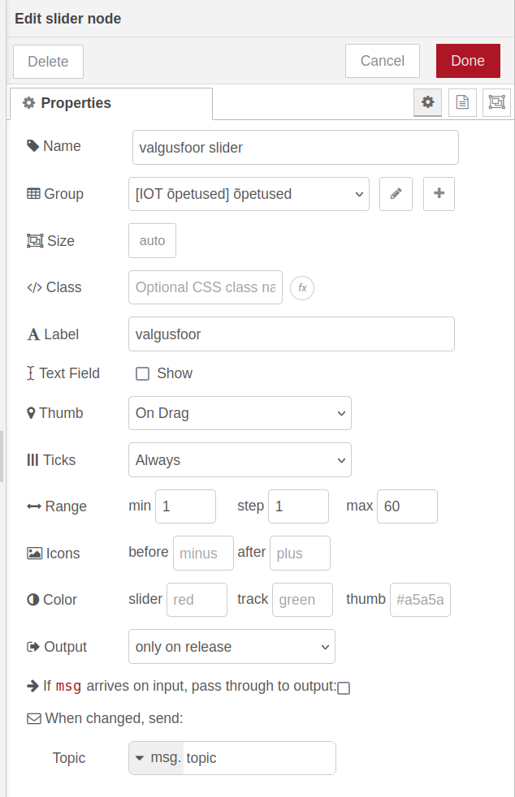
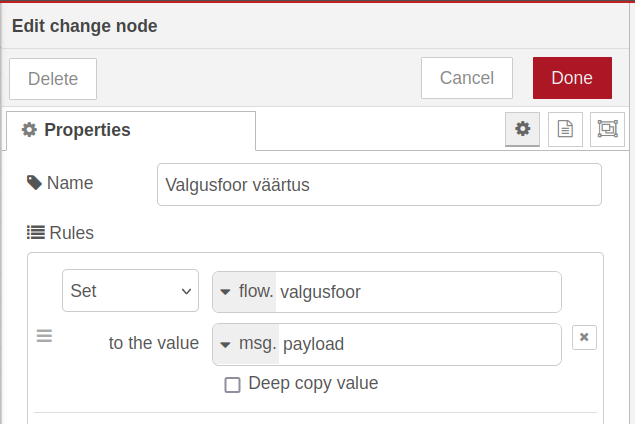
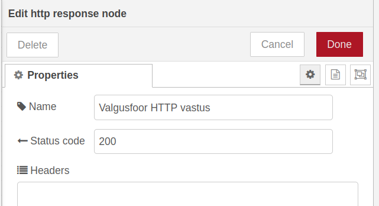

Kui see su arvutis juba ei käi, käivita Dockeris meie eelmises õpetuses tehtud konteineri. Selleks tee Docker käsureal:  
*docker start TarkLinn*  
Linuxi kasutajad saavad enda eelistatud käsureal teha:  
*sudo docker start TarkLinn*

Node-RED-ile pääsed ligi veebilehitsejas minnes aadressile *localhost:1880* või *127.0.0.1:1880*. 

Ekraani vasakus ääres leiad Node-RED sõlmede menüü või siis noole, millele klikkides menüü avaneb. Kerime seal menüüs alla, kuni leiame **dashboard 2** alt **slider** sõlme ja tirime selle ekraani keskele.

Tehes topeltkliki keskele pandud sõlme peal, avaneb ekraani paremas ääres menüü sõlme omaduste muutmiseks. 

Paneme sõlme nimeks *valgusfoor slider*, sildiks(label) *valgusfoor*, ning Range paneme min 1 ja max 60\. Output rippmenüüst valime “only on release”.

Kui *group* väljal on valik *none*, ei ole sliderit dashboardil näha. Uue grupi saad teha vajutades plussmärgiga nuppu *group* välja kõrval.
{: .important}

Vajutame üleval paremas nurgas nuppu *Deploy* ning läheme veebilehitsejas aadressile *localhost:1880/dashboard* (Või *127.0.0.1:1880/dashboard*). Näeme, et *slider* on täitsa olemas, kuid suurt kasu meile sellest ei ole. Läheme tagasi Node-RED redaktorisse.

Üks Node-RED eripäradest on see, et vaikimisi saadetakse infot signaalidena, mitte ei salvestata muutujates. See tähendab, et nt. HTTP päringule saab vastuse ainult see hetk, kui signaal saadetakse. See aga ei ole HTTP päringuga infot proovides saada väga praktiline. Et enda tehtud *slider*\-i väärtust salvestada nii, et me saaks seda kätte kogu aeg, kui Node-RED töötab, kasutame ***change*** sõlme.

Võtame vasakult menüüst *change* sõlme ja tirime selle keskele. Teeme selle peal topeltkliki, paneme nimeks “valgusfoor väärtus”, ja *Rules* välja all teeme ühe *Set* reegli, kus paneme *flow.valgusfoor* väärtuseks *msg.payload*

*flow* eesliidesega väärtused on Node-RED jaoks muutujad, mille väärtus säilitatakse. 

*msg.payload* on väärtus, mille väärtus on tavaliselt sõlmede väljunditeks.

Ühendame *Valgusfoor slider* sõlme *Valgusfoor väärtus* sõlmega, tirides ühe sõlme äärest nool teise sõlme äärde.

Nüüd salvestatakse *dashboard*\-il antud *slider*\-i väärtus muutujana.

Järgmisena loome HTTP päringu sõlme, et ESP32 saaks muutuja väärtuse kätte. Leia vasakult menüüst sõlm *http in* ning tiri see keskele. Tee sõlmel topeltklikk. Jätame meetodiks GET, paneme URL-iks /valgusfoor ning nimeks “valgusfoor HTTP sisse”.

Kasutame jälle *change* sõlme, et päringus saadava *payload*\-i väärtus muuta samaks, mis on *flow.valgusfoor*. Leiame vasakult menüüs *change* sõlme, lohistame selle keskele ning teeme selle peal topeltkliki. Paneme sõlme nimeks “valgusfoor muutuja payloadiks”, ja teeme *set* reegli, millega paneme *msg.payload* väärtuseks *flow.valgusfoor*.

Node-RED keskkonnas *flow* algusega muutujad kehtivad ühe *flow* ehk voolu sees (Voolud on eraldatud Node-RED siseste vahelehtedega). *msg* algusega muutujad kehtivad ainult omavahel ühendatud sõlmedes. See tähendab, et meil võib olla ühel Node-RED lehel näiteks mitu *msg.payload* muutujat, mis on üksteisest täiesti sõltumatud senikaua, kuni nendega tegelevad sõlmed ei ole ühendatud.
{: .info}

Järgmisena leiame vasakult menüüst *template* sõlme ja tirime selle samuti keskele. *Template* sõlme abil saame seadistada HTTP päringute(ja ka muude päringute) vastuseid. Paneme sõlme nimeks “valgusfoor HTTP template”, *Property* väärtuseks jätame *msg.payload* ning *Template* väärtuseks paneme lihtsalt “{{payload}}”.

Viimasena leiame vasakult menüüst *http response* sõlme. Tirime selle keskele ja teeme topeltkliki selle peal. Nimeks paneme “valgusfoor HTTP vastus” ja *Status code* väärtuseks paneme 200\.

Ühendame omavahel HTTP sõlmed ning vajutame jälle *Deploy*.

Praeguseks peaks meie Node-RED nägema välja selline:

Läheme uuesti dashboard-ile(localhost:1880/dashboard), võtame lahti Arduino IDE, laeme üles tehtud koodi, ja muudame *dashboard*\-il *slider*\-i väärtust. Kui kõik on õigesti tehtud, peaksid nüüd valgusfoore roheline ja punane tuli kestma kauem või vähem vastavalt Node-RED *dashboard*\-il antud väärtusele.

Kui valgusfoor töötab, võib soovi korral selle kokku joota ning nt. papist valgusfoori mudelisse paigaldada.

**Iseseisvaks nuputamiseks:**  
Kuidas teha nii, et rohelise ja punase tule kestust saaks eraldi reguleerida?

[Järgmine õpetus](../HTTP-info-saatmine)

**Kasutatud allikad:**  
- [https://flowfuse.com/node-red/getting-started/node-red-messages/](https://flowfuse.com/node-red/getting-started/node-red-messages/)  
- [https://www.digikey.com/en/maker/tutorials/2022/how-to-use-variables-in-node-red](https://www.digikey.com/en/maker/tutorials/2022/how-to-use-variables-in-node-red)  
- [https://flowfuse.com/node-red/core-nodes/change/](https://flowfuse.com/node-red/core-nodes/change/)