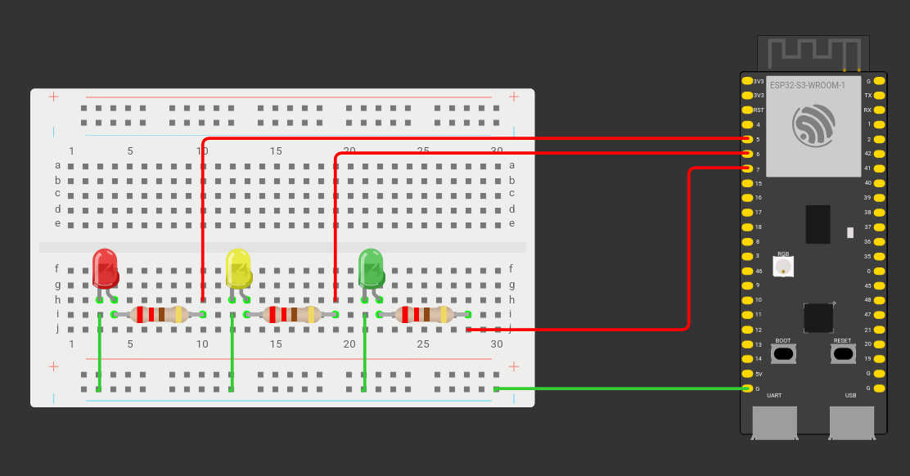
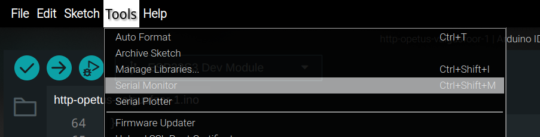

Konstrueerime kõigepealt valgusfoore mudeli maketeerimislaual. Selleks läheb vaja:  
- 1 punast LED tuld  
- 1 kollast LED tuld  
- 1 rohelist LED tuld  
- 3 220 ohm takistit

Joonis maketeerimislaual ühendamisest näeb välja selline:



Ühendused on:  
- ESP32 pin 5 \- 220 ohm takisti  
- 220 ohm takisti \- punane LED positiivne jalg(pikem)  
- punane LED negatiivne jalg(lühem) \- maandus  

Samad ühendused on kollase ja rohelise LED-iga, kuid kollase LED-i ees olev takisti on ühendatud 6\. ning rohelise LED-i ees olev takisti 7\. pin-iga.

Avame Arduino IDE ning valime enda arenduslaua(Õige arenduslaua valimisest oli juttu 0.1. peatükis). Alguses on meil kohe ees selline kood:
```cpp
void setup() {
// put your setup code here, to run once:

  

}

  

void loop() {
// put your main code here, to run repeatedly:

  

}
```

Arduino vajab töötamiseks neid kahte funktsiooni. **setup** funktsioon käivitub siis, kui esp32 sisse lülitatakse, ning **loop** funktsioon käivitub korduvalt alates setup funktsiooni lõpust kuni esp32 välja lülitamiseni. 

Deklareerime kõigepealt pin-id, millega LED tuled on ühendatud. Pin numbrid deklareeritakse täisarv(int) tüüpi muutujatega. Kirjutame enne setup funktsiooni:
```cpp
int punanePin = 5;
int kollanePin = 6;
int rohelinePin = 7;
```

Setup funktsioonis ütleme ESP32-le, et kasutame deklareeritud LED pin-e väljunditena. Lisame setup funktsiooni read:
```cpp
pinMode(punanePin, OUTPUT);
pinMode(kollanePin, OUTPUT);
pinMode(rohelinePin, OUTPUT);
```
Teeme uue funktsiooni nimega **punane**. Funktsiooni sees kirjutame punase LED pin-ile väärtuse HIGH, et see põlema panna. Lisame **delay,** et programm ootaks 3000 millisekundit ehk 3 sekundit, enne kui edasi liigub.
```cpp
void punane() {
digitalWrite(punanePin, HIGH);
delay(3000);
}
```
Et punane tuli enne kustumist vilguks, lisame ka for-tsükli, mille sees kirjutame pin-ile HIGH väärtuse, lisame 1000-millisekundilise delay, kirjutame pin-ile LOW väärtuse, ning lisame veel ühe 1000-millisekundilise delay.
```cpp
void punane() {
 digitalWrite(punanePin, HIGH);
 delay(3000);
 for(int i = 0; i < 2; i++){
   digitalWrite(punanePin, HIGH);
   delay(1000);
   digitalWrite(punanePin, LOW);
   delay(1000);
 }
}
```

Teeme samasuguse funktsiooni, kus sama asi toimub rohelise pin-iga.
```cpp
void roheline() {
digitalWrite(rohelinePin, HIGH);
delay(3000);
 for(int i = 0; i < 2; i++){
   digitalWrite(rohelinePin, HIGH);
   delay(1000);
   digitalWrite(rohelinePin, LOW);
   delay(1000);
 }
}

```

Kollase pin-i jaoks teeme funktsiooni, mille sees on ainult üks while-tsükkel, kus kolm korda vilgutatakse kollast tuld.
```cpp
void kollane() {
 for(int i = 0; i < 3; i++){
   digitalWrite(kollanePin, HIGH);
   delay(1000);
   digitalWrite(kollanePin, LOW);
   delay(1000);
 }
}

```

Lõpuks kutsume **loop** funktsioonis välja punase, kollase, rohelise, ning siis jälle kollase funktsiooni.
```cpp
void loop() {
 // loop funktsioon käivitub korduvalt kogu programmi töö ajal
 punane();
 kollane();
 roheline();
 kollane();
}

```

Lõpuks näeb meie kood välja selline:
```cpp
//Defineerime pin-id, millega eri värvi LED tuled on ühendatud
int punanePin = 5;
int kollanePin = 6;
int rohelinePin = 7;


void setup() {
 // setup funktsioon käivitub iga kord, kui esp32 lülitatakse sisse


 //Ütleme ESP32-le, et kasutame deklareeritud pin-e väljundina
 pinMode(punanePin, OUTPUT);
 pinMode(kollanePin, OUTPUT);
 pinMode(rohelinePin, OUTPUT);
}


void loop() {
 // loop funktsioon käivitub korduvalt kogu programmi töö ajal
 punane();
 kollane();
 roheline();
 kollane();
}


void punane() {
 digitalWrite(punanePin, HIGH); //Kirjutame pin-ile HIGH väärtuse - tuli läheb põlema
 delay(3000); //Ootame 3000 millisekundit ehk 3 sekundit, enne kui programmi töö jätkub
 for(int i = 0; i < 2; i++){
   digitalWrite(punanePin, HIGH);
   delay(1000);
   digitalWrite(punanePin, LOW); //Kirjutame pin-ile LOW väärtuse - tuli kustub
   delay(1000);
 }
}


void roheline() {
   digitalWrite(rohelinePin, HIGH);
 delay(3000);
 for(int i = 0; i < 2; i++){
   digitalWrite(rohelinePin, HIGH);
   delay(1000);
   digitalWrite(rohelinePin, LOW);
   delay(1000);
 }
}


void kollane() {
 for(int i = 0; i < 3; i++){
   digitalWrite(kollanePin, HIGH);
   delay(1000);
   digitalWrite(kollanePin, LOW);
   delay(1000);
 }
}

```

**Miks me kasutame delay() funktsiooni?** Kui me delay funktsiooni ei kasutaks, liiguks programm edasi nii kiiresti, et me ei näeks, kui LED tuli hetkeks põlema läheb või kustub.
{: .info}

Ühendame oma ESP32 arvutiga ning vajutame IDE-s *upload* nuppu. Kui kõik on õigesti tehtud, näeme, et tuled lähevad põlema, vilguvad, ning lähevad kustu.


Kui sinu ESP32-l on kaks kohta, kuhu USB kaabel ühendada, töötab tavaliselt Arduino IDE-st koodi laadimiseks pesa, mille juures on kirjas UART.
{: .important}

Valgusfoor küll töötab, aga kui me tahaksime muuta, kui kaua üks tsükkel kestab, peaksime me uuesti ESP32 arvutiga ühendama ning koodi manuaalselt muutma. See ei oleks eriti praktiline, kuna erinevatel aegadel võib olla kõige parem kasutada eri pikkusega tsüklit \- näiteks kui autosid kuigi palju ei sõida, võiks tsükkel olla lühem, aga kui liiklust on palju, võiks tsükkel kesta kauem, et võimalikult palju autosi saaksid ühe tsükliga ristmikust üle sõita. Mugav oleks, kui me saaksime tsükli pikkust reguleerida läbi veebi.

Et veebiga suhelda, läheb meil vaja väliseid teeke. Deklareerime programmi alguses kaks välist teeki: WiFi.h ning HTTPClient.h
```cpp
#include <WiFi.h>
#include <HTTPClient.h>
```

Seejärel defineerime wifi nime ning parooli, millega ESP32 peab ühenduma(Arvuti, kus töötab Node-RED ja ESP32 peavad olema samas võrgus\!). Lisaks defineerime URL-i, kuhu ESP32 päringut hakkab tegema. Aadressiks saab arvuti IP pordiga 1880, ning sellele lisame tee(*path*), kust ESP32 hakkab infot saama.
```cpp
const char* ssid = "wifi-nimi"; //esp32 toetab 2.4GhZ wifit!
const char* password = "wifi–parool";


String url = "http://1.2.3.4:1880/valgus";
```

(Enda arvuti IP aadressi saad teada Linux-is *hostname \-I* ning Windows-is *ipconfig* käsuga käsureal. ESP32-le vajalik minev IP aadress **ei alga** numbritega 172\!)

Deklareerima ka uue täisarvu tüüpi muutuja **aeg**, milles hakkame hoidma HTTP päringust saadud väärtust, kui kaua valgusfoori valgus põleb. Paneme tema vaikimisi väärtuseks 1\.
```cpp
int aeg = 1;
```

Asendame **delay(3000)** **punane** ning **roheline** funktsioonides reaga **delay(aeg)**.
```cpp
void punane() {
 digitalWrite(punanePin, HIGH); //Kirjutame pin-ile HIGH väärtuse - tuli läheb põlema
 delay(aeg);
 for(int i = 0; i < 2; i++){
   digitalWrite(punanePin, HIGH);
   delay(1000);
   digitalWrite(punanePin, LOW); //Kirjutame pin-ile LOW väärtuse - tuli kustub
   delay(1000);
 }
}

```

Arduino IDE-s on mugav jälgida programmi tööd **Serial monitor** abil. Lisame **setup** funktsiooni kaks rida:
```cpp
 Serial.begin(115200); //Alustame serial ühendust 115200 baudi peal
 WiFi.begin(ssid, password); //Alustame wifi ühendust eespool defineeritud nime ning parooliga
```

Kuvame serial monitoris teksti “Connecting…” ning lisame while-tsükli, mis laadimise näitamiseks kuvab punkte iga 500 millisekundi tagant senikaua, kuni ESP32 ei ole wifi-ga ühendust saanud.
```cpp
 Serial.print("Connecting...");
  while(WiFi.status() != WL_CONNECTED){
   delay(500);
   Serial.print(".");
 }

```

Lõpuks näeb meie setup funktsioon välja selline:
```cpp
void setup() {
 // setup funktsioon käivitub iga kord, kui esp32 lülitatakse sisse


 Serial.begin(115200); //Alustame serial ühendust 115200 baudi peal
 WiFi.begin(ssid, password); //Alustame wifi ühendust eespool defineeritud nime ning parooliga


 //Ütleme ESP32-le, et kasutame deklareeritud pin-e väljundina
 pinMode(punanePin, OUTPUT);
 pinMode(kollanePin, OUTPUT);
 pinMode(rohelinePin, OUTPUT);


 Serial.print("Connecting...");
   while(WiFi.status() != WL_CONNECTED){
   delay(500);
   Serial.print(".");
 }
}

```

Et hoida enda kood lihtsana, teeme uue funktsiooni **httpParing()**. Seda funktsiooni hakkame kasutama, et saada infot, kui kaua valgusfoori valgus peaks põlema.
```cpp
void httpParing(){

}
```

Lisame funktsiooni tingimuslause - HTTP päringut hakkame tegema ainult siis, kui wifi ühendus on olemas.
```cpp
void httpParing(){
   if(WiFi.status() == WL_CONNECTED){ //Kontrollime, et wifi ühendus on olemas
 }
}

```

Kirjutame tingimuslause sisse 3 rida:
```cpp
WiFiClient client;
HTTPClient http;


http.begin(client, url); //alustame http päringut, kasutades WiFiClient-i ning varem defineeritud URL-i
```

Lisaks defineerime täisarvulise muutuja, mille väärtuseks saab GET päringu vastusena saadud HTTP kood. Erinevate HTTP koodide kohta saab lugeda [siit](https://developer.mozilla.org/en-US/docs/Web/HTTP/Status).
```cpp
int responseCode = http.GET(); //defineerime muutuja HTTP päringu vastuse koodi hoidmiseks
```

Lisame uue tingimuslause: kui HTTP päringust saadud kood on suurem, kui 0, prindime serial monitori vastuse koodi ja jätkame päringu vastusest info saamisega. Kui ei ole, prindime serial monitoris veakoodi.
```cpp
if(responseCode > 0){
    Serial.print("HTTP Response code: ");
    Serial.println(responseCode);


}
else {
    Serial.print("Error code: ");
    Serial.println(responseCode);
}

```

Kui HTTP päringu vastuse kood on 200, saame muutuja “aeg” väärtuseks panna HTTP vastuse väärtuse täismuutujaks teisendatuna. Kuna me tahame kestust anda sekundites, kuid Arduino delay() funktsioon töötab millisekunditega, korrutame saadud vastuse tuhandega.
```cpp
 if(responseCode == 200){ //Jätkame kui kood on 200 - OK
   //Saame HTTP vastuse stringina, cast-ime selle täisarvuliseks muutujaks, ning korrutame selle 1000-ga, et saada väärtus millisekundites
   aeg = http.getString().toInt() * 1000;
   Serial.println(aeg);
 }
```

httpParing funktsiooni lõpus lõpetame http ühenduse.
```cpp
  http.end();
```

Lõpuks võiks httpParing funktsioon välja näha selline:
```cpp
void httpParing(){
   if(WiFi.status() == WL_CONNECTED){ //Kontrollime, et wifi ühendus on olemas
   WiFiClient client;
   HTTPClient http;


   http.begin(client, url); //alustame http päringut, kasutades WiFiClient-i ning varem defineeritud URL-i


   int responseCode = http.GET(); //defineerime muutuja HTTP päringu vastuse koodi hoidmiseks


   if(responseCode > 0){ //kontrollime, et HTTP päringu kood oleks suurem, kui 0
     Serial.print("HTTP Response code: ");
     Serial.println(responseCode);


     if(responseCode == 200){ //Jätkame kui kood on 200 - OK
       //Saame HTTP vastuse stringina, cast-ime selle täisarvuliseks muutujaks, ning korrutame selle 1000-ga, et saada väärtus millisekundites
       aeg = http.getString().toInt() * 1000;
       Serial.println(aeg);
     }
   }
   else { //kui HTTP päringu kood on väiksem, kui 0, prindime veateate
     Serial.print("Error code: ");
     Serial.println(responseCode);
   }
   http.end(); //lõpetame HTTP ühenduse
 }
}

```

Kutsume httpParing funktsiooni välja loop funktsioonis, et enne igat tsüklit ESP32 teeks HTTP päringu.
```cpp
void loop() {
 // loop funktsioon käivitub korduvalt kogu programmi töö ajal
 httpParing();
 punane();
 kollane();
 roheline();
 kollane();
}

```

Lõpuks näeb meie programm välja selline:
```cpp
#include <WiFi.h>
#include <HTTPClient.h>


//WiFi andmed
const char* ssid = "wifi-nimi"; //Defineerime wifi nime. NB! esp32 toetab 2.4GhZ wifit!
const char* password = "wifi-parool"; //Defineerime wifi parooli


String url = "http://1.2.3.4:1880/valgusfoor"; //URL, kuhu hakkame päringut tegema


int aeg = 1;


//Defineerime pin-id, millega eri värvi LED tuled on ühendatud
int punanePin = 5;
int kollanePin = 6;
int rohelinePin = 7;


void setup() {
 // setup funktsioon käivitub iga kord, kui esp32 lülitatakse sisse


 Serial.begin(115200); //Alustame serial ühendust 115200 baudi peal
 WiFi.begin(ssid, password); //Alustame wifi ühendust eespool defineeritud nime ning parooliga


 //Ütleme ESP32-le, et kasutame deklareeritud pin-e väljundina
 pinMode(punanePin, OUTPUT);
 pinMode(kollanePin, OUTPUT);
 pinMode(rohelinePin, OUTPUT);


 Serial.print("Connecting...");
   while(WiFi.status() != WL_CONNECTED){
   delay(500);
   Serial.print(".");
 }
}


void loop() {
 // loop funktsioon käivitub korduvalt kogu programmi töö ajal
 httpParing();
 punane();
 kollane();
 roheline();
 kollane();
}


void punane() {
 digitalWrite(punanePin, HIGH); //Kirjutame pin-ile HIGH väärtuse - tuli läheb põlema
 delay(aeg);
 for(int i = 0; i < 2; i++){
   digitalWrite(punanePin, HIGH);
   delay(1000);
   digitalWrite(punanePin, LOW); //Kirjutame pin-ile LOW väärtuse - tuli kustub
   delay(1000);
 }
}


void roheline() {
   digitalWrite(rohelinePin, HIGH);
 delay(aeg);
 for(int i = 0; i < 2; i++){
   digitalWrite(rohelinePin, HIGH);
   delay(1000);
   digitalWrite(rohelinePin, LOW);
   delay(1000);
 }
}


void kollane() {
 for(int i = 0; i < 3; i++){
   digitalWrite(kollanePin, HIGH);
   delay(1000);
   digitalWrite(kollanePin, LOW);
   delay(1000);
 }
}


void httpParing(){
   if(WiFi.status() == WL_CONNECTED){ //Kontrollime, et wifi ühendus on olemas
   WiFiClient client;
   HTTPClient http;


   http.begin(client, url); //alustame http päringut, kasutades WiFiClient-i ning varem defineeritud URL-i


   int responseCode = http.GET(); //defineerime muutuja HTTP päringu vastuse koodi hoidmiseks


   if(responseCode > 0){ //kontrollime, et HTTP päringu kood oleks suurem, kui 0
     Serial.print("HTTP Response code: ");
     Serial.println(responseCode);


     if(responseCode == 200){ //Jätkame kui kood on 200 - OK
       //Saame HTTP vastuse stringina, cast-ime selle täisarvuliseks muutujaks, ning korrutame selle 1000-ga, et saada väärtus millisekundites
       aeg = http.getString().toInt() * 1000;
       Serial.println(aeg);
     }
   }
   else { //kui HTTP päringu kood on väiksem, kui 0, prindime veateate
     Serial.print("Error code: ");
     Serial.println(responseCode);
   }
   http.end(); //lõpetame HTTP ühenduse
 }
}

```

ESP32 poolt on nüüd kõik vajalik tehtud, aga kui me programmi tööle paneks, ei saaks me kätte mingit infot. Et panna enda arvuti vajalikku infot saatma, kasutame Node-RED-i.

Koodi kirjutades oli mitu korda mainitud **serial monitor**. Serial monitor on tööriist, mille abil ESP32 saab saata sõnumeid otse Arduino IDE-sse, ning seda on hea kasutada veaotsinguks. Et serial monitor avada, kasuta Arduino IDE-s klahvikombinatsiooni ctrl+shift+M või võta ülevalt lahti *Tools* rippmenüü ja vali sealt *Serial Monitor*.



Programmi *setup* funktsioonis panime kirja, et Serial Monitor hakkab tööle 115200 baudi peal. Baudide väärtust, mida Arduino IDE Serial Monitor loeb, saab muuta Serial Monitori akna paremal pool.


[Node-RED HTTP info saatmine](./Node-red-http)

**Kasutatud allikad:**  
- [https://docs.arduino.cc/built-in-examples/strings/StringToInt/](https://docs.arduino.cc/built-in-examples/strings/StringToInt/)   