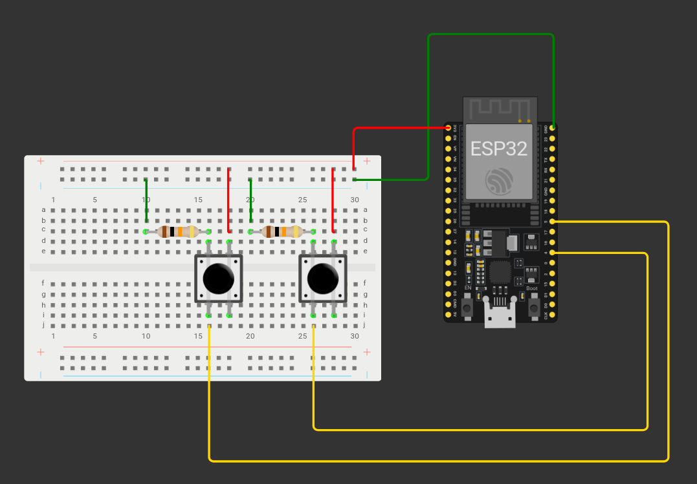

Parkimismaja mudeli konstrueerimiseks maketeerimislaual läheb vaja:
- 2 nuppu
- 2 10k oomist takistit

Joonis maketeerimislaual olevast mudelist näeb välja selline:



Ühendused on:  
- esp32 pin 4 \- nupp 1  
-  nupp 1 \- 10k takisti 1  
- 10k takisti 1 \- maandus  
- nupp 1 \- esp32 3v3  
- esp32 pin 5 \- nupp 2  
- nupp 2 \- 10k takisti 2  
- 10k takisti 2 \- maandus  
- nupp 2 \- esp32 3v3

Avame Arduino IDE ja avame uue sketši.

Sarnaselt eelmisele õpetusele anname kõigepealt teada, et kasutame WiFi ning HTTPClient teeke ja deklareerime wifi nime ja parooli ja lingi, kuhu me HTTP päringut hakkame tegema.
```cpp
#include <WiFi.h>
#include <HTTPClient.h>


//WiFi andmed
const char* ssid = "wifi-nimi";
const char* password = "wifi-parool";


String url = "http://1.2.3.4:1880/parkimine";
```

Kuna me hakkame saatma infot mitme parkimiskoha oleku kohta, on otstarbekas deklareerida nuppude pin-id ühe massiivina. Deklareerime neli massiivi: nuppude pin-id, nuppude olekud(Nende järgi saab ESP32 aru, kas nuppu on vajutatud või ei), parkimiskohtade numbrid, ning boolean väärtuse, kas kohad on vabad või mitte. Iga massiivi indeks vastab sama koha infole teises massiivis, ehk 4. pin-iga on ühendatud parkimiskoht number 1, selle nupu olek on praegu 0, ning see koht on esialgu vaba.
```cpp
int Btns[] = {4, 5}; //Nuppude pin-id
int BtnStates[] = {0, 0}; //Nuppude olekud
int kohad[] = {1, 2}; //Kohtade numbrid
bool vabad[] = {true, true}; //Iga koha olek, kas on vaba
```

Kuna Arduino IDE programmeerimine on sarnane C ja C++ keeltega, peame me tegema ka eraldi muutuja massiivide suuruse jaoks. Kuna kõik 4 massiivi on ühesuurused, läheb meil selle jaoks vaja ainult ühte muutujat.
```cpp
int size = sizeof(vabad) / sizeof(vabad[0]);
```

Teeme ka esialgu tühja massiivi, kus hakkame hoidma viimast massiivi “vabad” olekut. Massiiv on sama suur, nagu teised.
```cpp
bool vabadEelmine[size];
```

Programm hakkab töötama nii: for-tsükliga kontrollitakse, kas mõnda nuppu on vajutatud, ning kui on, muudetakse vastavalt nupule tõeväärtust vabade kohtade massivis. Kui for-tsükkel on tehtud, vaadatakse, kas praegune vabade kohtade massiiv erineb peale viimast muutust tehtud vabade kohtade massiivist, ning kui erineb, saadetakse uue massiivi kohta informatsioon Node-RED-ile.

Loome 2 uut funktsiooni. Esimene funktsioon on massiivide kopeerimiseks ning teine massiivide võrdlemiseks.
```cpp
//funktsioon massiivide kopeerimiseks
void copyArray(bool src[], bool dst[], int size) {
   for (int i = 0; i < size; i++) {
       dst[i] = src[i];
   }
}


//funktsioon massivide võrdlemiseks
bool eriMassiivid(bool arr1[], bool arr2[], int size){
 for (int i = 0; i < size; i++) { //Vaatame läbi kõik massiivis olevad elemendid
   if (arr1[i] != arr2[i]) { //Kui mõni element on erinev, tagastab tõeväärtuse
       return true;
   }
 }
 return false; //Kui tõeväärtust ei ole tagastatud, tagastab false-väärtuse
}

```

Loome funktsiooni, millega hakkame saatma HTTP päringut. Meie päring saab olema JSON formaadis ning näeb välja selline:  
`[{“koht”:”1”,”vaba”:”jah”},{“koht”:”2”,”vaba”:”jah”}]`  
Kuna me tegime Red-NODE tabelisse vaba koha välja lugema RGB värvi väärtust, saadame võtme “vaba” väärtused RGB värvikoodide kujul. Kui koht on vaba, saab väärtuseks   `#03fc03`(Roheline) ning kui ei ole, `#fc1303`(Punane).

Tegelikult oleks meil lihtsam kasutada Arduino JSON teeki, selle asemel, et JSON objekt manuaalselt teha. Siin õpetuses ehitame esialgu JSON objekti manuaalselt, et harjutada ESP32-s sõnedega töötamist. Arduino JSON teegiga tutvume edaspidi.
{: .info}

Alustame HTTP päringut ning lisame päise, mis ütleb, et tegu on JSON-iga.
```cpp
void httpPost(){
 Serial.println("Starting HTTP request...");
   if(WiFi.status() == WL_CONNECTED){
   WiFiClient client;
   HTTPClient http;


   http.begin(client, url);


   http.addHeader("Content-Type", "application/json");


}

```

 Hakkame päringut ehitama. Kasutame selleks *for*\-tsüklit, mis lisab päringusse iga massiivis oleva koha numbri ning talle vastava massiivis oleku. Kui tegu ei ole viimase elemendiga massiivis, lisame iga koha järel koma. Kuna me soovime päringus saata informatsiooni mitme koha kohta, lisame päringu algusesse ja lõppu nurksulud.
 ```cpp
    String postData = "[";


   for(int i = 0; i < size; i++){
     postData += "{\"koht\":\"";
     postData += (String)kohad[i];
     postData += "\",\"vaba\":";
     if(vabad[i]){
       postData += "\"#03fc03\"}";
     } else {
       postData += "\"#fc1303\"}";
     }
     if(i != size - 1){
       postData += ", ";
     }
   }
   postData += "]";
   ```

Et päringu sõnesse lisada jutumärke, kasutame \ märki enne jutumärki, mida soovime lisada.
{: .info}

Kui päring on valmis, prindime serial monitori päringu sõne ja kasutame **http.POST()**, et päring saata. Kui päring on saadetud, lõpetame HTTP ühenduse. Lisame funktsioonile ka poole sekundilise delay, et vältida mitu korda sama päringu saatmist.
```cpp
   Serial.println(postData);
   int httpResponseCode = http.POST(postData);


   Serial.print("HTTP response code: ");
   Serial.println(httpResponseCode);


   http.end();


   delay(500);
```

Lõpuks näeb meie httpPost funktsioon välja selline:
```cpp
void httpPost(){
 Serial.println("Starting HTTP request...");
   if(WiFi.status() == WL_CONNECTED){
   WiFiClient client;
   HTTPClient http;


   http.begin(client, url);


   http.addHeader("Content-Type", "application/json");
   String postData = "[";


   for(int i = 0; i < size; i++){
     postData += "{\"koht\":\"";
     postData += (String)kohad[i];
     postData += "\",\"vaba\":";
     if(vabad[i]){
       postData += "\"#03fc03\"}";
     } else {
       postData += "\"#fc1303\"}";
     }
     if(i != size - 1){
       postData += ", ";
     }
   }
   postData += "]";


   Serial.println(postData);
   int httpResponseCode = http.POST(postData);


   Serial.print("HTTP response code: ");
   Serial.println(httpResponseCode);


   http.end();


   delay(500);
 }
}

```

Liigume setup() funktsiooni juurde. Paneme kõigepealt käima serial monitori ning wifi.
```cpp
void setup() {
 Serial.begin(115200);
 WiFi.begin(ssid, password);


}

```

Eelmises õpetuses ütlesime ESP32-le, et meie deklareeritud pin-id on väljundid. Kuna seekord loeb ESP32 meie varem deklareeritud pin-idest infot, kasutame for-tsüklit, et öelda, et tegu on sisenditega.
```cpp
 for(int i = 0; i < size; i++){
   pinMode(Btns[i], INPUT);
 }

```

Kasutame enda tehtud funktsiooni, et panna vabadEelmine massiivi väärtuseks praegune vabade kohtade massiiv.
```cpp
 copyArray(vabad, vabadEelmine, sizeof(vabad) / sizeof(vabad[0]));

```

Viimasena lisame setup funktsiooni Wifi ühenduse loomise ning serial monitori selle kohta informatsiooni printimise.
```cpp
 while(WiFi.status() != WL_CONNECTED){
   delay(500);
   Serial.print(".");
 }
 Serial.println();
 Serial.println("Connected!");
```

Kogu setup funktsioon näeb välja selline:
```cpp
void setup() {
 //Paneme käima serial monitori ja wifi
 Serial.begin(115200);
 WiFi.begin(ssid, password);


 //Deklareerime, et meie massiivis olevad pin-id on sisendid
 for(int i = 0; i < size; i++){
   pinMode(Btns[i], INPUT);
 }


 //Paneme eelmise kohtade massiivi väärtuseks praeguse massiivi
 copyArray(vabad, vabadEelmine, sizeof(vabad) / sizeof(vabad[0]));


 //Informatsioon serial monitori
 Serial.print("Connecting...");
  while(WiFi.status() != WL_CONNECTED){
   delay(500);
   Serial.print(".");
 }
 Serial.println();
 Serial.println("Connected!");


}

```

Lõpuks koostame loop funktsiooni. Kõigepealt loeme for-tsükliga sisendit kõikidest deklareeritud nuppudest.
```cpp
void loop() {
 for(int i = 0; i < size; i++){
   BtnStates[i] = digitalRead(Btns[i]);


}

```

Lisame *for* tsüklisse tingimuslause: kui hetkel loetava pin-i sisend on HIGH, muudame vastavat *boolean* väärtust teises massiivis. (Meeldetuletuseks \- LED tulega väljund pin-il tähendas HIGH, et paneme tule põlema, ning LOW, et tuli kustus. Siin tähendab HIGH, et nuppu vajutatakse, ning LOW, et ei vajutata.)
```cpp
   if(BtnStates[i] == HIGH){
     vabad[i] = !vabad[i];
   }

```

Kui *for*\-tsükkel on tehtud, kontrollime, kas meie praegune parkimiskohtade oleku massiiv on sama, mis enne viimast muudetud. Kui massiivid on erinevad, alustame HTTP päringut ja paneme praeguse massiivi väärtuse viimati salvestatud väärtuseks.
```cpp
 if (arraysAreDifferent(vabadEelmine, vabad, sizeof(vabad) / sizeof(vabad[0]))){
   httpPost();
   copyArray(vabad, vabadEelmine, sizeof(vabad) / sizeof(vabad[0]));
 }

```

Valmis *loop* funktsioon:
```cpp
void loop() {
 //Vaatame tsükliga, kas mõni meie deklareeritud nuppudest on vajutatud
 for(int i = 0; i < size; i++){
   BtnStates[i] = digitalRead(Btns[i]);
   //Kui ESP32 loeb pin-ilt väärtuse HIGH, muudab ta vastava boolean väärtuse vastupidiseks
   if(BtnStates[i] == HIGH){
     vabad[i] = !vabad[i];
   }
 }


 //Kui praegune massiiv on eelmisest erinev, teeme HTTP POST päringu ning paneme eelmise massiivi väärtuse praeguse massiivi väärtusega võrduma
 if (arraysAreDifferent(vabadEelmine, vabad, sizeof(vabad) / sizeof(vabad[0]))){
   httpPost();
   copyArray(vabad, vabadEelmine, sizeof(vabad) / sizeof(vabad[0]));
 }
}

```

Terve programm:
```cpp
#include <WiFi.h>
#include <HTTPClient.h>


//WiFi andmed
const char* ssid = "wifi-nimi"; //Defineerime wifi nime
const char* password = "wifi-parool"; //Defineerime wifi parooli


String url = "http://1.2.3.4:1880/parkimine"; //URL, kuhu hakkame päringut tegema


//massiivid parkimiskohtade olekute jaoks
int Btns[] = {4, 5}; //Nuppude pin-id
int BtnStates[] = {0, 0}; //Nuppude olekud
int kohad[] = {1, 2}; //Kohtade numbrid
bool vabad[] = {true, true}; //Iga koha olek, kas on vaba


//Massiivi suurus - kuna massiivid on samasuurused, on meil vaja ainult üks kord massiivi suurus arvutada
int size = sizeof(vabad) / sizeof(vabad[0]);


//viimaste kohtade oleku massiiv. Alguses tühi, kuid ütleme ära, et see on sama suur, kui teised massivid
bool vabadEelmine[size];


//funktsioon massiivide kopeerimiseks
void copyArray(bool src[], bool dst[], int size) {
   for (int i = 0; i < size; i++) {
       dst[i] = src[i];
   }
}


//funktsioon massiivide võrdlemiseks
bool eriMassiivid(bool arr1[], bool arr2[], int size){
 for (int i = 0; i < size; i++) { //Vaatame läbi kõik massiivis olevad elemendid
   if (arr1[i] != arr2[i]) { //Kui mõni element on erinev, tagastab tõeväärtuse
       return true;
   }
 }
 return false; //Kui tõeväärtust ei ole tagastatud, tagastab false-väärtuse
}


//Funktsioon HTTP POST päringu tegemiseks
void httpPost(){
 Serial.println("Starting HTTP request...");
   if(WiFi.status() == WL_CONNECTED){
   WiFiClient client;
   HTTPClient http;


   http.begin(client, url);


   //Lisame päringu päisesse(header) info, et edastame JSON objekti
   http.addHeader("Content-Type", "application/json");
   //Hakkame ehitama päringut
   String postData = "[";


   for(int i = 0; i < size; i++){ //Käime läbi kõik elemendid massiivis
     postData += "{\"koht\":\"";
     postData += (String)kohad[i];
     postData += "\",\"vaba\":";
     if(vabad[i]){
       postData += "\"#03fc03\"}"; //Kui koht on vaba, edastame RGB koodi rohelise jaoks
     } else {
       postData += "\"#fc1303\"}"; //Kui koht ei ole vaba, edastame RGB koodi punase jaoks
     }
     if(i != size - 1){
       postData += ", "; //Kui tegu ei ole viimase elemendiga massiivis, lisame elemendi lõppu koma
     }
   }
   postData += "]";


   int httpResponseCode = http.POST(postData);


   Serial.print("HTTP response code: ");
   Serial.println(httpResponseCode);


   http.end(); //Kui päring on tehtud, sulgeme HTTP ühenduse


   delay(500); //Lisame poole sekundi pikkuse delay, et ei tekiks liigseid päringuid
 }
}


void setup() {
 //Paneme käima serial monitori ja wifi
 Serial.begin(115200);
 WiFi.begin(ssid, password);


 //Deklareerime, et meie massiivis olevad pin-id on sisendid
 for(int i = 0; i < size; i++){
   pinMode(Btns[i], INPUT);
 }


 //Paneme eelmise kohtade massiivi väärtuseks praeguse massiivi
 copyArray(vabad, vabadEelmine, sizeof(vabad) / sizeof(vabad[0]));


 //Informatsioon serial monitori
 Serial.print("Connecting...");
  while(WiFi.status() != WL_CONNECTED){
   delay(500);
   Serial.print(".");
 }
 Serial.println();
 Serial.println("Connected!");


}


void loop() {
 //Vaatame tsükliga, kas mõni meie deklareeritud nuppudest on vajutatud
 for(int i = 0; i < size; i++){
   BtnStates[i] = digitalRead(Btns[i]);
   //Kui ESP32 loeb pin-ilt väärtuse HIGH, muudab ta vastava boolean väärtuse vastupidiseks
   if(BtnStates[i] == HIGH){
     vabad[i] = !vabad[i];
   }
 }


 //Kui praegune massiiv on eelmisest erinev, teeme HTTP POST päringu ning paneme eelmise massiivi väärtuse praeguse massiivi väärtusega võrduma
 if (arraysAreDifferent(vabadEelmine, vabad, sizeof(vabad) / sizeof(vabad[0]))){
   httpPost();
   copyArray(vabad, vabadEelmine, sizeof(vabad) / sizeof(vabad[0]));
 }
}

```

Laeme programmi ESP32-le, avame Node-RED dashboard-i ning proovime nuppe vajutada. Kui kõik on õigesti tehtud, peaksid nüüd iga nupuvajutusega tabelis olevad värvid muutuma.

**Iseseisvaks nuputamiseks:**  
- Lisa ESP32-le veel 3 nuppu, millega parkimiskoha kohta infot edastada.  
- Lisa tabelisse veerg, kus on kirjas, mitu korda parkimiskohta on kasutatud. Edasta see info ESP32-ga.


[Järgmine õpetus](../MQTT-tellimine/)

**Kasutatud allikad:**

- [https://randomnerdtutorials.com/esp32-http-get-post-arduino/](https://randomnerdtutorials.com/esp32-http-get-post-arduino/)   
- [https://developer.mozilla.org/en-US/docs/Web/HTTP/Reference/Methods/POST](https://developer.mozilla.org/en-US/docs/Web/HTTP/Reference/Methods/POST)   
- [https://randomnerdtutorials.com/esp32-digital-inputs-outputs-arduino/](https://randomnerdtutorials.com/esp32-digital-inputs-outputs-arduino/)   
- [https://docs.arduino.cc/language-reference/en/variables/data-types/array/](https://docs.arduino.cc/language-reference/en/variables/data-types/array/)