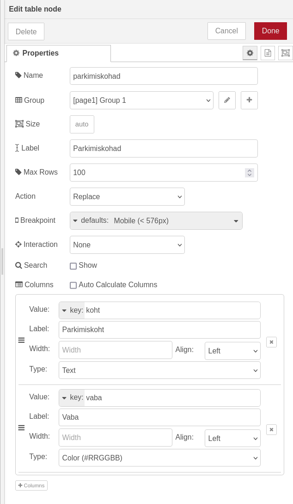
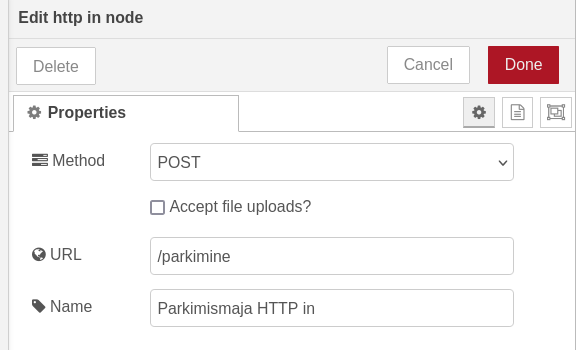
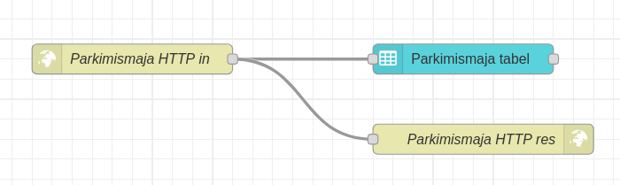
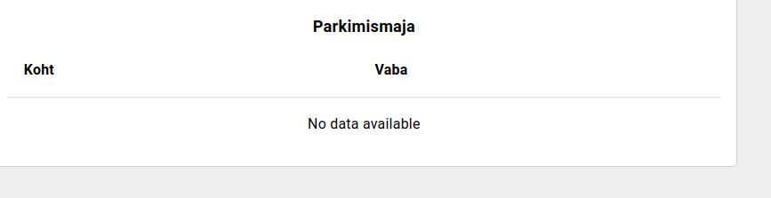

Teeme seekord kõigepealt valmis Node-RED poole. Paneme käima Node-RED(*docker start TarkLinn* või *sudo docker start TarkLinn)* ning läheme veebilehitsejas aadressile *localhost:1880*.

Võrreldes eelmise õpetusega on seekord Node-RED pool märksa lihtsam. Leia vasakult menüüst sõlm nimega *table*(*dashboard 2* sektsioonis) ning tiri see keskele(Jäta vasakule poole natuke ruumi\!). Tee sõlme peal topeltklikk, et avada menüü tabeli sätete muutmiseks. Paneme tabeli nimeks “parkimismaja tabel” ja sildiks(*label*) “parkimismaja”. *Max Rows* väärtuseks paneme 100\.  *Action* rippmenüüst vali “*Replace*”. *Search* valikus võta ära märge *Show* ning *Columns* valikus märge *Auto Calculate Columns*. 

Menüüse ilmub uus valik, millega saad lisada tabelisse tulpasi. Lisa kaks tulpa: esimese väärtuseks saab *key:koht*, sildiks “Koht” ja tüübiks *text*. Teise tulba väärtuseks saab *key:vaba*, sildiks “Vaba” ning tüübiks *“Color(\#RRGGBB)”.*

Loome HTTP päringu sõlme. Leia vasakult menüüst sõlm nimega *http in* ja tiri see keskele. Paneme sõlme meetodiks POST, URL-iks /parkimine ja nimeks *Parkimismaja HTTP in*.

Lisame ka *http response* sõlme, et HTTP päringut tehes ESP32 saaks vastuse, et päring oli edukas. Paneme sõlme nimeks Parkimismaja HTTP res ning koodiks 200\.

Ühendame *Parkimismaja HTTP in* sõlme enda tehtud tabeli ning *HTTP response* sõlmedega.

Kui me nüüd *Deploy* vajutame ja läheme aadressile *localhost:1880/dashboard*, näeme, et tabeli päised on olemas, aga tabelis infot veel ei ole.

Et tabelisse infot kuvada, paneme ESP32 HTTP POST päringuid tegema.

[ESP32 HTTP info saatmine](./esp32-http)