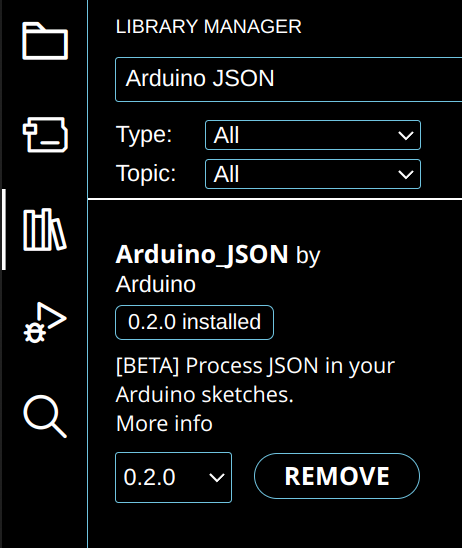
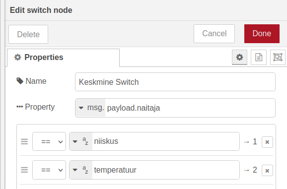
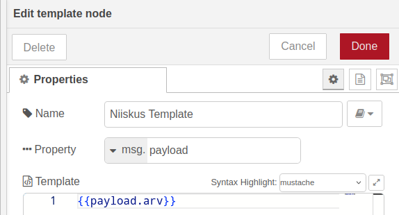
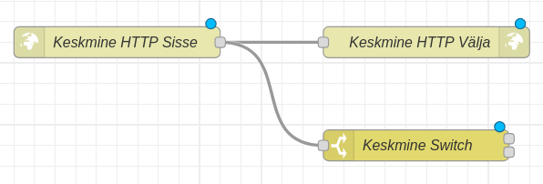
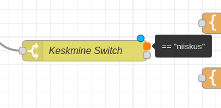
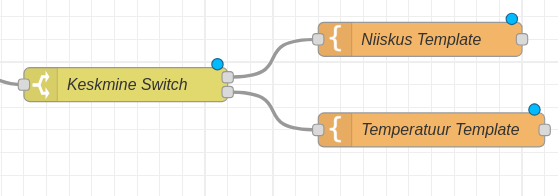
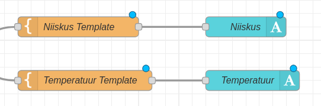
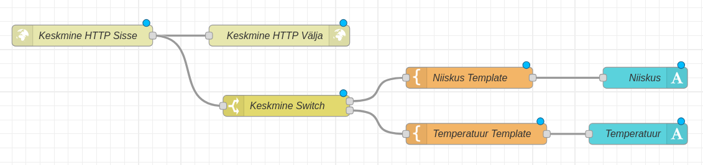

Siiamaani oleme tutvunud ESP32 kasutamisega HTTP kliendina, mis teeb päringuid. ESP32 on võimalik ka kasutada (suhteliselt väikse) HTTP serverina, mis suudab päringutele vastata.

Õhuandurite kasutamisega tutvusime 4\. õpetuses, kus panime ESP32 saatma infot enda anduri kohta. Loome siin õpetuses 2 ESP32 HTTP serverit, mis päringut saades tagastavad info enda õhuandurite mõõdikute kohta, ning ühe ESP32 HTTP kliendi, mis pärib info ESP32 HTTP serveritest, arvutab nende saadetud õhuniiskuse ja temperatuuri keskmise, ning saadab selle info Node-RED dashboardile.

Selles õpetuses läheb vaja kolme ESP32 arenduslauda, kahte DHT11, DHT21 või DHT22 andurit ja kahte 10k oomist takistit.

Joonised esimesest ning teisest ESP32 mudelist on identsed 4\. õpetuses oleva joonisega:


Kolmanda ESP32-ga pole vaja midagi ühendada.

Teeme kõigepealt valmis ESP32 veebiserverid. 

Deklareerime teegid, mida kasutame, ning wifi nime ja parooli.

```cpp
#include <WiFi.h>
#include <NetworkClient.h>
#include <WebServer.h>
#include <ESPmDNS.h>
#include "DHT.h"

const char *ssid = "wifi-nimi";
const char *password = "wifi-parool";
```

Loome WebServer objekti, mis hakkab tööle pordil 80, ning määrame HTTP serverile nime.

```cpp
WebServer server(80);
String serverName = "esp32-sensor-1";
```

Defineerime DHT sensori jaoks vajalikud muutujad - DHT sensori tüübi, pin-i, millega sensor on ühendatud, ning ujuvkomaarv tüüpi muutujad, milles hakkame talletama sensori näite.

```cpp
#define DHTTYPE DHT11
const int DhtPin = 4;

float niiskus;
float temperatuur;

DHT dht(DhtPin, DHTTYPE);
```

Loome funktsiooni *httpTemperatuur*. Funktsiooni käivitamisel loeb ESP32 DHT sensorist saadud temperatuuri ning väljastab selle info serverile HTTP koodiga 200 \- OK. Kui sensorist loetud info ei ole arv, väljastatakse serverile HTTP kood 502 \- *Bad Gateway* ning veateade.

```cpp
void httpTemperatuur(){
 temperatuur = dht.readTemperature();

 if(isnan(temperatuur)){
   server.send(502, "text/plain", "error reading temperature");
   return;
 }

 server.send(200, "text/plain", String(temperatuur));
}
```

Loome analoogse funktsiooni ka õhuniiskuse mõõtmiseks.

```cpp
void httpNiiskus(){
 niiskus = dht.readHumidity();

 if(isnan(niiskus)){
   server.send(502, "text/plain", "error reading humidity");
   return;
 }

 server.send(200, "text/plain", String(niiskus));
}
```

Liigume setup() funktsiooni juurde. Alustame Serial Monitori, loome wifi ühenduse, ja prindime Serial Monitori info wifi kohta, millega oleme ühendatud, ning ESP32 lokaalse IP.

```cpp
void setup() {
 Serial.begin(115200);
 WiFi.begin(ssid, password);

 while (WiFi.status() != WL_CONNECTED) {
   delay(500);
   Serial.print(".");
 }
 Serial.println("");
 Serial.print("Connected to ");
 Serial.println(ssid);
 Serial.print("IP address: ");
 Serial.println(WiFi.localIP());

}
```

ESP32 HTTP serverile on võimalik teha päringuid, kasutades ESP32 lokaalset IP-d, kuid ESP32 IP võib iga kord WiFi-ga ühendudes muutuda, ning iga kord ESP32 uue võrguga ühendamisel Serial Monitorist hakata ESP32 IP-d vaatama ei ole kuigi mugav ega praktiline. Pealegi on paljude ESP32-de puhul tüütu ja keeruline igaühe IP aadressi meeles pidada. 

Et oma elu lihtsamaks teha, kasutame MDNS-i ehk **M**ulticast **DNS**. Tegu on protokolliga, mille abil lokaalses võrgus olev seade saab enda nime ja IP aadressi saata kõikidele teistele seadmetele, mis võrgus on, ilma, et vaja oleks keskset DNS serverit. 

Alustame ESP32-s MDNS-i, kasutades nime, mille me programmi alguses ESP32-le andsime.

```cpp
if (MDNS.begin(serverName)) {
	Serial.println("MDNS responder started");
}
```

Järgmisena ütleme ESP32-le, mida teha erinevate päringute korral. Päring /temperatuur käivitab varem tehtud httpTemperatuur funktsiooni, ning päring /niiskus käivitab varem tehtud httpNiiskus funktsiooni. Kui päringule ei ole lisatud midagi, tagastab ESP32 info, et tegu on DHT sensor serveriga.

```cpp
server.on("/temperatuur", httpTemperatuur);

server.on("/niiskus", httpNiiskus);

server.on("/", []() {
	server.send(200, "text/plain", "esp32 DHT sensor server");
});
```

Paneme serveri käima ning prindime selle kohta info ka Serial Monitori.

```cpp
server.begin();

Serial.println("HTTP server started");
```

Terve setup funktsioon näeb välja selline:

```cpp
void setup() {
 Serial.begin(115200);
 WiFi.begin(ssid, password);

 while (WiFi.status() != WL_CONNECTED) {
   delay(500);
   Serial.print(".");
 }
 Serial.println("");
 Serial.print("Connected to ");
 Serial.println(ssid);
 Serial.print("IP address: ");
 Serial.println(WiFi.localIP());

 if (MDNS.begin(serverName)) {
   Serial.println("MDNS responder started");
 }

 server.on("/temperatuur", httpTemperatuur);

 server.on("/niiskus", httpNiiskus);

 server.on("/", []() {
   server.send(200, "text/plain", "esp32 DHT sensor server");
 });

 server.begin();
 Serial.println("HTTP server started");
}
```

loop funktsioonis kutsume välja ainult WebServer teeki sisseehitatud funktsiooni *server.handleClient,* mille abil ESP32 hakkab päringuid vastu võtma, ning lisame väikse *delay*, et vältida ESP32 üle koormamist pidevalt ainult päringute vastu võtmisega.

```cpp
void loop() {
 server.handleClient();
 delay(2);
}
```

Terve programm näeb välja selline:

```cpp
#include <WiFi.h>
#include <NetworkClient.h>
#include <WebServer.h>
#include <ESPmDNS.h>
#include "DHT.h"

const char *ssid = "wifi-nimi";
const char *password = "wifi-parool";

WebServer server(80);
String serverName = "esp32-sensor-1";

#define DHTTYPE DHT11
const int DhtPin = 4;

float niiskus;
float temperatuur;

DHT dht(DhtPin, DHTTYPE);

void httpTemperatuur(){
 temperatuur = dht.readTemperature();

 if(isnan(temperatuur)){
   server.send(502, "text/plain", "error reading temperature");
   return;
 }

 server.send(200, "text/plain", String(temperatuur));
}

void httpNiiskus(){
 niiskus = dht.readHumidity();

 if(isnan(niiskus)){
   server.send(502, "text/plain", "error reading humidity");
   return;
 }

 server.send(200, "text/plain", String(niiskus));
}

void setup() {
 Serial.begin(115200);
 WiFi.begin(ssid, password);

 while (WiFi.status() != WL_CONNECTED) {
   delay(500);
   Serial.print(".");
 }
 Serial.println("");
 Serial.print("Connected to ");
 Serial.println(ssid);
 Serial.print("IP address: ");
 Serial.println(WiFi.localIP());

 if (MDNS.begin(serverName)) {
   Serial.println("MDNS responder started");
 }

 server.on("/temperatuur", httpTemperatuur);

 server.on("/niiskus", httpNiiskus);

 server.on("/", []() {
   server.send(200, "text/plain", "esp32 DHT sensor server");
 });

 server.begin();
 Serial.println("HTTP server started");
}

void loop() {
 server.handleClient();
 delay(2);
}
```

Samasuguse koodi paneme ka teise ESP32 peale, mis on DHT sensoriga ühendatud, kuid muudame ära serverName muutuja.

```cpp
#include <WiFi.h>
#include <NetworkClient.h>
#include <WebServer.h>
#include <ESPmDNS.h>
#include "DHT.h"

const char *ssid = "wifi-nimi";
const char *password = "wifi-parool";

WebServer server(80);
String serverName = "esp32-sensor-2";

#define DHTTYPE DHT11
const int DhtPin = 4;

float niiskus;
float temperatuur;

DHT dht(DhtPin, DHTTYPE);

void httpTemperatuur(){
 temperatuur = dht.readTemperature();

 if(isnan(temperatuur)){
   server.send(502, "text/plain", "error reading temperature");
   return;
 }

 server.send(200, "text/plain", String(temperatuur));
}

void httpNiiskus(){
 niiskus = dht.readHumidity();

 if(isnan(niiskus)){
   server.send(502, "text/plain", "error reading humidity");
   return;
 }

 server.send(200, "text/plain", String(niiskus));
}

void setup() {
 Serial.begin(115200);
 WiFi.begin(ssid, password);

 while (WiFi.status() != WL_CONNECTED) {
   delay(500);
   Serial.print(".");
 }
 Serial.println("");
 Serial.print("Connected to ");
 Serial.println(ssid);
 Serial.print("IP address: ");
 Serial.println(WiFi.localIP());

 if (MDNS.begin(serverName)) {
   Serial.println("MDNS responder started");
 }

 server.on("/temperatuur", httpTemperatuur);

 server.on("/niiskus", httpNiiskus);

 server.on("/", []() {
   server.send(200, "text/plain", "esp32 DHT sensor server");
 });

 server.begin();
 Serial.println("HTTP server started");
}

void loop() {
 server.handleClient();
 delay(2);
}
```

Liigume edasi kolmanda ESP32 juurde, mis pärib ESP32 serveritelt temperatuuri ja niiskuse andmeid, arvutab nende keskmised, ning edastab keskmise temperatuuri ja niiskuse Node-Red-ile. 

Hakkame keskmist temperatuuri edastama JSON objektina. Ühe JSON objekti tegime manuaalselt 3\. õpetuses, kuid tunduvalt kergem on JSON objekte luua kasutades välist teeki *Arduino\_JSON*. Selle saame installida vasakul olevast *Library manager* menüüst.



Paneme kõigepealt kirja teegid, mida kasutame, wifi andmed, Node Red URL-i(Ehk arvuti IP, kus Node-RED jookseb, pordi 1880, ning /keskmine - selle lisame hiljem Node-RED-is). Paneme kirja ka ESP32 serverite aadressid ja paneme need massiivi. Samuti arvutame välja massiivi suuruse.

```cpp
#include <WiFi.h>
#include <HTTPClient.h>
#include <Arduino_JSON.h>

const char* ssid = "wifi-nimi";
const char* password = "wifi-parool";

const char* nodeRedUrl = "http://192.168.1.30:1880/keskmine";

String esp1 = "http://esp32-sensor-1.local";
String esp2 = "http://esp32-sensor-2.local";

String espSaatjad[2] = {esp1, esp2};
int saatjateArv = sizeof(espSaatjad) / sizeof(espSaatjad[0]);
```

Loome 4 ujuvkomaarvu tüüpi muutujat: keskmineTemp, keskmineNiiskus, viimaneKeskmineTemp ja viimaneKeskmineNiiskus. 2 viimase muutuja väärtuseks paneme 0.

```cpp
float keskmineTemp, keskmineNiiskus;
float viimaneKeskmineTemp = 0;
float viimaneKeskmineNiiskus = 0;
```

Teeme funktsiooni keskmineParing, millega kogume infot ESP32 serveritelt temperatuuri ning niiskuse kohta ja arvutame nende keskmise. Kõigilt serveritelt info kogumiseks kasutame *for* tsüklit.

```cpp
void keskmineParing(){
 keskmineTemp = 0;
 keskmineNiiskus = 0;

 for(int i = 0; i < saatjateArv; i++){
   String niiskusParing = espSaatjad[i] + "/niiskus";
   String niiskusString = httpParing(niiskusParing);
   float niiskus = niiskusString.toFloat();
   keskmineNiiskus = keskmineNiiskus + niiskus;

   String temperatuurParing = espSaatjad[i] + "/temperatuur";
   String temperatuurString = httpParing(temperatuurParing);
   float temperatuur = temperatuurString.toFloat();
   keskmineTemp = keskmineTemp + temperatuur;
 }
 keskmineNiiskus = keskmineNiiskus / saatjateArv;
 keskmineTemp = keskmineTemp / saatjateArv;
 Serial.print("Keskmine niiskus: ");
 Serial.println(keskmineNiiskus);
 Serial.print("Keskmine temperatuur: ");
 Serial.println(keskmineTemp);
}
```

Järgmisena loome funktsiooni httpParing, mille abil hakkame tegema HTTP päringuid. Funktsioon tagastab sõnena päringu vastuse.

```cpp
String httpParing(String paringUrl){
 WiFiClient client;
 HTTPClient http;

 http.begin(client, paringUrl);

 int responseCode = http.GET();

 if(responseCode > 0){
   if(responseCode == 200){
     return http.getString();
   }
 }
 else {
   Serial.print("Error code: ");
   Serial.println(responseCode);
 }
 http.end();
}
```

Järgmisena loome funktsiooni *httpKeskminePost*, mis võtab argumentidena näidiku, mille keskmise kohta infot edastame, ning arvu, mis on ESP32 välja arvutatud keskmine.

Loome JSON objekti keskmine\_json, WiFiClient-i ja HTTPClient-i.

```cpp
void httpKeskminePost(String naidik, String arv){
 JSONVar keskmine_json;
 WiFiClient client;
 HTTPClient http;

}
```

Alustame HTTP päringut ja lisame päringu päisesse info, et edastame JSON vormis infot.

```cpp
http.begin(client, nodeRedUrl);

http.addHeader("Content-Type", "application/json");
```

Lisame funktsiooni argumendid JSON objekti, ja edastame sõne kujul JSON objekti HTTP POST päringuga. Prindime HTTP vastuse koodi Serial Monitori ning lõpetame HTTP päringu.

```cpp
keskmine_json["naitaja"] = naidik;
keskmine_json["arv"] = arv;

int httpResponseCode = http.POST(JSON.stringify(keskmine_json));
Serial.print("HTTP response code: ");
Serial.println(httpResponseCode);

http.end();
```

Terve httpKeskminePost päring näeb välja selline:

```cpp
void httpKeskminePost(String naidik, String arv){
 JSONVar keskmine_json;
 WiFiClient client;
 HTTPClient http;

 http.begin(client, nodeRedUrl);

 http.addHeader("Content-Type", "application/json");

 keskmine_json["naitaja"] = naidik;
 keskmine_json["arv"] = arv;

 int httpResponseCode = http.POST(JSON.stringify(keskmine_json));
 Serial.print("HTTP response code: ");
 Serial.println(httpResponseCode);

 http.end();
}
```

Liigume setup funktsiooni juurde. Käivitame Serial Monitori, alustame WiFi ühendust, ja prindime ühenduse kohta info Serial Monitori.

```cpp
void setup() {
 Serial.begin(115200);
 WiFi.begin(ssid, password);

 Serial.print("Connecting...");
   while(WiFi.status() != WL_CONNECTED){
   delay(500);
   Serial.print(".");
 }
 Serial.println("Wifi connected!");
}
```

Viimasena paneme kirja loop funktsiooni. Kõigepealt kutsume välja keskmineParing funktsiooni, et arvutada välja keskmine õhutemperatuur ja niiskus.

```cpp
void loop() {
 keskmineParing();

}
```

Võrdleme viimast salvestatud keskmist temperatuuri praeguse keskmise temperatuuriga. Kui viimati salvestatud keskmine temperatuur erineb praegusest, saadame HTTP POST päringu praeguse keskmise temperatuuriga ja salvestame selle viimati saadetud keskmise temperatuurina.

```cpp
if(viimaneKeskmineTemp != keskmineTemp){
  httpKeskminePost("temperatuur", String(keskmineTemp));
  viimaneKeskmineTemp = keskmineTemp;
}
```

Teeme sama ka viimase salvestatud keskmise niiskuse ja praeguse keskmise niiskusega.

```cpp
if(viimaneKeskmineNiiskus != keskmineNiiskus){
  httpKeskminePost("niiskus", String(keskmineNiiskus));
  viimaneKeskmineNiiskus = keskmineNiiskus;
}
```

Lõpuks lisame 5 sekundilise delay päringute vahele.

```cpp
delay(5000);
```

Terve loop funktsioon näeb välja selline:

```cpp
void loop() {
 keskmineParing();
 if(viimaneKeskmineTemp != keskmineTemp){
   httpKeskminePost("temperatuur", String(keskmineTemp));
   viimaneKeskmineTemp = keskmineTemp;
 }
 if(viimaneKeskmineNiiskus != keskmineNiiskus){
   httpKeskminePost("niiskus", String(keskmineNiiskus));
   viimaneKeskmineNiiskus = keskmineNiiskus;
 }
 delay(5000);
}
```

Terve programm näeb välja selline:

```cpp
#include <WiFi.h>
#include <HTTPClient.h>
#include <Arduino_JSON.h>

const char* ssid = "wifi-nimi";
const char* password = "wifi-parool";

const char* nodeRedUrl = "http://192.168.1.30:1880/keskmine";

String esp1 = "http://esp32-sensor-1.local";
String esp2 = "http://esp32-sensor-2.local";

String espSaatjad[2] = {esp1, esp2};
int saatjateArv = sizeof(espSaatjad) / sizeof(espSaatjad[0]);

float keskmineTemp, keskmineNiiskus;
float viimaneKeskmineTemp = 0;
float viimaneKeskmineNiiskus = 0;

void keskmineParing(){
 keskmineTemp = 0;
 keskmineNiiskus = 0;

 for(int i = 0; i < saatjateArv; i++){
   String niiskusParing = espSaatjad[i] + "/niiskus";
   String niiskusString = httpParing(niiskusParing);
   float niiskus = niiskusString.toFloat();
   keskmineNiiskus = keskmineNiiskus + niiskus;

   String temperatuurParing = espSaatjad[i] + "/temperatuur";
   String temperatuurString = httpParing(temperatuurParing);
   float temperatuur = temperatuurString.toFloat();
   keskmineTemp = keskmineTemp + temperatuur;
 }
 keskmineNiiskus = keskmineNiiskus / saatjateArv;
 keskmineTemp = keskmineTemp / saatjateArv;
 Serial.print("Keskmine niiskus: ");
 Serial.println(keskmineNiiskus);
 Serial.print("Keskmine temperatuur: ");
 Serial.println(keskmineTemp);
}

String httpParing(String paringUrl){
 WiFiClient client;
 HTTPClient http;

 http.begin(client, paringUrl);

 int responseCode = http.GET();

 if(responseCode > 0){
   if(responseCode == 200){
     return http.getString();
   }
 }
 else {
   Serial.print("Error code: ");
   Serial.println(responseCode);
 }
 http.end();
}

void httpKeskminePost(String naidik, String arv){
 JSONVar keskmine_json;
 WiFiClient client;
 HTTPClient http;

 http.begin(client, nodeRedUrl);

 http.addHeader("Content-Type", "application/json");

 keskmine_json["naitaja"] = naidik;
 keskmine_json["arv"] = arv;

 int httpResponseCode = http.POST(JSON.stringify(keskmine_json));
 Serial.print("HTTP response code: ");
 Serial.println(httpResponseCode);

 http.end();
}

void setup() {
 Serial.begin(115200);
 WiFi.begin(ssid, password);

 Serial.print("Connecting...");
   while(WiFi.status() != WL_CONNECTED){
   delay(500);
   Serial.print(".");
 }
 Serial.println("Wifi connected!");
}

void loop() {
 keskmineParing();
 if(viimaneKeskmineTemp != keskmineTemp){
   httpKeskminePost("temperatuur", String(keskmineTemp));
   viimaneKeskmineTemp = keskmineTemp;
 }
 if(viimaneKeskmineNiiskus != keskmineNiiskus){
   httpKeskminePost("niiskus", String(keskmineNiiskus));
   viimaneKeskmineNiiskus = keskmineNiiskus;
 }
 delay(5000);
}
```

Laeme programmi kolmandale ESP32-le ja liigume Node-Red juurde.

Leiame Node-Red vasakult menüüst *http in* sõlme, paneme meetodiks POST, URL-iks /keskmine , ja nimeks Keskmine HTTP Sisse.


Leiame ka *http response* sõlme. Paneme staatusekoodiks 200 ja nimeks Keskmine HTTP Välja.


Järgmisena leiame *Switch* sõlme, mille abil suuname HTTP päringuga saadetud väärtuse olenevalt sellest, kas tegu on keskmise õhuniiskuse või temperatuuriga. *Switch* sõlmed toimivad Node-RED-is tingimuslausetena. *Switch* sõlme nimeks paneme Keskmine Switch, võrreldavaks muutujaks *msg.payload.naitaja*, esimeseks tingimuseks *\==niiskus* ja teiseks *\==temperatuur*.



Seejärel loome kaks identset *Template* sõlme. Mõlemas paneme muudetavaks omaduseks *msg.payload* ning *Template* väärtuseks *{{payload.arv}}*. Nii paneme HTTP laadungi väärtuseks ainult arvu, mida me soovime *dashboard*\-il näidata.

Paneme esimese *Template* sõlme nimeks Niiskus Template ja teise nimeks Temperatuur Template.




Samuti loome kaks *text* sõlme. Esimese nimeks ja sildiks saab Niiskus ja teise nimeks ja sildiks Temperatuur.


Ühendame *Keskmine HTTP Sisse* sõlme *Keskmine HTTP Välja* ning *Keskmine Switch* sõlmedega.



Näeme, et *Keskmine Switch* sõlmel on kaks kohta, kust on võimalik väljaminevaid ühendusi luua. Ülemise kohaga liigutakse edasi, kui on täidetud tingimuslause “naitaja \== niiskus”, ning alumise kohaga, kui on täidetud tingimuslause “naitaja \== temperatuur”. Tingimuslauset, mille puhul edasi liigutakse, saab näha, hoides kursorit ühenduskoha peal.



Ühendame ülemise ühenduskoha *Niiskus Template* sõlmega, ning alumise *Temperatuur Template* sõlmega.



Viimasena ühendame *Niiskus Template* ja *Temperatuur Template* vastavate tekstivälja sõlmedega.





Kui me nüüd Node-RED üleval paremas nurgas *Deploy* nuppu vajutame ja läheme Node-RED *Dashboard*\-ile, näeme ESP32 edastatud keskmist temperatuuri ning õhuniiskust.


**Iseseisvaks nuputamiseks:**  
- Lisa Node-RED-i näidik, kus on näha ESP32 serverite arvu, mille andmetest keskmine arvutatakse.

**Kasutatud allikad:**
- [https://lastminuteengineers.com/esp32-mdns-tutorial/](https://lastminuteengineers.com/esp32-mdns-tutorial/)   
- [https://developer.mozilla.org/en-US/docs/Web/HTTP/Reference/Status](https://developer.mozilla.org/en-US/docs/Web/HTTP/Reference/Status)


[Järgmine õpetus](../WebSocket-1/)