Leiame Node-Red vasakult menüüst *http in* sõlme, paneme meetodiks POST, URL-iks /keskmine , ja nimeks Keskmine HTTP Sisse.

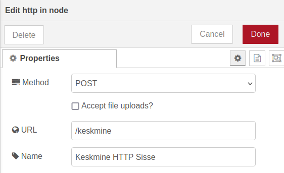

Leiame ka *http response* sõlme. Paneme staatusekoodiks 200 ja nimeks Keskmine HTTP Välja.

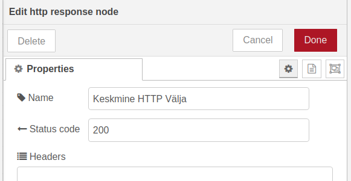

Järgmisena leiame *Switch* sõlme, mille abil suuname HTTP päringuga saadetud väärtuse olenevalt sellest, kas tegu on keskmise õhuniiskuse või temperatuuriga. *Switch* sõlmed toimivad Node-RED-is tingimuslausetena. *Switch* sõlme nimeks paneme Keskmine Switch, võrreldavaks muutujaks *msg.payload.naitaja*, esimeseks tingimuseks *\==niiskus* ja teiseks *\==temperatuur*.

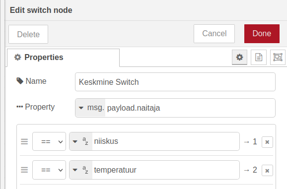

Seejärel loome kaks identset *Template* sõlme. Mõlemas paneme muudetavaks omaduseks *msg.payload* ning *Template* väärtuseks *{{payload.arv}}*. Nii paneme HTTP laadungi väärtuseks ainult arvu, mida me soovime *dashboard*\-il näidata.

Paneme esimese *Template* sõlme nimeks Niiskus Template ja teise nimeks Temperatuur Template.

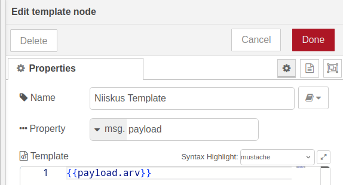

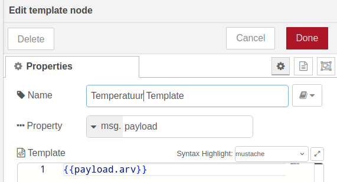

Samuti loome kaks *text* sõlme. Esimese nimeks ja sildiks saab Niiskus ja teise nimeks ja sildiks Temperatuur.

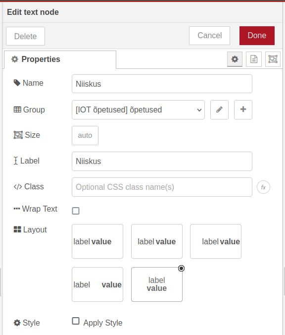

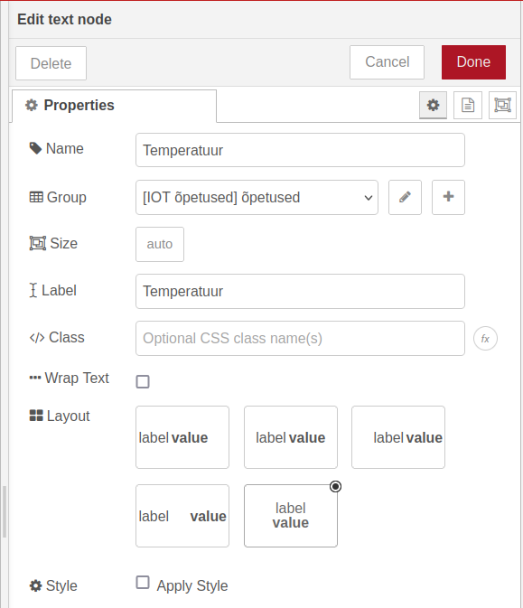

Ühendame *Keskmine HTTP Sisse* sõlme *Keskmine HTTP Välja* ning *Keskmine Switch* sõlmedega.

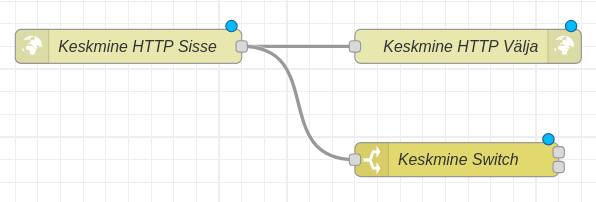

Näeme, et *Keskmine Switch* sõlmel on kaks kohta, kust on võimalik väljaminevaid ühendusi luua. Ülemise kohaga liigutakse edasi, kui on täidetud tingimuslause “naitaja \== niiskus”, ning alumise kohaga, kui on täidetud tingimuslause “naitaja \== temperatuur”. Tingimuslauset, mille puhul edasi liigutakse, saab näha, hoides kursorit ühenduskoha peal.

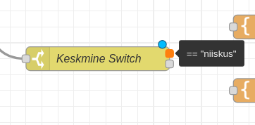

Ühendame ülemise ühenduskoha *Niiskus Template* sõlmega, ning alumise *Temperatuur Template* sõlmega.

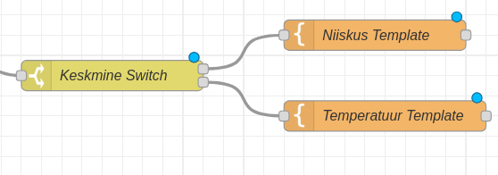

Viimasena ühendame *Niiskus Template* ja *Temperatuur Template* vastavate tekstivälja sõlmedega.

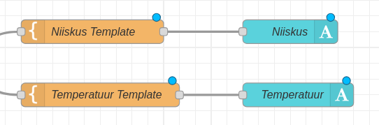

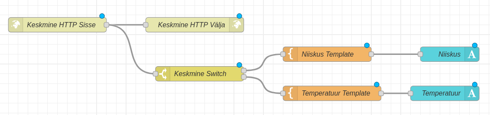

Kui me nüüd Node-RED üleval paremas nurgas *Deploy* nuppu vajutame ja läheme Node-RED *Dashboard*\-ile, näeme ESP32 edastatud keskmist temperatuuri ning õhuniiskust.

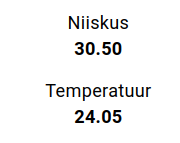

**Iseseisvaks nuputamiseks:**  
- Lisa Node-RED-i näidik, kus on näha ESP32 serverite arvu, mille andmetest keskmine arvutatakse.

[Järgmine õpetus](../WebSocket-1/)