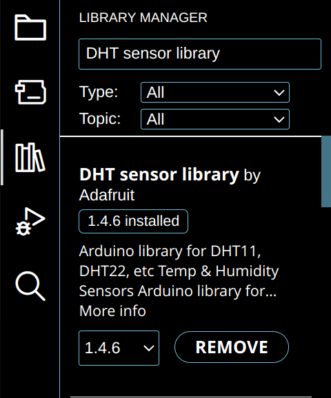

Paneme kõigepealt maketeerimislaual mudeli kokku. Joonis mudelist näeb välja selline:


- Ühendame 10k oomise takisti DHT anduri 1. ja 2. jalaga
- Ühendame DHT anduri 1. jala ESP32 5v pin-iga
- Ühendame DHT anduri 2. jala ESP32 5. pin-iga
- Ühendame DHT anduri 4. jala ESP32 maandusega
- Jätame DHT anduri 3. jala tühjaks

Mõndadel DHT anduritel on 4 jala asemel 3 jalga. Sellisel juhul on 1. ning 2. jala ühendused samad, kuid maanduse ühendame 3. jalaga.
{: .info}

Avame arvutis Arduino IDE. DHT anduri kasutamiseks läheb meil vaja Adafruit DHT teeki. Selle installimiseks tee Arduino IDE-s lahti Library Manager ning sisesta otsingukasti “DHT sensor library”. Installi “DHT sensor library by Adafruit”.



Programmis ütleme kõigepealt, et kasutame DHT, WiFi ning PubSubClient teeke. Samuti anname ESP32-le oma wifi andmed, oma MQTT vahendaja IP, ESP32 nime, mille alt ta hakkab MQTT vahendajaga suhtlema, ning teemad, mille kohta me hakkame infot andma.

```cpp
#include "DHT.h"
#include <WiFi.h>
#include <PubSubClient.h>


const char* ssid = "wifi-nimi";
const char* password = "wifi-parool";


//Arvuti, kus Mosquitto jookseb, IP.
const char* MQTT_broker = "1.2.3.4";
//MQTT teemad
const char* MQTT_t_temperatuur = "temperatuur";
const char* MQTT_t_niiskus = "niiskus";
//Nimi, millega ESP32 MQTT ühendust loob. NB! Ühel MQTT vahendajal ei saa olla mitu sama nimega ühendust!
const char* espName = "ESP32-dht-1";
```

Samuti ütleme ära, kas me kasutame DHT11, DHT21, või DHT22 andurit. Siin näites on kasutatud DHT11 andurit.

```cpp
#define DHTTYPE DHT11
```

Deklareerime 5 muutujat: pin-i, millega DHT andur on ühendatud, ujuvkomaarvud temperatuuri ning õhuniiskuse jaoks, ja char massiivid, kuhu hakkame salvestama sõnumit, mida tahame MQTT-ga saata.

```cpp
const int DhtPin = 4;

float niiskus;
float temperatuur;
char niiskusChar[8];
char temperatuurChar[8];
```

Võtame kasutusele wifiClient, MQTTclient ning DHT klassid. DHT klassi loomisel kasutame pin-i, millega DHT andur on ühendatud, ja meie DHT anduri tüüpi.

```cpp
WiFiClient wifiClient;
PubSubClient MQTTclient(wifiClient);
DHT dht(DhtPin, DHTTYPE);
```

Loome kõigepealt funktsiooni, millega me loeme infot DHT andurist ning prindime selle Serial Monitori.

```cpp
void DHTlugemine(){
 // Temperatuuri ja niiskuse lugemine võtab umbes 250 millisekundit
 niiskus = dht.readHumidity();
 temperatuur = dht.readTemperature();


 // Kui loetud temperatuur või niiskus ei ole numbrid, prindime veateate ja lahkume funktsioonist
 if (isnan(temperatuur) || isnan(niiskus)) {
   Serial.println(F("Failed to read from DHT sensor!"));
   return;
 }


 Serial.print(F("Õhuniiskus: "));
 Serial.print(niiskus);
 Serial.print(F("%  Temperatuur: "));
 Serial.print(temperatuur);
 Serial.println(F("°C "));
}
```

Setup funktsioonis paneme käima serial monitori, wifi, ning dht klassid. Anname MQTT klassile info MQTT serveri ning pordi kohta(MQTT ühendus toimub vaikimisi 1883 pordi peal).

```cpp
void setup() {
 Serial.begin(115200);
 WiFi.begin(ssid, password);
 dht.begin();


 MQTTclient.setServer(MQTT_broker, 1883);
}
```

Loop funktsioonis vaatame kõigepealt *while*\-tsükliga, kas ESP32 on MQTT vahendajaga ühendatud. Programm proovib tsüklis MQTT ühendust luua senikaua, kuni see õnnestub.

```cpp
void loop() {
 while(!MQTTclient.connected()){
   Serial.println("Connecting MQTT...");


   if(MQTTclient.connect(espName)){
     Serial.println("Connected!");
   } else {
     //Kui MQTT ühendus ei õnnestu, prindime veakoodi.
     Serial.print("Connection failed. rc=");
     Serial.println(MQTTclient.state());
   }
 }
}
```

Kui ESP32 on MQTT vahendajaga ühendatud, käivitame varem tehtud DHT lugemise funktsiooni, mis annab väärtused ujuvkomaarv muutujatele *temperatuur* ning *niiskus*. Kui mõlema muutuja väärtuseks on number(s.t. andur on mingi väärtuse sisse lugenud), teeme sama väärtused char massiivi andmetüübiga muutujad, ning edastame enda varem defineeritud teemade kohta info MQTT vahendajale.

```cpp
 DHTlugemine();
 if(!isnan(temperatuur) && !isnan(niiskus)){
   Serial.println("MQTT info saatmine...");
   dtostrf(temperatuur, 1, 2, temperatuurChar);
   MQTTclient.publish(MQTT_t_temperatuur, temperatuurChar);
   dtostrf(niiskus, 1, 2, niiskusChar);
   MQTTclient.publish(MQTT_t_niiskus, niiskusChar);
 }
```

Miks me muutujatest char massiivid teeme? PubSubClient.publish funktsioon võtab vastu ainult char massiive. Arduino teekides on char massiivide kasutamine sõnede ehk stringide asemel tavaline. Char massiivid on C keeles primitiiivne andmestruktuur, kuid sõne(String \- selles kontekstis alati suure tähega\!) on klass C++ keeles. Sõne võtab rohkem süsteemiressursse, ning esp32-l ja teistel arenduslaudadel on võrreldes arvutitega, mida me igapäevaselt kasutame, muutmälu ja muid ressursse palju vähem.
{: .info}

Lõpuks lisame loop funktsiooni 2 sekundi pikkuse delay, enne kui me hakkame uuesti DHT andurist infot lugema ning seda MQTT vahendajale saatma.

```cpp
delay(2000);
```

Terve programm näeb välja selline:

```cpp
#include "DHT.h"
#include <WiFi.h>
#include <PubSubClient.h>


//Wifi nimi ning parool. NB! Mõlemad on tõstutundlikud!
const char* ssid = "wifi-nimi";
const char* password = "wifi-parool";


//Arvuti, kus Mosquitto jookseb, IP.
//Enda arvuti IP aadressi saad teada Linux-is hostname -I ning Windows-is ipconfig käsuga käsureal.
const char* MQTT_broker = "1.2.3.4";
//Deklareerime muutuja MQTT teema jaoks.
const char* MQTT_t_temperatuur = "temperatuur";
const char* MQTT_t_niiskus = "niiskus";
//Nimi, millega ESP32 MQTT ühendust loob. NB! Ühel MQTT vahendajal ei saa olla mitu sama nimega ühendust!
const char* espName = "ESP32-dht-1";


#define DHTTYPE DHT11


const int DhtPin = 4;


float niiskus;
float temperatuur;
char niiskusChar[8];
char temperatuurChar[8];


WiFiClient wifiClient;
PubSubClient MQTTclient(wifiClient);
DHT dht(DhtPin, DHTTYPE);


void DHTlugemine(){
 // Temperatuuri ja niiskuse lugemine võtab umbes 250 millisekundit
 niiskus = dht.readHumidity();
 temperatuur = dht.readTemperature();


 // Kui loetud temperatuur või niiskus ei ole numbrid, prindime veateate ja lahkume funktsioonist
 if (isnan(temperatuur) || isnan(niiskus)) {
   Serial.println(F("Failed to read from DHT sensor!"));
   return;
 }


 Serial.print(F("Õhuniiskus: "));
 Serial.print(niiskus);
 Serial.print(F("%  Temperatuur: "));
 Serial.print(temperatuur);
 Serial.println(F("°C "));
}


void setup() {
 Serial.begin(115200);
 WiFi.begin(ssid, password);
 dht.begin();


 MQTTclient.setServer(MQTT_broker, 1883);
}


void loop() {
 while(!MQTTclient.connected()){
   Serial.println("Connecting MQTT...");


   if(MQTTclient.connect(espName)){
     Serial.println("Connected!");
   } else {
     //Kui MQTT ühendus ei õnnestu, prindime veakoodi.
     Serial.print("Connection failed. rc=");
     Serial.println(MQTTclient.state());
   }
 }


 DHTlugemine();
 if(!isnan(temperatuur) && !isnan(niiskus)){
   Serial.println("MQTT info saatmine...");
   dtostrf(temperatuur, 1, 2, temperatuurChar);
   MQTTclient.publish(MQTT_t_temperatuur, temperatuurChar);
   dtostrf(niiskus, 1, 2, niiskusChar);
   MQTTclient.publish(MQTT_t_niiskus, niiskusChar);
 }
 // Ootame 2 sekundit enne järgmist mõõtmist
 delay(2000);
}
```

Kui esp32 peale on programm laetud, võime edasi liikuda Node-RED juurde.

[Node-RED-is MQTT teemade kohta info tellimine](./node-red-mqtt)