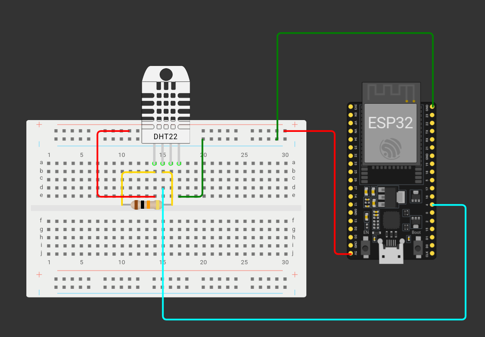
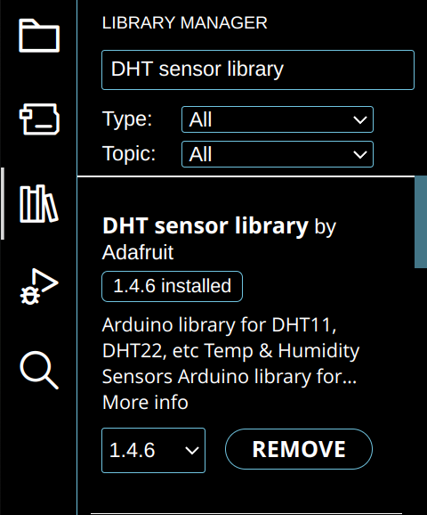
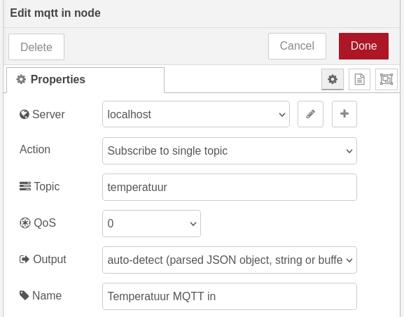
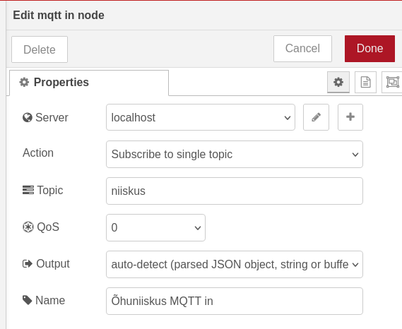
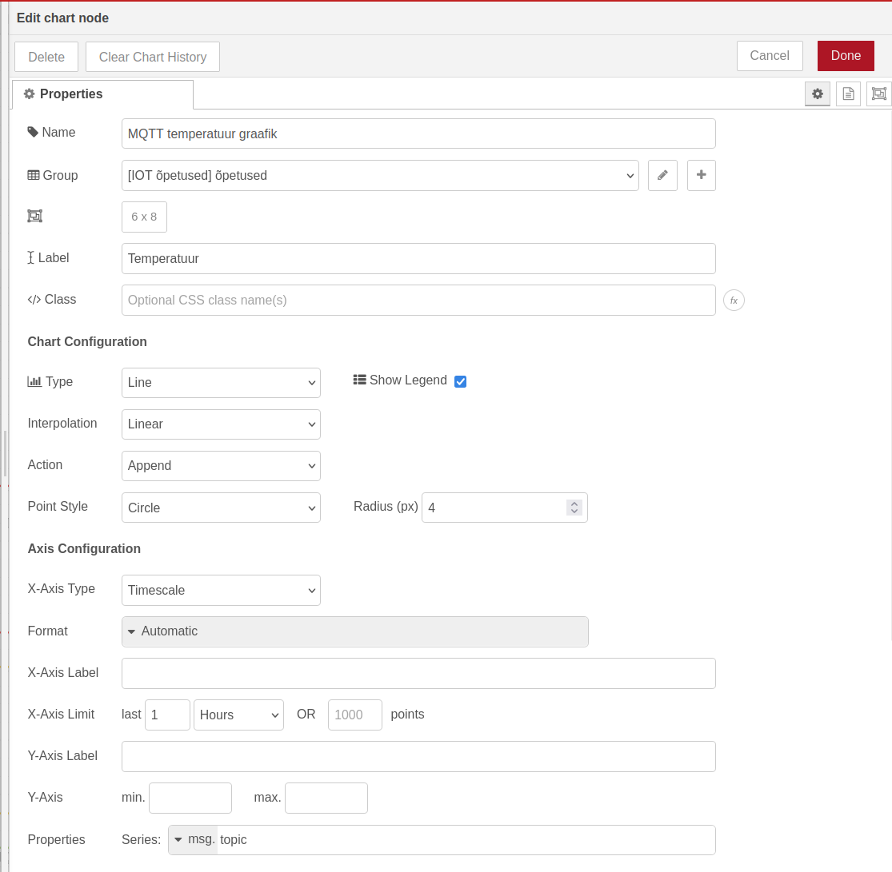
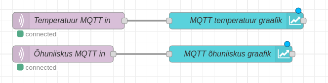
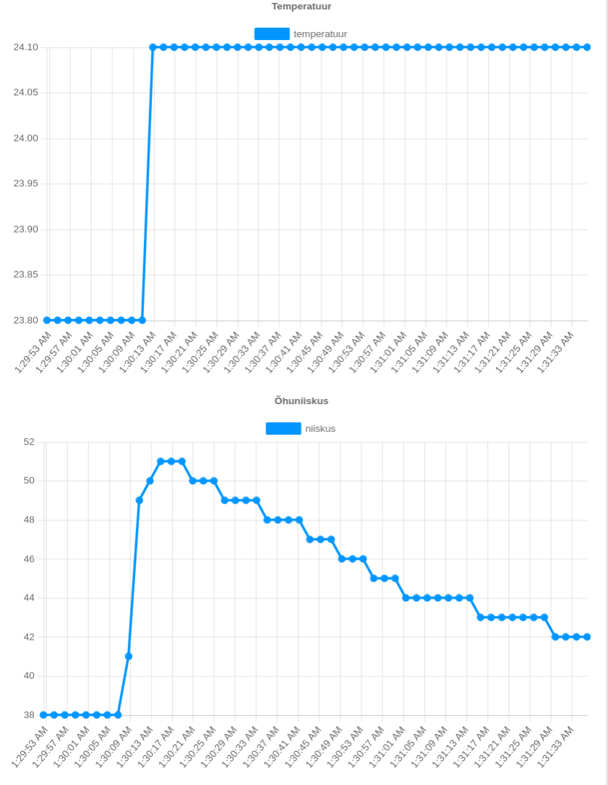

ESP32 abil on võimalik ka MQTT sõnumeid saata. Kuvame Node-RED dashboard-il infot meie linnas oleva temperatuuri ning õhuniiskuse kohta, kasutades MQTT protokolli ja DHT andurit.

Paneme kõigepealt maketeerimislaual mudeli kokku. Vaja läheb ühte DHT11, DHT21 või DHT22 andurit ja ühte 10k oomist takistit. Joonis mudelist näeb välja selline:



- Ühendame 10k oomise takisti DHT anduri 1. ja 2. jalaga
- Ühendame DHT anduri 1. jala ESP32 5v pin-iga
- Ühendame DHT anduri 2. jala ESP32 5. pin-iga
- Ühendame DHT anduri 4. jala ESP32 maandusega
- Jätame DHT anduri 3. jala tühjaks

Mõndadel DHT anduritel on 4 jala asemel 3 jalga. Sellisel juhul on 1. ning 2. jala ühendused samad, kuid maanduse ühendame 3. jalaga.
{: .info}

Avame arvutis Arduino IDE. DHT anduri kasutamiseks läheb meil vaja Adafruit DHT teeki. Selle installimiseks tee Arduino IDE-s lahti Library Manager ning sisesta otsingukasti “DHT sensor library”. Installi “DHT sensor library by Adafruit”.



Programmis ütleme kõigepealt, et kasutame DHT, WiFi ning PubSubClient teeke. Samuti anname ESP32-le oma wifi andmed, oma MQTT vahendaja IP, ESP32 nime, mille alt ta hakkab MQTT vahendajaga suhtlema, ning teemad, mille kohta me hakkame infot andma.

```cpp
#include "DHT.h"
#include <WiFi.h>
#include <PubSubClient.h>


const char* ssid = "wifi-nimi";
const char* password = "wifi-parool";


//Arvuti, kus Mosquitto jookseb, IP.
const char* MQTT_broker = "1.2.3.4";
//MQTT teemad
const char* MQTT_t_temperatuur = "temperatuur";
const char* MQTT_t_niiskus = "niiskus";
//Nimi, millega ESP32 MQTT ühendust loob. NB! Ühel MQTT vahendajal ei saa olla mitu sama nimega ühendust!
const char* espName = "ESP32-dht-1";
```

Samuti ütleme ära, kas me kasutame DHT11, DHT21, või DHT22 andurit. Siin näites on kasutatud DHT11 andurit.

```cpp
#define DHTTYPE DHT11
```

Deklareerime 5 muutujat: pin-i, millega DHT andur on ühendatud, ujuvkomaarvud temperatuuri ning õhuniiskuse jaoks, ja char massiivid, kuhu hakkame salvestama sõnumit, mida tahame MQTT-ga saata.

```cpp
const int DhtPin = 4;

float niiskus;
float temperatuur;
char niiskusChar[8];
char temperatuurChar[8];
```

Võtame kasutusele wifiClient, MQTTclient ning DHT klassid. DHT klassi loomisel kasutame pin-i, millega DHT andur on ühendatud, ja meie DHT anduri tüüpi.

```cpp
WiFiClient wifiClient;
PubSubClient MQTTclient(wifiClient);
DHT dht(DhtPin, DHTTYPE);
```

Loome kõigepealt funktsiooni, millega me loeme infot DHT andurist ning prindime selle Serial Monitori.

```cpp
void DHTlugemine(){
 // Temperatuuri ja niiskuse lugemine võtab umbes 250 millisekundit
 niiskus = dht.readHumidity();
 temperatuur = dht.readTemperature();


 // Kui loetud temperatuur või niiskus ei ole numbrid, prindime veateate ja lahkume funktsioonist
 if (isnan(temperatuur) || isnan(niiskus)) {
   Serial.println(F("Failed to read from DHT sensor!"));
   return;
 }


 Serial.print(F("Õhuniiskus: "));
 Serial.print(niiskus);
 Serial.print(F("%  Temperatuur: "));
 Serial.print(temperatuur);
 Serial.println(F("°C "));
}
```

Setup funktsioonis paneme käima serial monitori, wifi, ning dht klassid. Anname MQTT klassile info MQTT serveri ning pordi kohta(MQTT ühendus toimub vaikimisi 1883 pordi peal).

```cpp
void setup() {
 Serial.begin(115200);
 WiFi.begin(ssid, password);
 dht.begin();


 MQTTclient.setServer(MQTT_broker, 1883);
}
```

Loop funktsioonis vaatame kõigepealt *while*\-tsükliga, kas ESP32 on MQTT vahendajaga ühendatud. Programm proovib tsüklis MQTT ühendust luua senikaua, kuni see õnnestub.

```cpp
void loop() {
 while(!MQTTclient.connected()){
   Serial.println("Connecting MQTT...");


   if(MQTTclient.connect(espName)){
     Serial.println("Connected!");
   } else {
     //Kui MQTT ühendus ei õnnestu, prindime veakoodi.
     Serial.print("Connection failed. rc=");
     Serial.println(MQTTclient.state());
   }
 }
}
```

Kui ESP32 on MQTT vahendajaga ühendatud, käivitame varem tehtud DHT lugemise funktsiooni, mis annab väärtused ujuvkomaarv muutujatele *temperatuur* ning *niiskus*. Kui mõlema muutuja väärtuseks on number(s.t. andur on mingi väärtuse sisse lugenud), teeme sama väärtused char massiivi andmetüübiga muutujad, ning edastame enda varem defineeritud teemade kohta info MQTT vahendajale.

```cpp
 DHTlugemine();
 if(!isnan(temperatuur) && !isnan(niiskus)){
   Serial.println("MQTT info saatmine...");
   dtostrf(temperatuur, 1, 2, temperatuurChar);
   MQTTclient.publish(MQTT_t_temperatuur, temperatuurChar);
   dtostrf(niiskus, 1, 2, niiskusChar);
   MQTTclient.publish(MQTT_t_niiskus, niiskusChar);
 }
```

Miks me muutujatest char massiivid teeme? PubSubClient.publish funktsioon võtab vastu ainult char massiive. Arduino teekides on char massiivide kasutamine sõnede ehk stringide asemel tavaline. Char massiivid on C keeles primitiiivne andmestruktuur, kuid sõne(String \- selles kontekstis alati suure tähega\!) on klass C++ keeles. Sõne võtab rohkem süsteemiressursse, ning esp32-l ja teistel arenduslaudadel on võrreldes arvutitega, mida me igapäevaselt kasutame, muutmälu ja muid ressursse palju vähem.
{: .info}

Lõpuks lisame loop funktsiooni 2 sekundi pikkuse delay, enne kui me hakkame uuesti DHT andurist infot lugema ning seda MQTT vahendajale saatma.

```cpp
delay(2000);
```

Terve programm näeb välja selline:

```cpp
#include "DHT.h"
#include <WiFi.h>
#include <PubSubClient.h>


//Wifi nimi ning parool. NB! Mõlemad on tõstutundlikud!
const char* ssid = "wifi-nimi";
const char* password = "wifi-parool";


//Arvuti, kus Mosquitto jookseb, IP.
//Enda arvuti IP aadressi saad teada Linux-is hostname -I ning Windows-is ipconfig käsuga käsureal.
const char* MQTT_broker = "1.2.3.4";
//Deklareerime muutuja MQTT teema jaoks.
const char* MQTT_t_temperatuur = "temperatuur";
const char* MQTT_t_niiskus = "niiskus";
//Nimi, millega ESP32 MQTT ühendust loob. NB! Ühel MQTT vahendajal ei saa olla mitu sama nimega ühendust!
const char* espName = "ESP32-dht-1";


#define DHTTYPE DHT11


const int DhtPin = 4;


float niiskus;
float temperatuur;
char niiskusChar[8];
char temperatuurChar[8];


WiFiClient wifiClient;
PubSubClient MQTTclient(wifiClient);
DHT dht(DhtPin, DHTTYPE);


void DHTlugemine(){
 // Temperatuuri ja niiskuse lugemine võtab umbes 250 millisekundit
 niiskus = dht.readHumidity();
 temperatuur = dht.readTemperature();


 // Kui loetud temperatuur või niiskus ei ole numbrid, prindime veateate ja lahkume funktsioonist
 if (isnan(temperatuur) || isnan(niiskus)) {
   Serial.println(F("Failed to read from DHT sensor!"));
   return;
 }


 Serial.print(F("Õhuniiskus: "));
 Serial.print(niiskus);
 Serial.print(F("%  Temperatuur: "));
 Serial.print(temperatuur);
 Serial.println(F("°C "));
}


void setup() {
 Serial.begin(115200);
 WiFi.begin(ssid, password);
 dht.begin();


 MQTTclient.setServer(MQTT_broker, 1883);
}


void loop() {
 while(!MQTTclient.connected()){
   Serial.println("Connecting MQTT...");


   if(MQTTclient.connect(espName)){
     Serial.println("Connected!");
   } else {
     //Kui MQTT ühendus ei õnnestu, prindime veakoodi.
     Serial.print("Connection failed. rc=");
     Serial.println(MQTTclient.state());
   }
 }


 DHTlugemine();
 if(!isnan(temperatuur) && !isnan(niiskus)){
   Serial.println("MQTT info saatmine...");
   dtostrf(temperatuur, 1, 2, temperatuurChar);
   MQTTclient.publish(MQTT_t_temperatuur, temperatuurChar);
   dtostrf(niiskus, 1, 2, niiskusChar);
   MQTTclient.publish(MQTT_t_niiskus, niiskusChar);
 }
 // Ootame 2 sekundit enne järgmist mõõtmist
 delay(2000);
}
```

Avame enda arvutis Node-RED ja leiame vasakult menüüst *mqtt in* sõlme. Tirime selle keskele, paneme serveriks sama, mis eelmises õpetuses. Teemaks(*topic*) paneme “temperatuur”, teenuskvaliteediks(QoS) paneme 0, ning nimeks paneme “Temperatuur MQTT in”.



Loome veel ühe *mqtt in* sõlme, mille muud sätted on samad, kuid teemaks paneme “niiskus” ja nimeks paneme “Õhuniiskus MQTT in”.



Leiame vasakult menüüst *chart* sõlme ja toome selle keskele. Nimeks paneme “MQTT temperatuur graafik” ja sildiks(*label*) paneme “Temperatuur”.



Loome samasuguse sõlme ka õhuniiskuse jaoks. Ühendame *Temperatuur MQTT in* sõlme *MQTT temperatuur graafik* sõlmega ja *Õhuniiskus MQTT in* sõlme *MQTT õhuniiskus graafik* sõlmega.



Paneme enda arvutis käima Mosquitto, laeme tehtud programmi ESP32-le, ning vajutame Node-RED-is *Deploy*. Kui me nüüd läheme veebilehitsejas aadressile *localhost:1880/dashboard*, peaksime nägema graafikut temperatuuri ning õhuniiskuse kohta. Katsetamiseks võib proovida DHT anduri peale hingeõhku puhuda, et näha, kuidas temperatuur ning õhuniiskus selle peale muutub.




**Iseseisvaks nuputamiseks:**

 - Proovi panna veel mõned ESP32-d temperatuuri kohta infot saatma. Mis juhtub graafikuga? Tee iga ESP32 kohta eraldi graafik.  
 - Arvuta ESP32-s viimase 50 mõõdetud temperatuuri ja õhuniiskuse keskmine ning kasuta Node-RED dashboard 2 *text* sõlme, et neid *dashboard*\-il kuvada. (Vihje \- üks esp32 võib avaldata infot mitme teema kohta\!).

[Järgmine õpetus](../MQTT-turvalisus/)