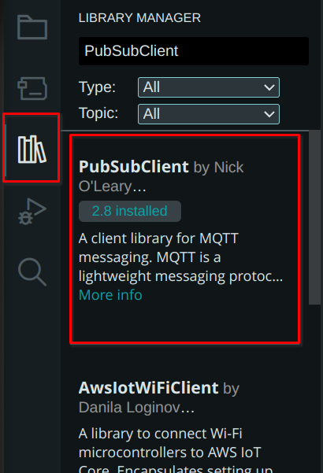

Kui Mosquitto on installitud ja tööle pandud, saame liikuda ESP32 programmeerimise juurde. 

Konstrueerime kõigepealt maketeerimislaua peal mudeli valmis. Esialgu on selleks vaja ühte LED tuld, kolme juhet, ning ühte 220 ohm takistit.

Joonis maketeerimislaual ühendamiseks:


Ühendused on:
- ESP32 pin 2 - 220 ohm resistor
- 220 ohm resistor - LED positiivne jalg(Pikem)
- LED negatiivne jalg(Lühem) - maandus

Avame Arduino IDE ning loome uue sketši. 

MQTT protokolliga suhtlemiseks läheb meil vaja välist teeki nimega PubSubClient. Et see installida, võta vasakult lahti “Library manager” ning kirjuta otsinguribale “PubSubClient”. Installi PubSubClient nimeline teek, mille autor on Nick O’Leary.



Liigume programmi juurde. Kõigepealt ütleme programmi alguses, et kasutame WiFi ning PubSubClient teeke.
```cpp
#include <WiFi.h>
#include <PubSubClient.h>
```

Järgmisena defineerime sarnaselt eelmistele õpetustele wifi nime ning parooli.
```cpp
const char* ssid = "wifi-nimi";
const char* password = "wifi-parool";
```

Seejärel defineerime MQTT vahendaja ehk masina IP, mille peal Mosquitto jookseb. Samuti defineerime teema, mille kohta me soovime infot saada, ning nime, millega ESP32 MQTT ühenduse loob. Pane tähele, et ühe MQTT vahendajaga ei saa olla ühendatud mitu sama nimega seadet\!
```cpp
const char* MQTT_broker = "1.2.3.4";
const char* MQTT_topic = "valgus";
const char* espName = "ESP32-valgus-1";
```

Meeldetuletus: Enda arvuti IP aadressi saad teada Linux-is *hostname \-I* ning Windows-is *ipconfig* käsuga käsureal. ESP32-le vajalik minev IP aadress **ei alga** numbritega 172\!
{: .important}

Järgmisena loome WiFiClient ning PubSubClient klassid, mille abil ESP32 hakkab MQTT protokolliga suhtlema. PubSubClient klassil on vaja WiFiClient klassi, et MQTT ühendust luua.
```cpp
WiFiClient wifiClient;
PubSubClient MQTTclient(wifiClient);
```

Deklareerime ka pin-i, millega meie LED on ühendatud.
```cpp
const int LEDpin = 2;
```

**setup** funktsioon on üsna sarnane eelmistele õpetustele: alustame sellega, et käivitame serial monitori 115200 baudi peal, alustame Wifi ühendust, ja ütleme ESP32-le, et meie deklareeritud pin on väljund. Serial monitori prindime wifi ühenduse kohta infot.
```cpp
void setup() {
 Serial.begin(115200);
 WiFi.begin(ssid, password);
 pinMode(LEDpin, OUTPUT);


 while(WiFi.status() != WL_CONNECTED){
   delay(500);
   Serial.print(".");
 }
 Serial.println("WiFi connected");
}
```

Lisame setup funktsiooni veel kaks rida:
```cpp
MQTTclient.setServer(MQTT_broker, 1883);
MQTTclient.setCallback(callback);
```

MTQQclient on meie varasemalt defineeritud PubSubClient. Esimene rida paneb PubSubClient vahendusserveriks meie defineeritud serveri pordil 1883\. Teine rida annab PubSubClient-ile funktsiooni nimega callback, mis käivitub, kui PubSubClient saab mingit infot. Callback funktsioon ei ole aga meil veel defineeritud.

Praeguseks peaks setup funktsioon meil välja nägema selline:
```cpp
void setup() {
 Serial.begin(115200);
 WiFi.begin(ssid, password);
 pinMode(LEDpin, OUTPUT);


 while(WiFi.status() != WL_CONNECTED){
   delay(500);
   Serial.print(".");
 }
 Serial.println("WiFi connected");


 MQTTclient.setServer(MQTT_broker, 1883);
 MQTTclient.setCallback(callback);
}
```

Liigume **loop** funktsiooni. Lisame sinna kõigepealt järgmise rea:
```cpp
MQTTclient.loop();
```

PubSubClient teegiga töötades on vajalik pidevalt välja kutsuda PubSubClient klassi loop() funktsioon. Selle funktsiooni abil saadab PubSubClient MQTT vahendajale sõnumi, et ta töötab endiselt, ning kontrollib, kas vahendaja on talle saatnud uusi sõnumeid.

Lisame *while*-tsükli, mis käivitub, kui MQTT ühendust ei ole. Kui MQTT ühendus puudub, proovitakse see luua. Kui ühenduse loomine õnnestub, tellitakse infot meie varasemalt defineeritud teema kohta, ning kui ei õnnestu, prinditakse serial monitori veakood.
```cpp
while(!MQTTclient.connected()){
	Serial.println("Connecting MQTT...");
	
	if(MQTTclient.connect(espName)){
		Serial.println("Connected!");
		MQTTclient.subscribe(MQTT_topic);
	} else {
		Serial.print("Connection failed. rc=");
		Serial.println(MQTTclient.state());
	}
}
```

Lõpuks näeb meie loop funktsioon välja selline:
```cpp
void loop() {
 //Kui MQTT ühendust ei ole, loome selle
 while(!MQTTclient.connected()){
   Serial.println("Connecting MQTT...");


   //Kui MQTT ühendus õnnestub, tellime infot eelpool defineeritud teema kohta
   if(MQTTclient.connect(espName)){
     Serial.println("Connected!");
     MQTTclient.subscribe(MQTT_topic);
   } else {
     //Kui MQTT ühendus ei õnnestu, prindime veakoodi.
     Serial.print("Connection failed. rc=");
     Serial.println(MQTTclient.state());
   }
 }
 MQTTclient.loop(); //pidevalt väljakutsutav funktsioon, et MQTT ühendust säilitada ning sõnumeid kätte saada. Kui seda funktsiooni piisavalt tihti ei kutsuta, ei saa ESP32 MQTT sõnumeid kätte!
}
```

Loome kaks uut funktsiooni: üks, kus vastavalt saadud sõnumile lülitatakse LED tuld sisse ja välja, ning teine, mis on MQTT töö jaoks vajalik callback funktsioon.

LED tulede sisse ning välja lülitamise funktsioon näeb välja selline:
```cpp
void valgusSisseValja(String sonum){
 if(sonum == "on"){
   digitalWrite(LEDpin, HIGH);
 }
 else if(sonum == "off"){
   digitalWrite(LEDpin, LOW);
 }
}
```

Liigume edasi callback funktsiooni juurde. Callback funktsioonis prindime kõigepealt serial monitori informatsiooni, et oleme kätte saanud sõnumi, ning teema, mis sõnumil on. Defineerime ka sõne, kus hakkame sõnumit hoidma.
```cpp
void callback(String topic, byte* message, unsigned int length){
 Serial.print("Message received on topic: ");
 Serial.println(topic);
 Serial.print("Message: ");
 String MQTTmessage;

}
```

Et MQTT sõnumi sõne vormil kätte saada, kasutame *for*-tsüklit. Samuti kuvame *for*-tsüklis saadud sõnumi serial monitori. Peale tsükli töö lõppu prindime serial monitori tühja uue rea märgise, et meil oleks kergem serial monitori lugeda.
```cpp
for(int i = 0; i < length; i++){
    Serial.print((char)message[i]);
    MQTTmessage += (char)message[i];
 }
Serial.println();
```

Lõpuks kontrollime, kas saadud sõnumi teema on see, mis me tahame, ning kui on, kutsume välja eelpool defineeritud funktsiooni LED tule kontrollimiseks.
```cpp
if(topic == MQTT_topic){
	valgusSisseValja(MQTTmessage);
}
```

Kui kõik vajalik on tehtud, peaks meie *callback* funktsioon välja nägema selline:
```cpp
void callback(String topic, byte* message, unsigned int length){
 Serial.print("Message received on topic: ");
 Serial.println(topic);
 Serial.print("Message: ");
 String MQTTmessage; 


 for(int i = 0; i < length; i++){
 Serial.print((char)message[i]);
   MQTTmessage += (char)message[i];
 }
 Serial.println();


 if(topic == MQTT_topic){
   valgusSisseValja(MQTTmessage);
 }
}
```

Ning terve programm peaks olema selline:
```cpp
//Deklareerime teegid, mida meil vaja läheb
#include <WiFi.h>
#include <PubSubClient.h>


//Wifi nimi ning parool. NB! Mõlemad on tõstutundlikud!
const char* ssid = "wifi-nimi";
const char* password = "wifi-parool";


//Arvuti, kus Mosquitto jookseb, IP.
//Enda arvuti IP aadressi saad teada Linux-is hostname -I ning Windows-is ipconfig käsuga käsureal.
const char* MQTT_broker = "1.2.3.4";
//Deklareerime muutuja MQTT teema jaoks.
const char* MQTT_topic = "valgus";
//Nimi, millega ESP32 MQTT ühendust loob. NB! Ühel MQTT vahendajal ei saa olla mitu sama nimega ühendust!
const char* espName = "ESP32-valgus-1";


WiFiClient wifiClient;
PubSubClient MQTTclient(wifiClient);


//Deklareerime pin-i, millega meie LED on ühendatud.
const int LEDpin = 2;


//Funktsioon LED kontrollimiseks vastavalt saadud sõnumi sisule.
void valgusSisseValja(String sonum){
 if(sonum == "on"){
   digitalWrite(LEDpin, HIGH);
 }
 else if(sonum == "off"){
   digitalWrite(LEDpin, LOW);
 }
}


//MQTT jaoks vajalik callback funktsioon. Selle funktsiooniga hakkab ESP32 MQTT sõnumeid lugema.
void callback(String topic, byte* message, unsigned int length){
 //Prindime serial monitori, et oleme kätte saanud mingi sõnumi koos sõnumi teemaga.
 Serial.print("Message received on topic: ");
 Serial.println(topic);
 Serial.print("Message: ");
 String MQTTmessage; //String, kuhu hakkame salvestama MQTT saadud sõnumit


 //Funktsioon MQTTmessage muutujasse saadud sõnumi salvestamise jaoks
 for(int i = 0; i < length; i++){
 Serial.print((char)message[i]);
   MQTTmessage += (char)message[i];
 }
 Serial.println();


 //Kontrollime, kas saadud sõnumi teema on see, mida me tahtsime
 if(topic == MQTT_topic){
   //Eelpool defineeritud funktsioon LED tule sisse ning välja lülitamiseks
   valgusSisseValja(MQTTmessage);
 }
}


void setup() {
 Serial.begin(115200); //Alustame serial ühendust 115200 baudi peal
 WiFi.begin(ssid, password); //Alustame wifi ühendust eespool defineeritud nime ning parooliga
 pinMode(LEDpin, OUTPUT); //Ütleme esp32-le, et meie defineeritud led pin on väljund


 while(WiFi.status() != WL_CONNECTED){
   delay(500);
   Serial.print(".");
 }
 Serial.println("WiFi connected");


 //Määrame oma MQTT ühendusele serveri koos pordiga(Vaikimisi edastatakse MQTT sõnumeid 1883 pordil)
 MQTTclient.setServer(MQTT_broker, 1883);
 //Määrame oma MQTT kliendile varasemalt defineeritud callback funktsiooni, mille abil MQTT hakkab sõnumeid vastu võtma ja lugema
 MQTTclient.setCallback(callback);
}


void loop() {
 //Kui MQTT ühendust ei ole, loome selle
 while(!MQTTclient.connected()){
   Serial.println("Connecting MQTT...");


   //Kui MQTT ühendus õnnestub, tellime infot eelpool defineeritud teema kohta
   if(MQTTclient.connect(espName)){
     Serial.println("Connected!");
     MQTTclient.subscribe(MQTT_topic);
   } else {
     //Kui MQTT ühendus ei õnnestu, prindime veakoodi.
     Serial.print("Connection failed. rc=");
     Serial.println(MQTTclient.state());
   }
 }
 MQTTclient.loop(); //pidevalt väljakutsutav funktsioon, et MQTT ühendust säilitada ning sõnumeid kätte saada. Kui seda funktsiooni piisavalt tihti ei kutsuta, ei saa ESP32 MQTT sõnumeid kätte!
}
```

ESP32 poolt on nüüd kõik vajalik tehtud. Liigume Node-RED juurde.

[MQTT teemade kohta info avaldamine Node-RED-is](./mqtt-node-red)

**Kasutatud allikad:**
- [https://forum.arduino.cc/t/mqtt-loop-in-the-loop-section-why/1015200](https://forum.arduino.cc/t/mqtt-loop-in-the-loop-section-why/1015200)
- [https://pubsubclient.knolleary.net/api](https://pubsubclient.knolleary.net/api)