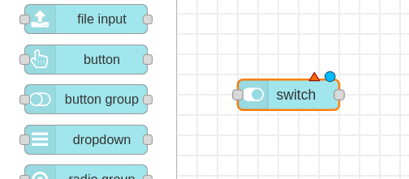
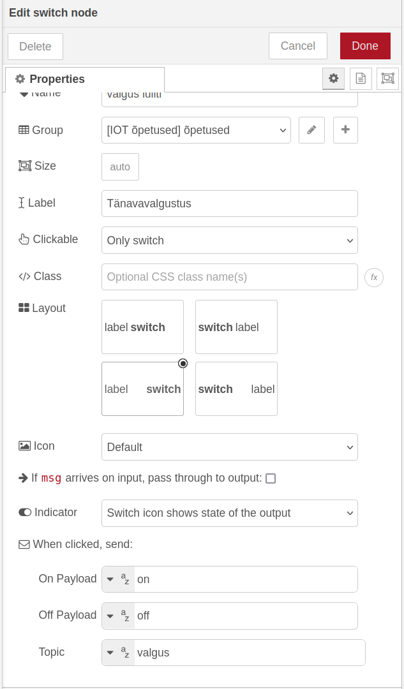
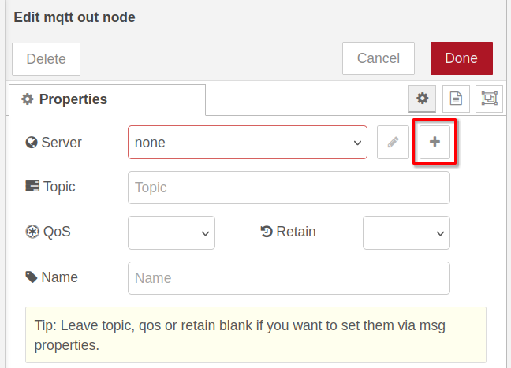
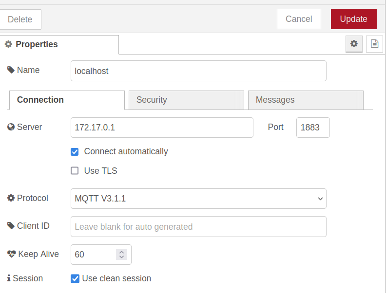
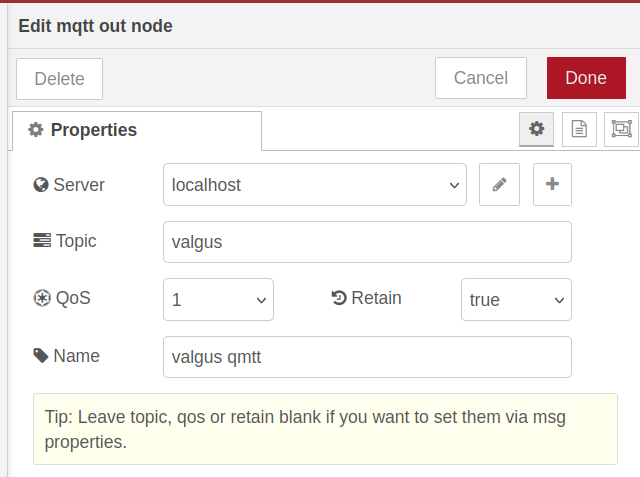
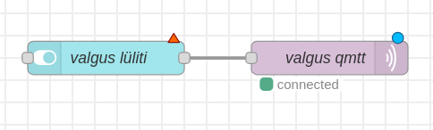

 Liigume Node-RED juurde. Ava arvuti veebilehitsejas Node-RED(tavaliselt *localhost:1880* või *127.0.0.1:1880*) ning tiri vasakult menüüs keskele *Dashboard 2.0* alt helesinine *switch* sõlm

Teeme *switch* sõlme peal topeltkliki, et avada selle sätted. *Switch*\-i nimeks paneme “valgus lüliti” ning sildiks(*Label*) paneme “Tänavavalgustus”. *On Payload* väärtuseks paneme sõne “on” ning *Off Payload* väärtuseks sõne “off”. Teemaks(*Topic*) paneme “valgus”.

Järgmisena leiame vasakult menüüst sõlme nimega *mqtt out*. Tirime selle keskele, teeme selle peal topeltkliki.

Esimesena lisame Node-RED-i oma MQTT vahendusserveri informatsiooni. Vajutame välja *Server* paremal pool asuvat pluss nuppu.

Ekraani paremas ääres avaneb uus aken. Paneme node nimeks “localhost” ning serveriks 172.17.0.1 . Teised sätted võime jätta nii, nagu need on.

Vajutame paremal üleval ääres olevat nuppu *Add*. Oleme tagasi MQTT sõlme sätetes. Paneme serveriks oma loodud *localhost* serveri. *Topic* väljaks paneme “valgus”(Sama topic, mida tellime oma ESP32 koodis), QoS väärtuseks paneme 1, Retain väärtuseks “true” ning sõlme nimeks “valgus qmtt”.

{: .info}
>Mida tähendavad siin aknas QoS ja Retain?  
>QoS on lühend väljendist “Quality of Service”. MQTT-l on kolm kvaliteedi taset:  
>  0 \- sõnum saadetakse maksimaalselt üks kord ning saatja ei saa infot, kas ta sõnum saadi kätte.  
 > 1 \- sõnum saadetakse vähemalt ühe korra, saatja saadab sõnumit korduvalt, kuni ta on tagasi saanud kinnituse, et sõnum saadi kätte.  
 >  2 \- sõnum saadetakse täpselt üks kord. Saatja saadab vastuvõtjale info, et hakkab sõnumit saatma. Kui saatja on saanud tagasi info, et vastuvõtja on valmis sõnumit vastu võtma, saadab ta sõnumi. Kui vastuvõtja on sõnumi kätte saanud, saadab ta saatjale selle kohta sõnumi. 
> Retain määrab, kas viimati saadetud sõnum säilitatakse, või mitte. Kui *Retain* väärtuseks on *Off*, ei saa peale sõnumit avaldamist ühendunud kliendid viimati avaldatud sõnumi kohta infot.

Ühendame kokku *valgus lüliti* ja *valgus qmtt* sõlmed.

Vajuta Node-RED-is *Deploy* nuppu, mine Node-RED dashboardile, ja pane ESP32 tööle. Proovi Node-RED dashboardil lülitit sisse ja välja lülitada. Kui kõik on õigesti tehtud, lülitub ESP32-ga ühendatud LED vastavalt sellele, mis olekus on dashboardil olev lüliti, sisse ning välja.

**Ülesandeid iseseisvaks nuputamiseks:**  
1\. Proovi MQTT sõnumeid saada mitme ESP32-ga korraga.  
2\. Ühenda ESP32-ga veel üks lamp. Kuidas võiks teha nii, et Node-RED dashboardilt saab kontrollida, kumb lamp põleb?

[Järgmine õpetus](../MQTT-avaldamine)

**Kasutatud allikad:**

- [https://www.hivemq.com/blog/mqtt-essentials-part-6-mqtt-quality-of-service-levels/](https://www.hivemq.com/blog/mqtt-essentials-part-6-mqtt-quality-of-service-levels/)  
- [https://randomnerdtutorials.com/esp8266-and-node-red-with-mqtt/](https://randomnerdtutorials.com/esp8266-and-node-red-with-mqtt/)  