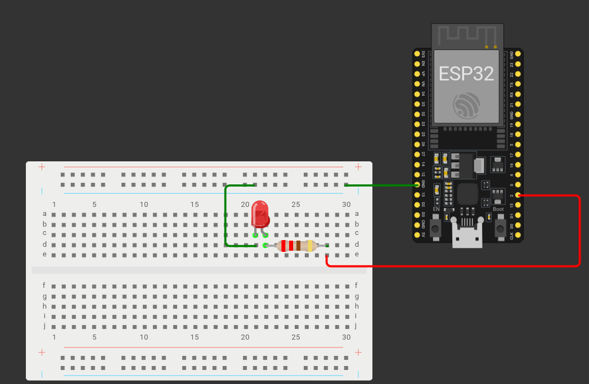

Liigume ESP32 juurde. Mudeli tegemiseks läheb vaja 1 LED lampi ning ühte 220 oomist takistit. Joonis on sama, nagu 3. õpetuses.



Avame Arduino IDE. Kõigepealt ütleme ära, et kasutame WiFi ning PubSubClient teeke. Defineerime wifi nime ja parooli, MQTT vahendaja IP, MQTT teema, ESP32 nime, millega me MQTT vahendajaga ühendume, MQTT kasutajanime, ning MQTT parooli.

```cpp
#include <WiFi.h>
#include <PubSubClient.h>

const char* ssid = "wifi-nimi";
const char* password = "wifi-parool";

const char* MQTT_broker = "1.2.3.4";
const char* MQTT_topic = "kutsung";
const char* espName = "ESP32-kutsung-1";

const char* MQTT_user = "alert-station";
const char* MQTT_password = "esp321";
```

Loome WiFiClient ning PubSubClient klassid, mida ESP32 hakkab kasutama MQTT vahendajaga suhtlemiseks.

```cpp
WiFiClient wifiClient;
PubSubClient MQTTclient(wifiClient);
```

Ütleme, mis pin-iga meie LED tuli on ühendatud, ning loome muutuja alertOn, mis hakkab muutuma vastavalt sellele, kas Node-RED-ist on edastatud kutsung või mitte.

```cpp
const int LEDpin = 2;

bool alertOn;
```

Loome funktsiooni kutsungValgus, mis paneb LED tule vilkuma, kui alertOn muutuja väärtus on tõene.

```cpp
void kutsungValgus(){
 if(alertOn){
   digitalWrite(LEDpin, HIGH);
   delay(500);
   digitalWrite(LEDpin, LOW);
   delay(500);
 }
}
```

Loome ka *callback* funktsiooni, mis on sarnane 3. õpetuses loodud funktsiooniga. Erinevus on see, et kui MQTT vahendajalt saadud sõnum teema “kutsung” kohta on “alert”, on alertOn muutuja väärtus tõene, ning kui sõnum on “clear”, on alertOn muutuja väärtus vale.

```cpp
void callback(String topic, byte* message, unsigned int length){
 //Prindime serial monitori, et oleme kätte saanud mingi sõnumi koos sõnumi teemaga.
 Serial.print("Message received on topic: ");
 Serial.println(topic);
 Serial.print("Message: ");
 String MQTTmessage;


 for(int i = 0; i < length; i++){
 Serial.print((char)message[i]);
   MQTTmessage += (char)message[i];
 }
 Serial.println();


 if(topic == MQTT_topic){
   if(MQTTmessage == "alert"){
     alertOn = true;
   }
   else if(MQTTmessage == "clear"){
     alertOn = false;
   }
 }
}
```

Setup funktsioon on identne 3. õpetuses tehtud setup funktsiooniga.

```cpp
void setup() {
 Serial.begin(115200);
 WiFi.begin(ssid, password);
 pinMode(LEDpin, OUTPUT);


 while(WiFi.status() != WL_CONNECTED){
   delay(500);
   Serial.print(".");
 }
 Serial.println("WiFi connected");


 MQTTclient.setServer(MQTT_broker, 1883);
 MQTTclient.setCallback(callback);
}
```

*Loop* funktsioonis kontrollime, kas ühendus MQTT vahendajaga on olemas. Kui ei ole, loome selle, kasutades varasemalt defineeritud ESP nime, MQTT kasutajanime ning MQTT parooli. Tellime infot varem defineeritud “kutsung” teema kohta. Kui MQTT ühendus on olemas, kutsume välja PubSubClient.loop funktsiooni(See funktsioon on vajalik, et me saaks infot MQTT teemade kohta ning et ühendus ei katkeks!) ja kutsume välja kutsungValgus funktsiooni.

```cpp
void loop() {
 while(!MQTTclient.connected()){
   Serial.println("Connecting MQTT...");


   if(MQTTclient.connect(espName, MQTT_user, MQTT_password)){
     Serial.println("Connected!");
     MQTTclient.subscribe(MQTT_topic);
   } else {
     Serial.print("Connection failed. rc=");
     Serial.println(MQTTclient.state());
   }
 }
 MQTTclient.loop();
 kutsungValgus();
}
```

Terve kood näeb välja selline:

```cpp
//Deklareerime teegid, mida meil vaja läheb
#include <WiFi.h>
#include <PubSubClient.h>


//Wifi nimi ning parool. NB! Mõlemad on tõstutundlikud!
const char* ssid = "Aeglane";
const char* password = "anuausmees";


//Arvuti, kus Mosquitto jookseb, IP.
//Enda arvuti IP aadressi saad teada Linux-is hostname -I ning Windows-is ipconfig käsuga käsureal.
const char* MQTT_broker = "192.168.1.30";
//Deklareerime muutuja MQTT teema jaoks.
const char* MQTT_topic = "kutsung";
//Nimi, millega ESP32 MQTT ühendust loob. NB! Ühel MQTT vahendajal ei saa olla mitu sama nimega ühendust!
const char* espName = "ESP32-kutsung-1";


const char* MQTT_user = "alert-station";
const char* MQTT_password = "esp321";


WiFiClient wifiClient;
PubSubClient MQTTclient(wifiClient);


//Deklareerime pin-i, millega meie LED on ühendatud.
const int LEDpin = 4;


bool alertOn;


void kutsungValgus(){
 if(alertOn){
   digitalWrite(LEDpin, HIGH);
   delay(500);
   digitalWrite(LEDpin, LOW);
   delay(500);
 }
}


//MQTT jaoks vajalik callback funktsioon. Selle funktsiooniga hakkab ESP32 MQTT sõnumeid lugema.
void callback(String topic, byte* message, unsigned int length){
 //Prindime serial monitori, et oleme kätte saanud mingi sõnumi koos sõnumi teemaga.
 Serial.print("Message received on topic: ");
 Serial.println(topic);
 Serial.print("Message: ");
 String MQTTmessage; //String, kuhu hakkame salvestama MQTT saadud sõnumit


 //Funktsioon MQTTmessage muutujasse saadud sõnumi salvestamise jaoks
 for(int i = 0; i < length; i++){
 Serial.print((char)message[i]);
   MQTTmessage += (char)message[i];
 }
 Serial.println();


 //Kontrollime, kas saadud sõnumi teema on see, mida me tahtsime
 if(topic == MQTT_topic){
   if(MQTTmessage == "alert"){
     alertOn = true;
   }
   else if(MQTTmessage == "clear"){
     alertOn = false;
   }
 }
}


void setup() {
 Serial.begin(115200); //Alustame serial ühendust 115200 baudi peal
 WiFi.begin(ssid, password); //Alustame wifi ühendust eespool defineeritud nime ning parooliga
 pinMode(LEDpin, OUTPUT); //Ütleme esp32-le, et meie defineeritud led pin on väljund


 while(WiFi.status() != WL_CONNECTED){
   delay(500);
   Serial.print(".");
 }
 Serial.println("WiFi connected");


 //Määrame oma MQTT ühendusele serveri koos pordiga(Vaikimisi edastatakse MQTT sõnumeid 1883 pordil)
 MQTTclient.setServer(MQTT_broker, 1883);
 //Määrame oma MQTT kliendile varasemalt defineeritud callback funktsiooni, mille abil MQTT hakkab sõnumeid vastu võtma ja lugema
 MQTTclient.setCallback(callback);
}


void loop() {
 //Kui MQTT ühendust ei ole, loome selle
 while(!MQTTclient.connected()){
   Serial.println("Connecting MQTT...");


   //Kui MQTT ühendus õnnestub, tellime infot eelpool defineeritud teema kohta
   if(MQTTclient.connect(espName, MQTT_user, MQTT_password)){
     Serial.println("Connected!");
     MQTTclient.subscribe(MQTT_topic);
   } else {
     //Kui MQTT ühendus ei õnnestu, prindime veakoodi.
     Serial.print("Connection failed. rc=");
     Serial.println(MQTTclient.state());
   }
 }
 MQTTclient.loop();
 kutsungValgus();
}
```

Mosquitto ei lase ühenduda kahel kliendil sama **kliendi nimega**(Siin õpetuses ESP32-kutsung-1), kuid sama **kasutajanimega** ühendumine on lubatud\!
{: .important}

[Node-RED-iga turvaliselt MQTT info saatmine](./node-red-mqtt)