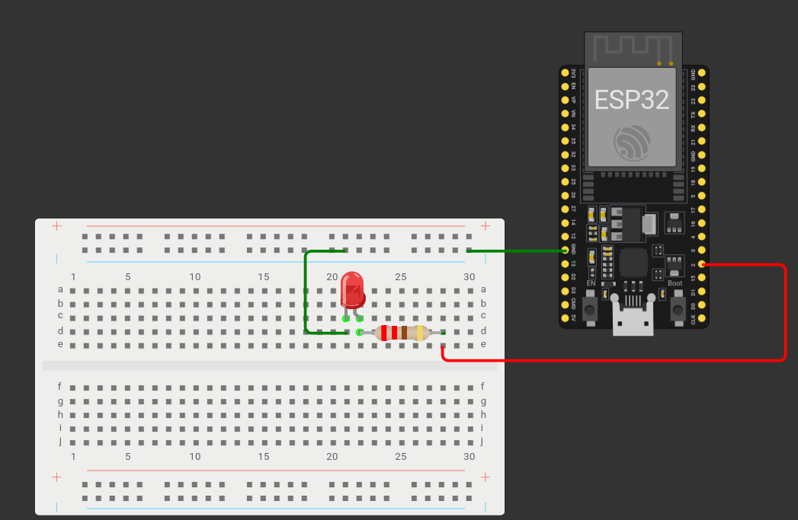

Siiamaani MQTT protokolliga asjad küll töötavad, kuid need on turvamata. Igaüks, kellel on olemas meie MQTT vahendaja IP aadress ning teemad, mille kohta infot edastatakse, saab samuti infot saata. Targas linnas oleks tegu suure turvaauguga. 

Õnneks on MQTT protokolliga võimalik infot saata ka turvatud moel. Kasutame seda, et luua kutsungisüsteem. Loome Mosquitto vahendajaga MQTT kasutaja ning ACL(Access Control List), millega piirame teemadele ligipääsu. Teeme häirekutsungisüsteemi, mis edastab ESP32-le signaali, mille peale LED tuli hakkab vilkuma. Selline süsteem võiks olla kasulik näiteks selleks, et teavitada turvatöötajaid, et koguneda kuskile kindlasse kohta. (Tänapäeval saab muidugi selleks kasutada telefone ning muid suhtluskanaleid, aga mõnes olukorras võivad ka primitiivsed meetodid, nagu meie oma, kasulikud olla.)

Muudame kõigepealt oma Mosquitto konfiguratsioonifaili. Linux operatsioonisüsteemides leiad selle `/etc/mosquitto/mosquitto.conf` , Windows operatsioonisüsteemis samas kaustas, kus on Mosquitto.exe fail, nt `C:\\Program Files\\mosquitto\\mosquitto.conf`  
Lisame read:

Linux kasutajad:
`acl\_file /etc/mosquitto/acl-kutsung`  
`password\_file /etc/mosquitto/passwd`

Windows kasutajad:
`acl_file C:\Program Files\mosquitto\acl-kutsung.txt`
`password_file C:\Program Files\mosquitto\passwd.txt`

Salvesta konfiguratsioonifail. Järgmiseks lisame mosquitto-ga samasse teeki acl faili. Loo uus acl fail nimega acl-kutsung(Windowsi kasutajad: acl-kutsung.txt) ja lisa sinna read:

```bash
topic readwrite #

user alert-info
topic write kutsung

user alert-station
topic read kutsung
```

Mida need read tähendavad?

`topic readwrite #` - kõik kasutajad, kelle kohta pole ACL failis midagi muud öeldud, saavad kirjutada ning lugeda infot kõikide teemade kohta, mille kohta ei ole ACL failis midagi muud öeldud. Selle rea lisame, et meie varem tehtud MQTT protokolliga tehtud asjad töötaksid. \# märk Mosquitto ACL failis tähistab kõike. Näiteks kui me lisaksime rea:  
`topic readwrite #/info`   
saaksid kõik kasutajad, kelle kohta pole ACL failis midagi muud öelda, kirjutada ja lugeda infot teemade valgusfoor/info , tuled/info , teekond/info jne kohta, kuid teema tuled/olek ei oleks ligipääsetav.

`user alert-info` \- järgnevad read käivad kasutaja alert-info kohta  
`topic write kutsung` \- eelpool öeldud kasutaja saab teemal kutsung kirjutada(kuid ei saa seda teemat lugeda\!)

`user alert-station` \- järgnevad read käivad kasutaja alert-station kohta  
`topic read kutsung` \- kasutaja saab teemat kutsung lugeda, kuid ei saa selle teema kohta infot kirjutada.

**Mosquitto passwd faili õpetus Linux kasutajatele**  
jooksuta käsureal:  
`mosquitto_passwd -c  /etc/mosquitto/passwd alert-station`

Programm küsib parooli. Pane parooliks “esp321”.

Järgmisena jooksuta käsureal:  
`mosquitto_passwd /etc/mosquitto/passwd alert-info`

Pane seekord parooliks “alert123”

Mosquitto paroolifail on loodud.

**Mosquitto passwd faili õpetus Windows kasutajatele**  
Loo uus fail nimega “passwd.txt” ja sisesta sinna:  
`alert-station:esp321`  
`alert-info:alert123`

Salvesta fail ning liiguta see samasse kausta, kus on mosquitto.exe(Tavaliselt `C:\Program Files\mosquitto\`). Ava mosquitto kaustas käsurida ning sisesta:  
`mosquitto_passwd -c passwd.txt`

Mosquitto paroolifail on loodud.

Nüüd võib Mosquitto käivitada(Või taaskäivitada, kui see käib teenusena).

Liigume ESP32 juurde. Mudeli tegemiseks läheb vaja 1 LED lampi ning ühte 220 oomist takistit. Joonis on sama, nagu 3. õpetuses.



Avame Arduino IDE. Kõigepealt ütleme ära, et kasutame WiFi ning PubSubClient teeke. Defineerime wifi nime ja parooli, MQTT vahendaja IP, MQTT teema, ESP32 nime, millega me MQTT vahendajaga ühendume, MQTT kasutajanime, ning MQTT parooli.

```cpp
#include <WiFi.h>
#include <PubSubClient.h>

const char* ssid = "wifi-nimi";
const char* password = "wifi-parool";

const char* MQTT_broker = "1.2.3.4";
const char* MQTT_topic = "kutsung";
const char* espName = "ESP32-kutsung-1";

const char* MQTT_user = "alert-station";
const char* MQTT_password = "esp321";
```

Loome WiFiClient ning PubSubClient klassid, mida ESP32 hakkab kasutama MQTT vahendajaga suhtlemiseks.

```cpp
WiFiClient wifiClient;
PubSubClient MQTTclient(wifiClient);
```

Ütleme, mis pin-iga meie LED tuli on ühendatud, ning loome muutuja alertOn, mis hakkab muutuma vastavalt sellele, kas Node-RED-ist on edastatud kutsung või mitte.

```cpp
const int LEDpin = 2;

bool alertOn;
```

Loome funktsiooni kutsungValgus, mis paneb LED tule vilkuma, kui alertOn muutuja väärtus on tõene.

```cpp
void kutsungValgus(){
 if(alertOn){
   digitalWrite(LEDpin, HIGH);
   delay(500);
   digitalWrite(LEDpin, LOW);
   delay(500);
 }
}
```

Loome ka *callback* funktsiooni, mis on sarnane 3. õpetuses loodud funktsiooniga. Erinevus on see, et kui MQTT vahendajalt saadud sõnum teema “kutsung” kohta on “alert”, on alertOn muutuja väärtus tõene, ning kui sõnum on “clear”, on alertOn muutuja väärtus vale.

```cpp
void callback(String topic, byte* message, unsigned int length){
 //Prindime serial monitori, et oleme kätte saanud mingi sõnumi koos sõnumi teemaga.
 Serial.print("Message received on topic: ");
 Serial.println(topic);
 Serial.print("Message: ");
 String MQTTmessage;


 for(int i = 0; i < length; i++){
 Serial.print((char)message[i]);
   MQTTmessage += (char)message[i];
 }
 Serial.println();


 if(topic == MQTT_topic){
   if(MQTTmessage == "alert"){
     alertOn = true;
   }
   else if(MQTTmessage == "clear"){
     alertOn = false;
   }
 }
}
```

Setup funktsioon on identne 3. õpetuses tehtud setup funktsiooniga.

```cpp
void setup() {
 Serial.begin(115200);
 WiFi.begin(ssid, password);
 pinMode(LEDpin, OUTPUT);


 while(WiFi.status() != WL_CONNECTED){
   delay(500);
   Serial.print(".");
 }
 Serial.println("WiFi connected");


 MQTTclient.setServer(MQTT_broker, 1883);
 MQTTclient.setCallback(callback);
}
```

*Loop* funktsioonis kontrollime, kas ühendus MQTT vahendajaga on olemas. Kui ei ole, loome selle, kasutades varasemalt defineeritud ESP nime, MQTT kasutajanime ning MQTT parooli. Tellime infot varem defineeritud “kutsung” teema kohta. Kui MQTT ühendus on olemas, kutsume välja PubSubClient.loop funktsiooni(See funktsioon on vajalik, et me saaks infot MQTT teemade kohta ning et ühendus ei katkeks!) ja kutsume välja kutsungValgus funktsiooni.

```cpp
void loop() {
 while(!MQTTclient.connected()){
   Serial.println("Connecting MQTT...");


   if(MQTTclient.connect(espName, MQTT_user, MQTT_password)){
     Serial.println("Connected!");
     MQTTclient.subscribe(MQTT_topic);
   } else {
     Serial.print("Connection failed. rc=");
     Serial.println(MQTTclient.state());
   }
 }
 MQTTclient.loop();
 kutsungValgus();
}
```

Terve kood näeb välja selline:

```cpp
//Deklareerime teegid, mida meil vaja läheb
#include <WiFi.h>
#include <PubSubClient.h>


//Wifi nimi ning parool. NB! Mõlemad on tõstutundlikud!
const char* ssid = "Aeglane";
const char* password = "anuausmees";


//Arvuti, kus Mosquitto jookseb, IP.
//Enda arvuti IP aadressi saad teada Linux-is hostname -I ning Windows-is ipconfig käsuga käsureal.
const char* MQTT_broker = "192.168.1.30";
//Deklareerime muutuja MQTT teema jaoks.
const char* MQTT_topic = "kutsung";
//Nimi, millega ESP32 MQTT ühendust loob. NB! Ühel MQTT vahendajal ei saa olla mitu sama nimega ühendust!
const char* espName = "ESP32-kutsung-1";


const char* MQTT_user = "alert-station";
const char* MQTT_password = "esp321";


WiFiClient wifiClient;
PubSubClient MQTTclient(wifiClient);


//Deklareerime pin-i, millega meie LED on ühendatud.
const int LEDpin = 4;


bool alertOn;


void kutsungValgus(){
 if(alertOn){
   digitalWrite(LEDpin, HIGH);
   delay(500);
   digitalWrite(LEDpin, LOW);
   delay(500);
 }
}


//MQTT jaoks vajalik callback funktsioon. Selle funktsiooniga hakkab ESP32 MQTT sõnumeid lugema.
void callback(String topic, byte* message, unsigned int length){
 //Prindime serial monitori, et oleme kätte saanud mingi sõnumi koos sõnumi teemaga.
 Serial.print("Message received on topic: ");
 Serial.println(topic);
 Serial.print("Message: ");
 String MQTTmessage; //String, kuhu hakkame salvestama MQTT saadud sõnumit


 //Funktsioon MQTTmessage muutujasse saadud sõnumi salvestamise jaoks
 for(int i = 0; i < length; i++){
 Serial.print((char)message[i]);
   MQTTmessage += (char)message[i];
 }
 Serial.println();


 //Kontrollime, kas saadud sõnumi teema on see, mida me tahtsime
 if(topic == MQTT_topic){
   if(MQTTmessage == "alert"){
     alertOn = true;
   }
   else if(MQTTmessage == "clear"){
     alertOn = false;
   }
 }
}


void setup() {
 Serial.begin(115200); //Alustame serial ühendust 115200 baudi peal
 WiFi.begin(ssid, password); //Alustame wifi ühendust eespool defineeritud nime ning parooliga
 pinMode(LEDpin, OUTPUT); //Ütleme esp32-le, et meie defineeritud led pin on väljund


 while(WiFi.status() != WL_CONNECTED){
   delay(500);
   Serial.print(".");
 }
 Serial.println("WiFi connected");


 //Määrame oma MQTT ühendusele serveri koos pordiga(Vaikimisi edastatakse MQTT sõnumeid 1883 pordil)
 MQTTclient.setServer(MQTT_broker, 1883);
 //Määrame oma MQTT kliendile varasemalt defineeritud callback funktsiooni, mille abil MQTT hakkab sõnumeid vastu võtma ja lugema
 MQTTclient.setCallback(callback);
}


void loop() {
 //Kui MQTT ühendust ei ole, loome selle
 while(!MQTTclient.connected()){
   Serial.println("Connecting MQTT...");


   //Kui MQTT ühendus õnnestub, tellime infot eelpool defineeritud teema kohta
   if(MQTTclient.connect(espName, MQTT_user, MQTT_password)){
     Serial.println("Connected!");
     MQTTclient.subscribe(MQTT_topic);
   } else {
     //Kui MQTT ühendus ei õnnestu, prindime veakoodi.
     Serial.print("Connection failed. rc=");
     Serial.println(MQTTclient.state());
   }
 }
 MQTTclient.loop();
 kutsungValgus();
}
```

Mosquitto ei lase ühenduda kahel sama **kliendi nimega**(Siin õpetuses ESP32-kutsung-1), kuid sama **kasutajanimega** ühendumine on lubatud\!
{: .important}

Liigume node-RED juurde. Leia node-RED vasakult menüüst sõlm nimega *button* ja tiri see keskele. Paneme nupu nimeks kutsung ja sildiks “Häire”. *Payload* väärtuseks paneme “alert”.


Teeme nii, et häire kestab 5 minutit, enne, kui nuppu peab uuesti vajutama. Selle jaoks leia vasakult menüüst *delay* sõlm ja ühenda see *kutsung* sõlmega. Paneme *delay* sõlme nimeks “5 minutit delay” ja pikkuseks 5 minutit.


Lisame ka *template* sõlme, mille nimeks saab “Häire läbi template” ja mis paneb msg.payload väärtuseks “clear”.


Ühendame omavahel *kutsung*, *5 minutit delay*, ning *häire läbi template* sõlmed.


Selleks, et häiret varem lõpetada, lisame veel ühe *button* sõlme nimega “kutsung läbi”. Paneme selle *payload*\-iks samuti “clear”.


Viimasena lisame *mqtt out* sõlme. Loome node-RED-is uue MQTT serveri. Serveri aadress on sama, mis varem(172.17.0.1), kuid *Security* vahelehel paneme kasutajanimeks “alert-info” ning parooliks “alert123”(Need seadistasime õpetuse alguses Mosquittos\!).


Lisame MQTT serveri, paneme *MQTT out* sõlme nimeks “MQTT kutsung out”, teemaks “kutsung”, *retain* väärtuseks *false* ning *QoS* väärtuseks 2\.


Kui *MQTT kutsung out* sõlm on tehtud, ühendame sellega järgmised sõlmed:
- kutsung läbi
- kutsung
- häire läbi template


Vajutame *Deploy* ning läheme *localhost:1880/dashboard* . Kui kõik on õigesti tehtud, näeme kahte nuppu: *Häire* ning *Häire läbi*. Proovime neid kordamööda vajutada või peale häire nupu vajutamist oodata. Kui kõik on õigesti tehtud, peaks *häire* nupu vajutamisel LED tuli hakkama vilkuma ja *häire läbi* nupu vajutamisel või peale 5 minutit tuli kustuma.

**Iseseisvaks nuputamiseks:**  
Proovi ka varem tehtud MQTT asjad teha turvaliseks.

**Kasutatud allikad:**

[http://www.steves-internet-guide.com/topic-restriction-mosquitto-configuration/](http://www.steves-internet-guide.com/topic-restriction-mosquitto-configuration/)

[https://shop.theengs.io/blogs/news/installing-mosquitto-on-windows-and-make-it-accessible-from-your-local-network](https://shop.theengs.io/blogs/news/installing-mosquitto-on-windows-and-make-it-accessible-from-your-local-network)


[Järgmine õpetus](../node-red-ettevalmistus/)