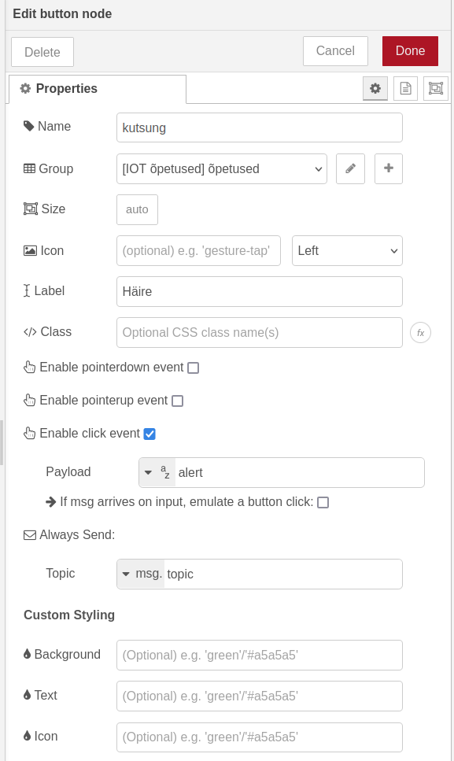
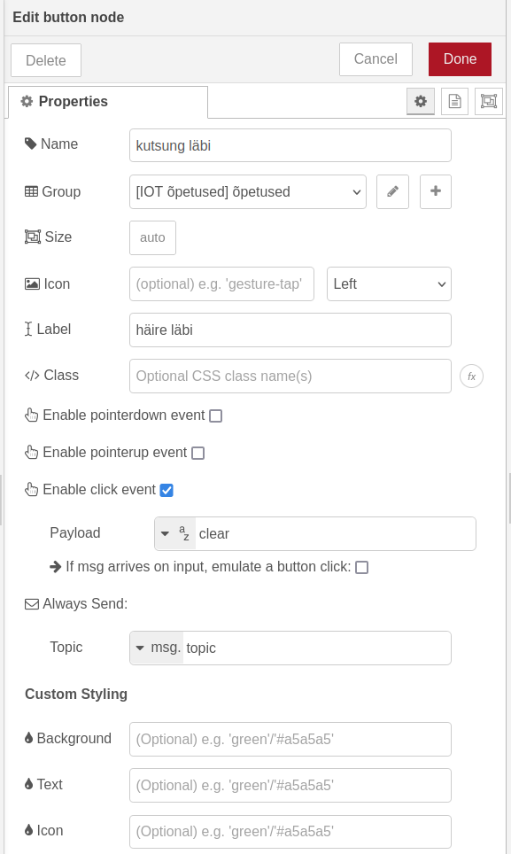
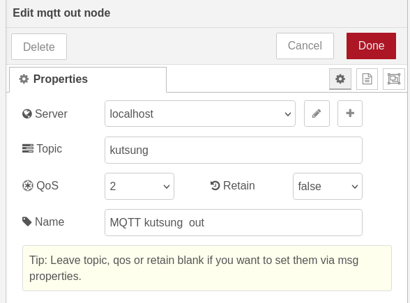
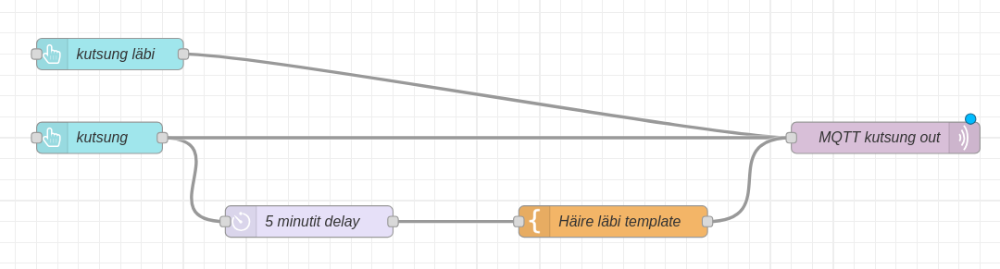

Liigume node-RED juurde. Leia node-RED vasakult menüüst sõlm nimega *button* ja tiri see keskele. Paneme nupu nimeks kutsung ja sildiks “Häire”. *Payload* väärtuseks paneme “alert”.

Teeme nii, et häire kestab 5 minutit, enne, kui nuppu peab uuesti vajutama. Selle jaoks leia vasakult menüüst *delay* sõlm ja ühenda see *kutsung* sõlmega. Paneme *delay* sõlme nimeks “5 minutit delay” ja pikkuseks 5 minutit.

Lisame ka *template* sõlme, mille nimeks saab “Häire läbi template” ja mis paneb msg.payload väärtuseks “clear”.

Ühendame omavahel *kutsung*, *5 minutit delay*, ning *häire läbi template* sõlmed.

Selleks, et häiret varem lõpetada, lisame veel ühe *button* sõlme nimega “kutsung läbi”. Paneme selle *payload*\-iks samuti “clear”.

Viimasena lisame *mqtt out* sõlme. Loome node-RED-is uue MQTT serveri. Serveri aadress on sama, mis varem(172.17.0.1), kuid *Security* vahelehel paneme kasutajanimeks “alert-info” ning parooliks “alert123”(Need seadistasime õpetuse alguses Mosquittos\!).

Lisame MQTT serveri, paneme *MQTT out* sõlme nimeks “MQTT kutsung out”, teemaks “kutsung”, *retain* väärtuseks *false* ning *QoS* väärtuseks 2\.

Kui *MQTT kutsung out* sõlm on tehtud, ühendame sellega järgmised sõlmed:
- kutsung läbi
- kutsung
- häire läbi template

Vajutame *Deploy* ning läheme *localhost:1880/dashboard* . Kui kõik on õigesti tehtud, näeme kahte nuppu: *Häire* ning *Häire läbi*. Proovime neid kordamööda vajutada või peale häire nupu vajutamist oodata. Kui kõik on õigesti tehtud, peaks *häire* nupu vajutamisel LED tuli hakkama vilkuma ja *häire läbi* nupu vajutamisel või peale 5 minutit tuli kustuma.

**Iseseisvaks nuputamiseks:**  
Proovi ka varem tehtud MQTT asjad teha turvaliseks.

[Järgmine õpetus](../HTTP-server/)

