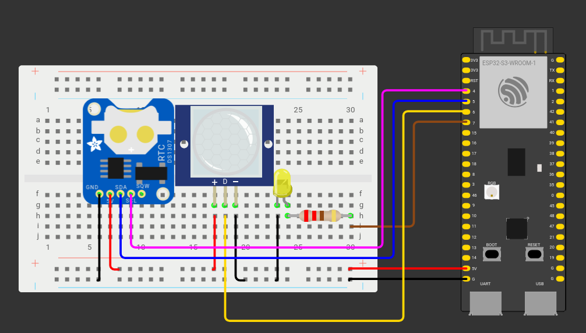
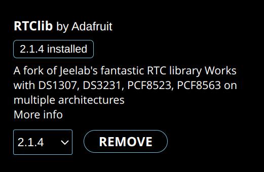
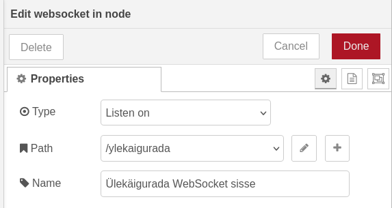
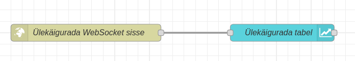
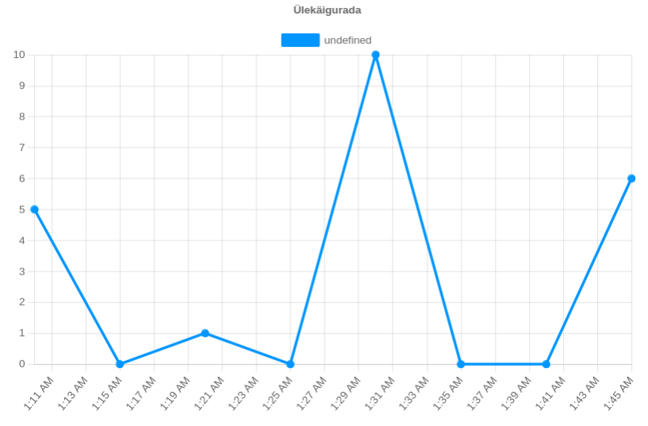

Siiamaani oleme lasknud ESP32-l infot saata ning vastu võtta, kui infot uuendatakse. Mõnikord soovime aga infot saata või midagi muud teha kindlatel kellaaegadel. Seda saame teha RTC(**R**eal **T**ime **C**lock) mooduli abil.

Mitme seadme omavahelises suhtluses vigade vältimiseks on oluline, et neil oleks ühine arusaam kellaajast. Näiteks kui me tahaksime ESP32-st saata info Node-RED dashboardile kell 19:00, kuid mingil põhjusel näitab ESP32 kellaaeg 19:00 siis, kui meie arvuti näitab 18:30, saaksime me info kätte alles kell 19:30. Samuti tekitaks probleeme kellakeeramine, mille kuupäevad iga aasta muutuvad. Kaks korda aastas ESP32-te hakata ümber programmeerima võib olla päris tüütu.

Erinevate seadmete kellaaja sünkroniseerimiseks kasutatakse NTP-d ehk **Network Time Protocol**\-li. Tõenäoliselt saavad selle abil õige kellaaja kätte ka sinu arvuti ning telefon. 

Loome targa ülekäiguraja, mis PIR sensori abil tuvastab, kui teda ületama hakatakse. Kui ülekäigurada hakatakse ületama, läheb põlema LED tuli ning ESP32 paneb ületamise kirja. Iga 5 minuti tagant saadab ESP32 Node-RED dashboardile info, mitu ületamist on viimase 5 minuti jooksul toimunud. Lisaks sünkroniseerib iga päev kell 00:00 ESP32 oma kellaaja ülemaailmse NTP serveriga. 

Siin õpetuses läheb vaja ühte ESP32 arenduslauda, ühte LED tuld, ühte 220 oomist takistit, ühte ds3231 RTC moodulit, ja ühte PIR sensorit. Joonis mudelist maketeerimislaual näeb välja selline:



- ESP32 4. pin on ühendatud RTC mooduli SCL pin-iga
- ESP32 5. pin on ühendatud RTC mooduli SDA pin-iga
- RTC mooduli 5V/VCC pin on ühendatud ESP32 5v toitega
- RTC mooduli GND pin on ühendatud maandusega
- PIR sensori VCC pin on ühendatud ESP32 5v toitega
- PIR sensori Data pin on ühendatud ESP32 6. pin-iga
- PIR sensori GND pin on ühendatud maandusega
- ESP32 7. pin on ühendatud 220 oomise takistiga
- 220 oomine takisti on ühendatud LED tule positiivse jalaga
- LED tule negatiivne jalg on ühendatud maandusega

Teeme lahti Arduino IDE. RTC mooduli kasutamiseks läheb meil vaja Adafruit tehtud RTClib teeki. Selle saame installida Arduino IDE library manager menüüst.



Paneme kõigepealt kirja teegid, mida kasutame.

```cpp
#include <WiFi.h>
#include <time.h>
#include <Wire.h>
#include "RTClib.h"
#include <ArduinoWebsockets.h>
```

Paneme kirja wifi andmed ning lingi, kuhu hakkame infot saatma.

```cpp
const char* ssid = "wifi-nimi";
const char* password = "wifi-parool";
const char* websocket_server = "ws://1.2.3.4:1880/ylekaigurada";
```

Samuti paneme kirja ajatsooni, mille kohta infot hakkame saama. Ajatsoonide sõnede kohta saab infot [siit](https://github.com/nayarsystems/posix_tz_db/blob/master/zones.csv). Siin õpetuses kasutame Eesti ajatsooni.

```cpp
const char* timezone = "EET-2EEST,M3.5.0/3,M10.5.0/4";
```

Järgmisena deklareerime muutujad RTC-ga töötamiseks ja ajahetkede salvestamiseks. Samuti deklareerime *boolean* muutuja, millega näitame, kas PIR sensor on liikumist tuvastanud või mitte.

```cpp
RTC_DS3231 rtc;
DateTime now;
DateTime liikumiseAeg;
DateTime liikumineLabi;

bool liikumineDetect = false;
```

Paneme kirja ESP32 pin-id, mida kasutame, ning loome täisarvulise muutuja, kuhu hakkame salvestama ületamiste arvu.

```cpp
const int rtcSCLpin = 4;
const int rtcSDApin = 5;
const int PIRpin = 6;
const int ledPin = 7;

int yletamised = 0;
```

kasutame juba tuttavaid websockets nimeruumi ning Wifi ja WebSockets kliente.

```cpp
using namespace websockets;

WiFiClient wifiClient;
WebsocketsClient WSclient;
```

Loome eelmiste õpetustega samasuguse onEventsCallback funktsiooni WebSockets tööks.

```cpp
void onEventsCallback(WebsocketsEvent event, String data) {
 switch(event){
   case WebsocketsEvent::ConnectionOpened:
     Serial.println("Connection Opened");
     break;
   case WebsocketsEvent::ConnectionClosed:
     Serial.println("Connection Closed");
     break;
   case WebsocketsEvent::GotPing:
     Serial.println("Got a Ping!");
     break;
   case WebsocketsEvent::GotPong:
     Serial.println("Got a Pong!");
     break;
 }
}
```

Loome syncTime funktsiooni, mille abil hakkame NTP serveriga ESP32 RTC aega sünkroniseerima. Kasutame Arduino IDE sisse ehitatud configTime funktsiooni, mille argumentideks paneme NTP serverid. Argumendid 0 ja 0 näitavad, et saame aja arvestamata ajatsooni ning suveaja nihet.

```cpp
void syncTime(){
 Serial.print("Synchronizing time with NTP server...");
 configTime(0, 0, "pool.ntp.org", "time.nist.gov");
```

Loome kohaliku muutuja *now*, kuhu salvestame NTP serverist saadud aja. Kuna *time(nullptr)* tagastab aja alatess Unix epoch-ist(1. jaanuar 1970), ei ole ajaväärtus korrektne, kui see on vähem, kui üks päev ehk 24 korda 3600 sekundit.

```cpp
 time_t now = time(nullptr);
 while (now < 24 * 3600) { // Wait until time is valid
   delay(100);
   now = time(nullptr);
 }
 Serial.println(" Time synchronized!");
```

Järgmisena määrame varasemalt deklareeritud ajatsooni ja teisendame NTP serverist saadud aja Eesti ajatsooni.

```cpp
 setenv("TZ", timezone, 1);
 tzset();

 struct tm timeInfo;
 localtime_r(&now, &timeInfo);
```

Lõpuks paneme RTC mooduli ajaks NTP serverist saadud ja meie ajatsooni teisendatud aja.

```cpp
 rtc.adjust(DateTime(timeInfo.tm_year + 1900, timeInfo.tm_mon + 1, timeInfo.tm_mday, timeInfo.tm_hour, timeInfo.tm_min, timeInfo.tm_sec));
```

Terve funktsioon näeb välja selline:

```cpp
void syncTime(){
 Serial.print("Synchronizing time with NTP server...");
 configTime(0, 0, "pool.ntp.org", "time.nist.gov");
 time_t now = time(nullptr);
 while (now < 24 * 3600) { // Wait until time is valid
   delay(100);
   now = time(nullptr);
 }
 Serial.println(" Time synchronized!");

 setenv("TZ", timezone, 1);
 tzset();

 struct tm timeInfo;
 localtime_r(&now, &timeInfo);

 rtc.adjust(DateTime(timeInfo.tm_year + 1900, timeInfo.tm_mon + 1, timeInfo.tm_mday, timeInfo.tm_hour, timeInfo.tm_min, timeInfo.tm_sec));
}
```

Seejärel loome funktsiooni, mis käivitub, kui PIR sensor tuvastab liikumise. Liikumise tuvastamisel kirjutatakse LED pin-ile HIGH väärtus ja suurendatakse *yletamised* muutujat.

```cpp
void liikumine(){
 digitalWrite(ledPin, HIGH);
 yletamised++;
}
```

Loome ka funktsiooni WebSockets info saatmiseks. Saadame sõne kujul *yletamised* muutuja väärtuse ja paneme muutuja väärtuseks null, et hakata lugema ületamisi järgmise 5 minuti jooksul. Lisame ka 1 sekundi pikkuse delay, et vältida info mitu korda saatmist.

```cpp
void infoSaatmine(){
 WSclient.send(String(yletamised));
 yletamised = 0;
 delay(1000);
}
```

Liigume setup funktsiooni juurde.

```cpp
void setup() {
 Serial.begin(115200);

 pinMode(ledPin, OUTPUT);
 pinMode(PIRpin, INPUT_PULLUP);
```

PIR pin-i sätteks paneme INPUT\_PULLUP, et kasutame ESP32 sisemist pull-up takistit. Vaikimisi loeb ESP32 pin-ilt HIGH väärtuse, kuid kui PIR sensor tuvastab liikumist, saab ESP32 kätte LOW väärtuse. INPUT\_PULLUP sätet kasutame, et vältida pin-ilt valeinfo saamist.

RTC mooduliga suhtlemiseks kasutab ESP32 Wire teeki. Paneme Wire pin-ideks varem deklareeritud pin-id ja alustame RTC tööd.

```cpp
 Wire.setPins(rtcSDApin, rtcSCLpin);

 rtc.begin();
```

Siiamaani oleme sisendite väärtusi lugenud, tehes pidevalt päringuid sisendite pin-ide kohta. Pideva kontrollimine võtab aga rohkem aega ning koormab rohkem ESP32 protsessorit. Selle asemel kasutame katkestusi, mis tuvastades PIR pin-il RISING(LOW väärtus muutub HIGH väärtuseks) väärtuse käivitab varasemalt defineeritud liikumine funktsiooni.

```cpp
attachInterrupt(digitalPinToInterrupt(PIRpin), liikumine, RISING);
```

Paneme LED pin-i algseks väärtuseks LOW.

```cpp
digitalWrite(ledPin, LOW);
```

Alustame Wifi ja WebSocket tööd. Määrame WebSocket kliendile onEvent *callback* funktsiooni, saadame serverile ping-i.

```cpp
 WiFi.begin(ssid, password);
 while (WiFi.status() != WL_CONNECTED) {
   delay(500);
   Serial.print(".");
 }
 Serial.print("Connecting to websocket server");
 while(!WSclient.connect(websocket_server)){
   Serial.print(".");
 }
 Serial.println("WebSocket connected!");

 WSclient.onEvent(onEventsCallback);

 WSclient.ping();
```

Kutsume välja *syncTime* funktsiooni, et programmi alguses RTC mooduli aeg sünkroniseerida NTP serveriga.

```cpp
syncTime();
```

Terve setup funktsioon näeb välja selline:

```cpp
void setup() {
 Serial.begin(115200);

 pinMode(ledPin, OUTPUT);
 pinMode(PIRpin, INPUT_PULLUP);

 Wire.setPins(rtcSDApin, rtcSCLpin);

 rtc.begin();

 attachInterrupt(digitalPinToInterrupt(PIRpin), liikumine, RISING);
 digitalWrite(ledPin, LOW);

 WiFi.begin(ssid, password);
 while (WiFi.status() != WL_CONNECTED) {
   delay(500);
   Serial.print(".");
 }
 Serial.print("Connecting to websocket server");
 while(!WSclient.connect(websocket_server)){
   Serial.print(".");
 }
 Serial.println("WebSocket connected!");

 WSclient.onEvent(onEventsCallback);

 WSclient.ping();

 syncTime();
}
```

Liigume *loop* funktsiooni juurde. Paneme globaalse muutuja now väärtuseks RTC moodulist saadud väärtuse.

```cpp
void loop() {
 now = rtc.now();
```

Panime varasemalt kirja, et kui PIR sensor tuvastab liikumise, pannakse LED pin-i väärtuseks HIGH. Kui loop funktsioonis loeme LED pin-ilt HIGH väärtuse, paneme liikumineDetect muutuja väärtuseks true. Fikseerime aja, millal liikumine tuvastati, ning arvutame aja 0 päeva, 0 tunni, 0 minuti ja 30 sekundi pärast.

```cpp
 if((digitalRead(ledPin) == HIGH) && (liikumineDetect == false)){
   liikumiseAeg = now;
   liikumineLabi = liikumiseAeg + TimeSpan(0, 0, 0, 30);
   liikumineDetect = true;
 }
```

Kui liikumineDetect muutuja väärtus on tõene ja praegune aeg on suurem, kui varasemalt arvutatud liikumineLabi, kirjutame LED pin-ile LOW väärtuse ja paneme liikumineDetect muutuja väärtuseks jälle *false*. Aegade võrdlemiseks kasutame Unix epoch aega.

```cpp
 if((liikumineDetect == true) && (now.unixtime() > liikumineLabi.unixtime())){
   digitalWrite(ledPin, LOW);
   liikumineDetect = false;
 }
```

Kui praegune minut jagub viiega ja praeguse sekundi väärtuseks on 0, kutsume välja infoSaatmine funktsiooni, et ületuste arv saata WebSocket serverile.

```cpp
 if(((now.minute() % 5) == 0) && (now.second() == 0)){
   Serial.println("WebSocket info saatmine");
   infoSaatmine();
 }
```

Kui praeguse tunni, minuti, ning sekundi väärtusteks on null, s.t. RTC mooduli info järgi on südaöö, sünkroniseerime ESP32 aja NTP serveriga.

```cpp
 if((now.hour() == 0) && (now.minute() == 0) && (now.second() == 0)){
   syncTime();
 }
```

Terve *loop* funktsioon näeb välja selline:

```cpp
void loop() {
 now = rtc.now();

 if((digitalRead(ledPin) == HIGH) && (liikumineDetect == false)){
   liikumiseAeg = now;
   liikumineLabi = liikumiseAeg + TimeSpan(0, 0, 0, 30);
   liikumineDetect = true;
 }

 if((liikumineDetect == true) && (now.unixtime() > liikumineLabi.unixtime())){
   digitalWrite(ledPin, LOW);
   liikumineDetect = false;
 }

 if(((now.minute() % 5) == 0) && (now.second() == 0)){
   Serial.println("WebSocket info saatmine");
   infoSaatmine();
 }

 if((now.hour() == 0) && (now.minute() == 0) && (now.second() == 0)){
   syncTime();
 }
}
```

Ning terve programm näeb välja selline:

```cpp
#include <WiFi.h>
#include <time.h>
#include <Wire.h>
#include "RTClib.h"
#include <ArduinoWebsockets.h>

const char* ssid = "wifi-nimi"; //Enter SSID
const char* password = "wifi-parool"; //Enter Password
const char* websocket_server = "ws://1.2.3.4:1880/ylekaigurada";

const char* timezone = "EET-2EEST,M3.5.0/3,M10.5.0/4";

RTC_DS3231 rtc;
DateTime now;
DateTime liikumiseAeg;
DateTime liikumineLabi;

bool liikumineDetect = false;

const int rtcSCLpin = 4;
const int rtcSDApin = 5;
const int PIRpin = 6;
const int ledPin = 7;

int yletamised = 0;

using namespace websockets;

WiFiClient wifiClient;
WebsocketsClient WSclient;

void onEventsCallback(WebsocketsEvent event, String data) {
 switch(event){
   case WebsocketsEvent::ConnectionOpened:
     Serial.println("Connection Opened");
     break;
   case WebsocketsEvent::ConnectionClosed:
     Serial.println("Connection Closed");
     break;
   case WebsocketsEvent::GotPing:
     Serial.println("Got a Ping!");
     break;
   case WebsocketsEvent::GotPong:
     Serial.println("Got a Pong!");
     break;
 }
}

void syncTime(){
 Serial.print("Synchronizing time with NTP server...");
 configTime(0, 0, "pool.ntp.org", "time.nist.gov");
 time_t now = time(nullptr);
 while (now < 24 * 3600) {
   delay(100);
   now = time(nullptr);
 }
 Serial.println(" Time synchronized!");

 setenv("TZ", timezone, 1);
 tzset();

 struct tm timeInfo;
 localtime_r(&now, &timeInfo);

 rtc.adjust(DateTime(timeInfo.tm_year + 1900, timeInfo.tm_mon + 1, timeInfo.tm_mday, timeInfo.tm_hour, timeInfo.tm_min, timeInfo.tm_sec));
}

void liikumine(){
 digitalWrite(ledPin, HIGH);
 yletamised++;
}

void infoSaatmine(){
 WSclient.send(String(yletamised));
 yletamised = 0;
 delay(1000);
}

void setup() {
 Serial.begin(115200);

 pinMode(ledPin, OUTPUT);
 pinMode(PIRpin, INPUT_PULLUP);

 Wire.setPins(rtcSDApin, rtcSCLpin);

 rtc.begin();

 attachInterrupt(digitalPinToInterrupt(PIRpin), liikumine, RISING);
 digitalWrite(ledPin, LOW);

 WiFi.begin(ssid, password);
 while (WiFi.status() != WL_CONNECTED) {
   delay(500);
   Serial.print(".");
 }
 Serial.print("Connecting to websocket server");
 while(!WSclient.connect(websocket_server)){
   Serial.print(".");
 }
 Serial.println("WebSocket connected!");

 WSclient.onEvent(onEventsCallback);

 WSclient.ping();

 syncTime();
}

void loop() {
 now = rtc.now();

 if((digitalRead(ledPin) == HIGH) && (liikumineDetect == false)){
   liikumiseAeg = now;
   liikumineLabi = liikumiseAeg + TimeSpan(0, 0, 0, 30);
   liikumineDetect = true;
 }

 if((liikumineDetect == true) && (now.unixtime() > liikumineLabi.unixtime())){
   digitalWrite(ledPin, LOW);
   liikumineDetect = false;
 }

 if(((now.minute() % 5) == 0) && (now.second() == 0)){
   Serial.println("WebSocket info saatmine");
   infoSaatmine();
 }

 if((now.hour() == 0) && (now.minute() == 0) && (now.second() == 0)){
   syncTime();
 }
}

```

Liigume Node-RED juurde. Leiame vasakult *websocket in* sõlme. Paneme selle tüübiks *listen on*, URL teeks /ylekaigurada, ning nimeks *Ülekäigurada WebSocket sisse*.



Järgmisena leiame vasakult *chart* sõlme. Paneme sõlme nimeks *Ülekäigurada graafik* ning sildiks *Ülekäigurada*. Muid sätteid pole vaja muuta.


Ühendame omavahel *Ülekäigurada WebSocket sisse* ning *Ülekäigurada graafik* sõlmed.



Kui me nüüd *Deploy* vajutame ning mõneks ajaks ESP32 tööle jätame, näeme 5 minuti kaupa, mitu korda PIR sensor on liikumist tuvastanud.



**Iseseisvaks nuputamiseks:**  
Näita kellaaega ka ekraanil. Nii ekraan kui ka RTC sensor kasutavad Wire teeki. Näitekood ekraani ja RTC ühendamiseks kahe Wire abil näeb välja selline:

```cpp
const int rtcSCL = 4;
const int rtcSDA = 5;
const int screenSDA = 6;
const int screenSCL = 7;

#define SCREEN_WIDTH 128
#define SCREEN_HEIGHT 64

RTC_DS3231 rtc;
Adafruit_SSD1306 display(SCREEN_WIDTH, SCREEN_HEIGHT, &Wire1, -1);

void setup() {
   Serial.begin(115200);
   Wire.begin(rtcSDA, rtcSCL);
   Wire1.begin(screenSDA, screenSCL);
  
   rtc.begin()) {
       Serial.println("Couldn't find RTC");
       while (1);
   }

   if (!display.begin(SSD1306_SWITCHCAPVCC, 0x3C)) {
       Serial.println("SSD1306 allocation failed");
       while (1);
   }
   display.clearDisplay();
   display.display();
}
```

**Kasutatud allikad:**
- [https://www.ntp.org/documentation/4.2.8-series/\#introduction](https://www.ntp.org/documentation/4.2.8-series/#introduction)   
- [https://randomnerdtutorials.com/esp32-pir-motion-sensor-interrupts-timers/](https://randomnerdtutorials.com/esp32-pir-motion-sensor-interrupts-timers/)   
- [https://randomnerdtutorials.com/esp32-ds1307-real-time-clock-rtc-arduino/\#set-time-ntp](https://randomnerdtutorials.com/esp32-ds1307-real-time-clock-rtc-arduino/#set-time-ntp)   
- [https://howtomechatronics.com/tutorials/arduino/arduino-ds3231-real-time-clock-tutorial/](https://howtomechatronics.com/tutorials/arduino/arduino-ds3231-real-time-clock-tutorial/)   
- [https://github.com/nayarsystems/posix\_tz\_db/blob/master/zones.csv](https://github.com/nayarsystems/posix_tz_db/blob/master/zones.csv)   
- [https://randomnerdtutorials.com/esp32-esp8266-run-daily-task/](https://randomnerdtutorials.com/esp32-esp8266-run-daily-task/)

[Järgmine õpetus](../node-red-ettevalmistus/)