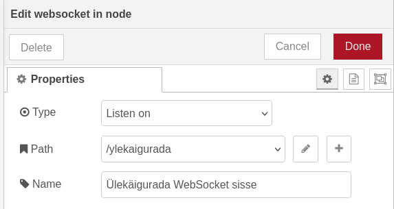

Liigume Node-RED juurde. Leiame vasakult *websocket in* sõlme. Paneme selle tüübiks *listen on*, URL teeks /ylekaigurada, ning nimeks *Ülekäigurada WebSocket sisse*.



Järgmisena leiame vasakult *chart* sõlme. Paneme sõlme nimeks *Ülekäigurada graafik* ning sildiks *Ülekäigurada*. Muid sätteid pole vaja muuta.


Ühendame omavahel *Ülekäigurada WebSocket sisse* ning *Ülekäigurada graafik* sõlmed.


Kui me nüüd *Deploy* vajutame ning mõneks ajaks ESP32 tööle jätame, näeme 5 minuti kaupa, mitu korda PIR sensor on liikumist tuvastanud.


**Iseseisvaks nuputamiseks:**  
Näita kellaaega ka ekraanil. Nii ekraan kui ka RTC sensor kasutavad Wire teeki. Näidiskood ekraani ja RTC ühendamiseks kahe Wire abil näeb välja selline:

```cpp
const int rtcSCL = 4;
const int rtcSDA = 5;
const int screenSDA = 6;
const int screenSCL = 7;

#define SCREEN_WIDTH 128
#define SCREEN_HEIGHT 64

RTC_DS3231 rtc;
Adafruit_SSD1306 display(SCREEN_WIDTH, SCREEN_HEIGHT, &Wire1, -1);

void setup() {
   Serial.begin(115200);
   Wire.begin(rtcSDA, rtcSCL);
   Wire1.begin(screenSDA, screenSCL);
  
   rtc.begin()) {
       Serial.println("Couldn't find RTC");
       while (1);
   }

   if (!display.begin(SSD1306_SWITCHCAPVCC, 0x3C)) {
       Serial.println("SSD1306 allocation failed");
       while (1);
   }
   display.clearDisplay();
   display.display();
}
```

[Iseseisvaks ESP32-ga töötamiseks](../Iseseisvaks)

