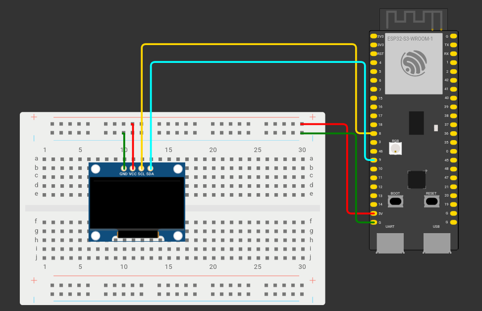
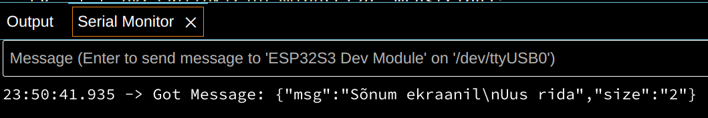

Joonis ESP32 mudelist maketeerimislaual näeb välja selline:



- SSD1306 VCC on ühendatud ESP32 5V pin-iga  
- SSD1306 GND on ühendatud ESP32 maandusega  
- SSD1306 SCL on ühendatud ESP32 8\. pin-iga  
- SSD1306 SDA on ühendatud ESP32 9\. pin-iga

Avame Arduino IDE. Installime kõigepealt välised teegid, mida meil vaja läheb. Selleks ava vasakult menüüst *Library Manager* ja installi teegid:  
**Adafruit SSD1306** *by Adafruit*  
**ArduinoWebSockets** *by Gil Maimon*  
**Arduino\_JSON** *by Arduino*

Paneme kõigepealt programmi algusesse kirja teegid, mida me kasutame.

```cpp
#include <WiFi.h>
#include <SPI.h>
#include <Wire.h>
#include <Adafruit_GFX.h>
#include <Adafruit_SSD1306.h>
#include <ArduinoWebsockets.h>
#include <Arduino_JSON.h>
```

Defineerime ekraani jaoks vajalikud muutujad. Üldjuhul ei ole neid vajalik muuta.

```cpp
#define SCREEN_WIDTH 128 // OLED display width, in pixels
#define SCREEN_HEIGHT 32 // OLED display height, in pixels
#define OLED_RESET     -1 // Reset pin # (or -1 if sharing Arduino reset pin)
#define SCREEN_ADDRESS 0x3C ///< See datasheet for Address; 0x3D for 128x64, 0x3C for 128x32
Adafruit_SSD1306 display(SCREEN_WIDTH, SCREEN_HEIGHT, &Wire, OLED_RESET);
```

Järgmisena defineerime WiFi nime, parooli, ning WebSocket serveri. Serveri URL koosneb *ws://* algusest, arvuti IP-st, pordist, kus Node-RED on(Üldjuhul 1880), ning Node-RED-is kirja pandud URL teest.

```cpp
const char* ssid = "wifi-nimi";
const char* password = "wifi-parool";
const char* websocket_server = "ws://1.2.3.4:1880/ekraan";
```

Kuna Node-RED saadab WebSocket ühendusega infot JSON vormis, teeme ka esialgu tühja muutuja, kus hakkame hoidma Node-RED-ist saadud sõnumeid, ning sõned suuruse ning sõnumi jaoks.

```cpp
JSONVar websocket_msg;

String sizeString;
String msgString;
```

Kasutame *websockets* nimeruumi

```cpp
using namespace websockets;
```

Viimasena defineerime wifi ning websockets kliendid.

```cpp
WiFiClient wifiClient;
WebsocketsClient WSclient;
```

Loome *onEventsCallBack* funktsiooni, mille sees kontrollime *switch* lausega, milline websocket sündmus on meile saadetud, ning prindime vastavalt sellele infot serial monitori.

```cpp
void onEventsCallback(WebsocketsEvent event, String data) {
 switch(event){
   case WebsocketsEvent::ConnectionOpened:
     Serial.println("Connnection Opened");
     break;
   case WebsocketsEvent::ConnectionClosed:
     Serial.println("Connnection Closed");
     break;
   case WebsocketsEvent::GotPing:
     Serial.println("Got a Ping!");
     break;
   case WebsocketsEvent::GotPong:
     Serial.println("Got a Pong!");
     break;
 }
}
```

Järgmisena loome *onMessageCallback* funktsiooni, mis käivitub, kui me saame WebSocket ühendusest sõnumi. Funktsiooni alguses prindime serial monitori info, et oleme sõnumi saanud, ning sõnumi sisu.

```cpp
void onMessageCallback(WebsocketsMessage message) {
   Serial.print("Got Message: ");
   Serial.println(message.data());

}
```

Node-RED saadab WebSockets sõnumi JSON kujul. Loeme sõnumi eelpool defineeritud *websocket\_msg* JSON objekti.

```cpp
void onMessageCallback(WebsocketsMessage message) {
   Serial.print("Got Message: ");
   Serial.println(message.data());
   websocket_msg = JSON.parse(message.data());

}
```

Näide sõnumist, mida me hakkame saama, näeb välja selline:



Näeme, et kui me sõnumi praegusel kujul ekraanil kuvaks, näeks me teksti koos jutumärkidega, reavahetuse asemel kuvataks \\n(Koodiks oleks see kujul \\\\n), ning suurust ei saaks me üldse muuta, kuna suuruseks on “2” koos jutumärkidega. 

Et seda parandada, teeme *size* võtme väärtusest sõne, paigutame selle varem defineeritud *sizeString* muutujasse, ning eemaldame “ märgid. Seejärel teeme sõnest täisarvulise muutuja.

```cpp
void onMessageCallback(WebsocketsMessage message) {
   Serial.print("Got Message: ");
   Serial.println(message.data());
   websocket_msg = JSON.parse(message.data());
   sizeString = JSON.stringify(websocket_msg["size"]);
   sizeString.replace("\"","");
   int size = sizeString.toInt();
}
```

Teeme ka *msg* võtme väärtusest sõne, eemaldame jutumärgid, ning asendame \\n reavahetusmärgiga, millest ESP32 aru saab.

```cpp
void onMessageCallback(WebsocketsMessage message) {
   Serial.print("Got Message: ");
   Serial.println(message.data());
   websocket_msg = JSON.parse(message.data());
   sizeString = JSON.stringify(websocket_msg["size"]);
   sizeString.replace("\"","");
   int size = sizeString.toInt();
   msgString = JSON.stringify(websocket_msg["msg"]);
   msgString.replace("\"", "");
   msgString.replace("\\n", "\n");
}
```

Viimasena kutsume välja funktsiooni *ekraanileKirjutamine*, mille parameetriteks paneme *size* ja *msgString* muutujad.

```cpp
void onMessageCallback(WebsocketsMessage message) {
   Serial.print("Got Message: ");
   Serial.println(message.data());
   websocket_msg = JSON.parse(message.data());
   sizeString = JSON.stringify(websocket_msg["size"]);
   sizeString.replace("\"","");
   int size = sizeString.toInt();
   msgString = JSON.stringify(websocket_msg["msg"]);
   msgString.replace("\"", "");
   msgString.replace("\\n", "\n");
   ekraanileKirjutamine(size, msgString);
}
```

Loome ka *ekraanileKirjutamine* funktsiooni. Nagu nimigi ütleb, kasutame seda funktsiooni ekraanile kirjutamiseks.

```cpp
void ekraanileKirjutamine(int size, String msgString){

}
```

Esimesena kustutame ekraanilt eelmise sõnumi ja paneme kursori 0,0 positsioonile. Kursori positsiooni lugemine algab ekraani vasakult ülevalt äärest.

```cpp
void ekraanileKirjutamine(int size, String msgString){
 display.clearDisplay();
 display.setCursor(0, 0);
}
```

Paneme teksti suuruseks *size* parameetri ning prindime ekraanile *msgString* sõne. Viimasena kutsume välja *display.display()* funktsiooni, et ekraanil tehtud asjad kuvada.

```cpp
void ekraanileKirjutamine(int size, String msgString){
 display.clearDisplay();
 display.setCursor(0, 0);
 display.setTextSize(size);
 display.print(msgString);
 display.display();
}
```

Liigume *setup* funktsiooni juurde. 

Meie ekraan kasutab *I2C* protokolli, et ESP32-ga suhelda. Selle jaoks kasutame *Wire* teeki. I2C protokoll kasutab kahte juhet, et infot saata ja kätte saada. SCL(**S**erial **Cl**ock) juhtme abil saadab ESP32 pulseeriva signaali, mille abil sünkroniseeritakse andmete vahetamise ajastus ESP32 ning I2C seadme vahel. SDA(**S**erial **Da**ta) juhtme abil saadab ESP32(Kontroller) seitsme või kaheksa biti kaupa informatsiooni. Kui seade on selle info kätte saanud, sooritab ta vajalikud toimingud ning vajadusel saadab sama juhtmega vajaliku info tagasi ESP32-le.

Alustame *setup* funktsioonis kõigepealt Serial monitori 115200 baudi peal. Seejärel defineerime pin-id, mida *wire* kasutab(pin 9 \- SDA, pin 8 \- SCL) ja alustame ekraani tööd. Alustame ka wifi tööd.

```cpp
void setup() {
 Serial.begin(115200);
 Wire.setPins(9, 8);
 display.begin(SSD1306_SWITCHCAPVCC, SCREEN_ADDRESS);
 WiFi.begin(ssid, password);
```

Kustutame ekraanilt varem selle peal olnud info, paneme teksti värviks valge, ning kutsume välja *display.display()* funktsiooni, et kuvada ekraanil tehtud toimingud.

```cpp
void setup() {
 Serial.begin(115200);
 Wire.setPins(9, 8);
 display.begin(SSD1306_SWITCHCAPVCC, SCREEN_ADDRESS);
 WiFi.begin(ssid, password);
 display.clearDisplay();
 display.setTextColor(WHITE);
 display.display();
```

Kuigi meie näites on tegemist ühevärvilise OLED ekraaniga, on siiski vaja, et me teksti värviks paneme valge, et teksti näha oleks.
{: .info}

display.display() funktsiooni on vaja välja kutsuda iga kord, kui me tahame muuta, mida ekraanil näidatakse.
{: .important}

Lisame tsüklid wifi ning websocket ühenduste tegemiseks.

```cpp
 Serial.print("Connecting to WiFi...");
   while(WiFi.status() != WL_CONNECTED){
   delay(500);
   Serial.print(".");
 }
 Serial.println("WiFi connected!");

 Serial.print("Connecting to websocket server");
 while(!WSclient.connect(websocket_server)){
   Serial.print(".");
 }
 Serial.println("WebSocket connected!");
```

Määrame WebSocket kliendi onMessage ning onEvent funktsioonid, saadame WebSocket serverile sõnumi, et ESP32 on ühendatud, ja pingi.

```cpp
WSclient.onMessage(onMessageCallback);
WSclient.onEvent(onEventsCallback);

WSclient.send("ESP32 connected");
WSclient.ping();
```

Terve setup funktsioon näeb välja selline:

```cpp
void setup() {
 Serial.begin(115200);
 Wire.setPins(9, 8);
 display.begin(SSD1306_SWITCHCAPVCC, SCREEN_ADDRESS);
 WiFi.begin(ssid, password);
 display.clearDisplay();
 display.setTextColor(WHITE);
 display.display();

 Serial.print("Connecting to WiFi...");
   while(WiFi.status() != WL_CONNECTED){
   delay(500);
   Serial.print(".");
 }
 Serial.println("WiFi connected!");

 Serial.print("Connecting to websocket server");
 while(!WSclient.connect(websocket_server)){
   Serial.print(".");
 }
 Serial.println("WebSocket connected!");

 WSclient.onMessage(onMessageCallback);
 WSclient.onEvent(onEventsCallback);

 WSclient.send("ESP32 connected");
 WSclient.ping();
}
```

Loop funktsioon koosneb vaid ühest reast:

```cpp
void loop() {
 WSclient.poll();
}
```

Sarnaselt MQTT protokollile, on ESP32 WebSocketiga vajalik pidevalt välja kutsuda WebsocketsClient.poll() funktsiooni, et sõnumeid kätte saada.

Laeme tehtud programmi ESP32-le ja proovime Node-Red dashboardilt sõnumeid saata. Kui kõik on õigesti tehtud, saab Node-RED dashboard-ilt panna ekraani eri suurustes sõnumeid kuvama.

Kui Node-RED uuesti deploy-da samal ajal, kui ESP32 on ühendatud, WebSocket ühendus katkeb. Uuesti ühendamiseks vajuta ESP32 arenduslaual reset nuppu.
{: .important}

**Iseseisvaks nuputamiseks:**
- funktsiooni display.invertDisplay(true) abil saab panna ekraan kuvama tumedat teksti heledal taustal. Lisa Node-RED dashboard-i funktsionaalsus muuta, kas tekst on kuvatud tumedana heledal taustal või heledana tumedal taustal.

[Järgmine õpetus](../WebSocket-2/)

**Kasutatud allikad:**  
- [https://docs.arduino.cc/learn/communication/wire/](https://docs.arduino.cc/learn/communication/wire/)   
- [https://akit.cyber.ee/](https://akit.cyber.ee/)   
- [https://websocket.org/guides/road-to-websockets/\#enter-websockets](https://websocket.org/guides/road-to-websockets/#enter-websockets)   
- [https://docs.arduino.cc/built-in-examples/strings/StringReplace/](https://docs.arduino.cc/built-in-examples/strings/StringReplace/)  
- [https://github.com/arduino-libraries/Arduino\_JSON/blob/master/examples/JSONObject/JSONObject.ino](https://github.com/arduino-libraries/Arduino_JSON/blob/master/examples/JSONObject/JSONObject.ino)   
- [https://www.arduino.cc/reference/cs/language/structure/control-structure/switchcase/](https://www.arduino.cc/reference/cs/language/structure/control-structure/switchcase/)   
- [https://github.com/gilmaimon/ArduinoWebsockets/tree/master](https://github.com/gilmaimon/ArduinoWebsockets/tree/master)   
- [https://randomnerdtutorials.com/esp32-ssd1306-oled-display-arduino-ide/](https://randomnerdtutorials.com/esp32-ssd1306-oled-display-arduino-ide/)