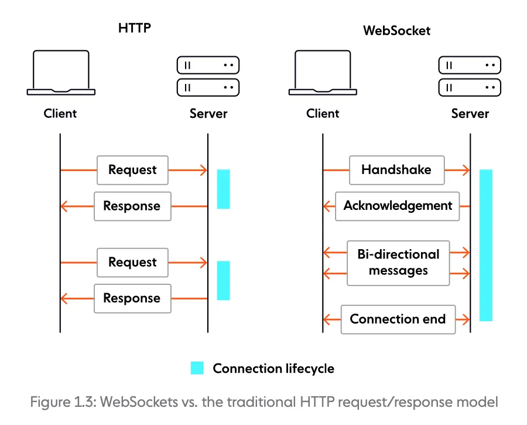

Praeguseks oleme vaadanud 2 erinevat protokolli, mille abil ESP32 saab suhelda veebibrauseriga. HTTP protokoll nõuab iga kord, kui uut infot on vaja, uue päringu tegemist, ning võtab seetõttu oluliselt rohkem ressursse, kui MQTT protokoll. MQTT protokoll ei võta kuigi palju ressursse, kuid selle kasutamiseks on vaja eraldi vahendajat. Siin õpetuses tutvume WebSocket protokolliga, mida võib võtta kui HTTP ning MQTT protokollide vahepealset. 

WebSocket protokoll loodi 2008 aastal. WebSocket protokollis algab ühendus kliendi poolt algatatud kätlusega(*handshake*). Vastuseks tuleb serverilt kviteerimine(*acknowledgement*), et server on valmis ühendust alustama. Ühenduse ajal saavad klient ning server omavahel sõnumeid saata senikaua, kuni ühendus suletakse.

*Joonis HTTP ja WebSockets protokollide tööpõhimõttest. Allikas: [https://websocket.org/guides/road-to-websockets/\#enter-websockets](https://websocket.org/guides/road-to-websockets/#enter-websockets)*

WebSockets protokolliga töötamiseks ei ole vaja vahendajat, kuna ühendus algab HTTP teel kätlemise ning kviteerimisega. Seetõttu on selle Node-RED-iga tööle panemine märkimisväärselt lihtsam.

Kasutame selles õpetuses WebSockets protokolli, et Node-RED-iga kuvada sõnumit ekraanil. Selle õpetuse jaoks läheb vaja ühte ESP32 arenduslauda ning ühte SSD1306 ekraani.

[Node-RED-iga WebSockets info saatmine](./node-red-websockets)

**Kasutatud allikad:**  
- [https://akit.cyber.ee/](https://akit.cyber.ee/)   
- [https://websocket.org/guides/road-to-websockets/\#enter-websockets](https://websocket.org/guides/road-to-websockets/#enter-websockets)   