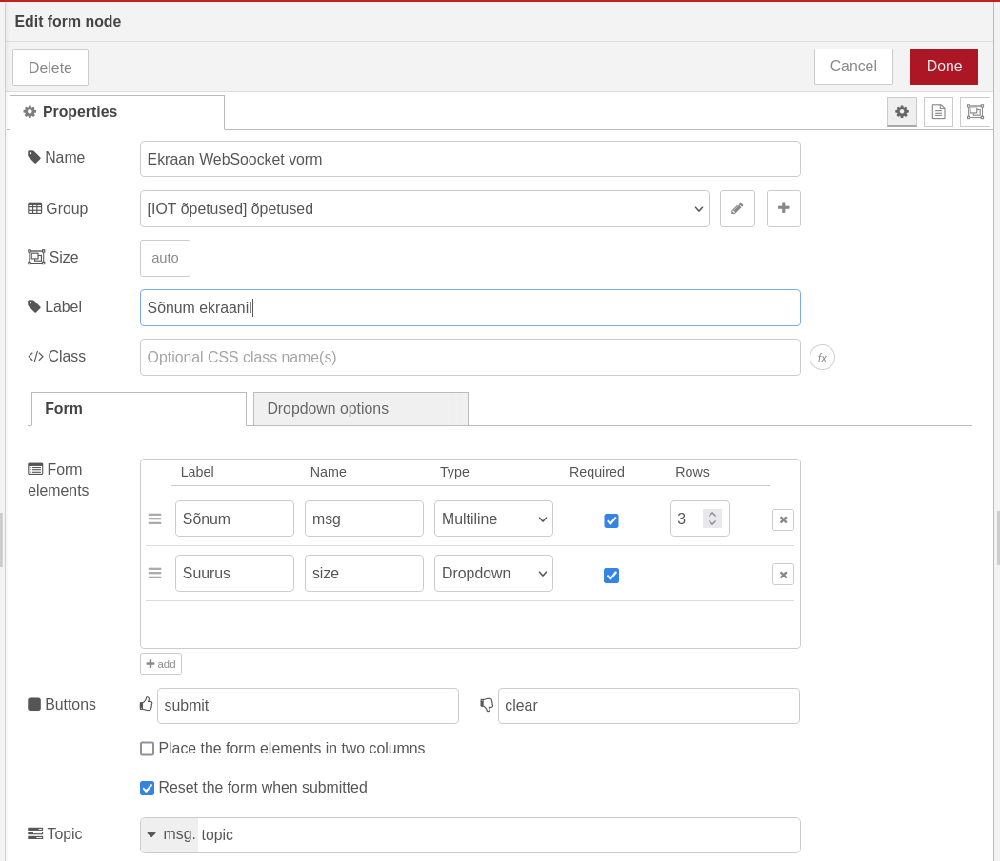
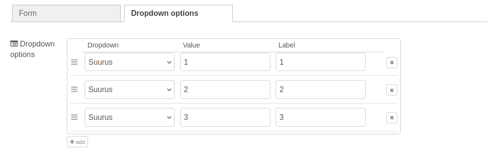
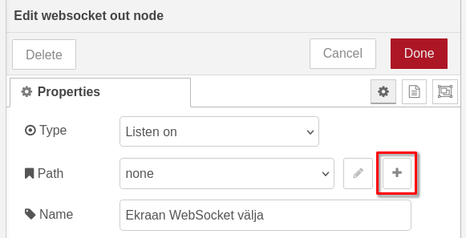
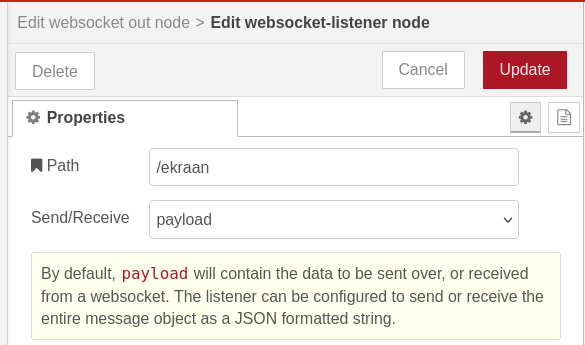
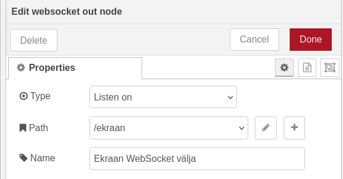
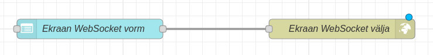

Avame *Node-Red* ning leiame vasakult *form* sõlme. Paneme vormi nimeks Ekraan WebSocket vorm ja sildiks “Sõnum ekraanil”. Lisame vormi kaks välja: *multiline*, kuhu kirjutame enda sõnumi, ning *dropdown*, kust valime teksti suuruse. Sõnumivälja sildiks saab “Sõnum” ja nimeks *msg*, teksti suuruse välja sildiks saab “Suurus” ja nimeks *size*.

Valime *Dropdown options* vahelehe ning lisame kolm väärtust: 1, 2, ja 3\.

Järgmisena leiame vasakult menüüst *websocket out* sõlme. Selle abil paneme *Node-RED* WebSocket URL-il kuulama. Paneme sõlme tüübiks *Listen on* ning nimeks Ekraan WebSocket välja. Loome uue tee(*Path*), vajutades *Path* välja juures olevale plussmärgile.

Paneme teeks(*Path*) /ekraan ja *Send/Receive* väärtuseks *payload*.

Ühendame omavahel Ekraan WebSocket vorm ning Ekraan WebSocket välja sõlmed ning vajutame *Deploy*.

Liigume ESP32 programmeerimise juurde.

[WebSockets info kätte saamine esp32-ga](./esp32-websockets)

**Kasutatud allikad:**  
- [https://dashboard.flowfuse.com/nodes/widgets/ui-form.html](https://dashboard.flowfuse.com/nodes/widgets/ui-form.html)   
- [https://flowfuse.com/node-red/core-nodes/websocket/](https://flowfuse.com/node-red/core-nodes/websocket/)   