Eelmises õpetuses saime WebSocket abil infot sõnumi kohta ekraanil. Proovime nüüd WebSocket abil teha kiiruskaamera, mis mõõdab sõiduki kiirust ja saadab selle info Node-RED tabelisse. Node-RED hakkab kuvama ka seda, millal mõõtmine toimus, ning kas kiirust ületati või mitte.

Selles õpetuses läheb vaja ühte ESP32 arenduslauda ning ühte HC-SR04 ultraheli sensorit.

Ehitame valmis mudeli maketeerimislaual. Joonis mudelist näeb välja selline:
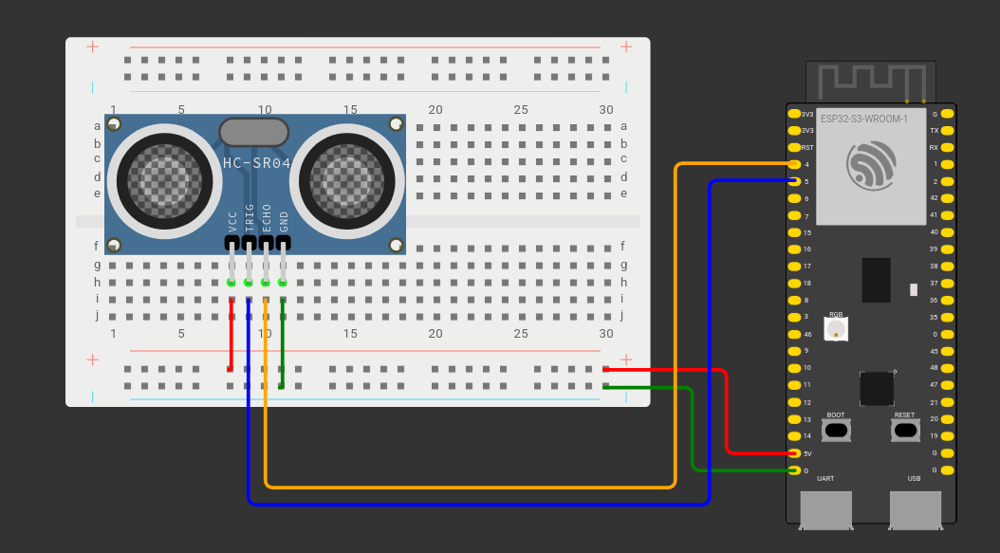

- HC-SR04 GND pin on ühendatud maandusega
- HC-SR04 ECHO pin on ühendatud ESP32 5. pin-iga
- HC-SR04 TRIG pin on ühendatud ESP32 4. pin-iga
- HC-SR04 VCC pin on ühendatud ESP32  5v pin-iga

Avame Arduino IDE ja paneme kirja välised teegid, mida kasutame.

```cpp
#include <WiFi.h>
#include <ArduinoWebsockets.h>
#include <Arduino_JSON.h>
```

Defineerime pin-id, mida kasutame, ning teeme 5 ujuvkomaarvu tüüpi muutujat:

```cpp
const int trigPin = 4;
const int echoPin = 5;
float duration, distance, dist1, dist2, speed;
```

Paneme kirja WiFi andmed ning WebSocket serveri, kuhu hakkame infot saatma(Selle loome hiljem Node-RED-is)
```cpp
const char* ssid = "wifi-nimi";
const char* password = "wifi-parool";
const char* websocket_server = "ws://1.2.3.4:1880/kiirus";
```

Kuna me hakkame infot saatma JSON kujul, loome muutuja kiirus_json.

```cpp
JSONVar kiirus_json;
```

Kasutame websockets nimeruumi

```cpp
using namespace websockets;
```

Loome wifi ning websockets kliendid

```cpp
WiFiClient wifiClient;
WebsocketsClient WSclient;
```

Teeme WebSockets tööks vajaliku onEventsCallBack funktsiooni. See funktsioon on identne funktsiooniga, mida kasutasime eelmises õpetuses.

```cpp
void onEventsCallback(WebsocketsEvent event, String data) {
 switch(event){
   case WebsocketsEvent::ConnectionOpened:
     Serial.println("Connnection Opened");
     break;
   case WebsocketsEvent::ConnectionClosed:
     Serial.println("Connnection Closed");
     break;
   case WebsocketsEvent::GotPing:
     Serial.println("Got a Ping!");
     break;
   case WebsocketsEvent::GotPong:
     Serial.println("Got a Pong!");
     break;
 }
}
```

Loome funktsiooni kauguse mõõtmiseks, mis tagastab ujuvkomaarvu.

```cpp
float kaugus(){
 digitalWrite(trigPin, LOW); 
 delayMicroseconds(2); 
 digitalWrite(trigPin, HIGH); 
 delayMicroseconds(10); 
 digitalWrite(trigPin, LOW); 
 duration = pulseIn(echoPin, HIGH);
 return (duration * .0343)/2;
}
```

Mida see funktsioon teeb?

HC-SR04 ultrahelisensor tööpõhimõte koosneb kahest osast: kõigepealt saadab sensor ultrahelilaine. Kui laine puutub millegagi kokku, põrkab see tagasi vastu HC-SR04 sensorit. Vaadates, kui kaua läheb aega tagasi põrkunud laine sensorini jõudmiseks, saame me arvutada objektide kaugust.

```cpp
 digitalWrite(trigPin, LOW); 
 delayMicroseconds(2); 
 digitalWrite(trigPin, HIGH); 
 delayMicroseconds(10); 
 digitalWrite(trigPin, LOW); 
```

Kirjutame 10 mikrosekundiks trigPin pin-ile HIGH väärtuse, et sensor saadaks välja ultrahelilaine.

Senikaua, kuni sensor ootab tagasipõrkunud lainet, on echoPin pin väärtus HIGH. Kui laine on tagasi põrkunud, saab echoPin pin väärtuseks LOW.

Selleks, et vaadata, kui kaua aega läks laine saamiseks, kasutame Arduino pulseIn funktsiooni, mis mõõdab, kui kaua oli pin-il kindel väärtus.

```cpp
duration = pulseIn(echoPin, HIGH);
```

Et kestusest saada kaugus, tuletame meelde põhikooli füüsikat. Teatavasti oli valem kiiruse arvutamiseks teepikkus jagada ajaga. Helikiirus on 0.0343 sentimeetrit mikrosekundis, ning aeg on meil mikrosekundites *duration* muutujas. Järelikult läheb meil teepikkuse arvutamiseks vaja korrutada aeg kiirusega. 

Kuna me mõõtsime aega, et ultrahelilaine jõuaks objektini ning tagasi, jagame saadud väärtuse kahega.

```cpp
return (duration * .0343)/2;
```

Valmis funktsioon kauguse mõõtmiseks näeb välja selline:

```cpp
float kaugus(){
 digitalWrite(trigPin, LOW); 
 delayMicroseconds(2); 
 digitalWrite(trigPin, HIGH); 
 delayMicroseconds(10); 
 digitalWrite(trigPin, LOW); 
 duration = pulseIn(echoPin, HIGH);
 return (duration * .0343)/2;
}
```

Loome järgmisena funktsiooni kiiruse mõõtmiseks. Mõõdame kaugust kaks korda, ühe sekundilise vahega.

```cpp
void kiirus(){
 dist1 = kaugus();
 delay(1000);
 dist2 = kaugus();

}
```

Kiiruse väärtuseks saame teise kauguse vahe esimesest kaugusest. Prindime kiiruse info ka serial monitori.

```cpp
void kiirus(){
 dist1 = kaugus();
 delay(1000);
 dist2 = kaugus();
 kiirus = dist1 - dist2;
 Serial.print("Kiirus: ");
 Serial.print(kiirus);
 Serial.println(" cm/s");

}
```

Salvestame saadud kiiruse kiirus_json objekti “kiirus” võtme väärtusena. Lisame ka “aeg” ning “alla piiri” võtmed. “Aeg” võtme väärtuseks paneme 0, kuna selle registreerime Node-RED-is, ning “alla piiri” väärtuseks paneme “true”, kuna me eeldame, et liiklejad peavad piirkiirusest kinni. Piirkiiruse määrame me Node-RED-is, ning seetõttu on kergem seda kontrollida seal.

```cpp
void kiirus(){
 dist1 = kaugus();
 delay(1000);
 dist2 = kaugus();
 kiirus = dist1 - dist2;
 Serial.print("Kiirus: ");
 Serial.print(kiirus);
 Serial.println(" cm/s");
 kiirus_json["kiirus"] = kiirus;
 kiirus_json["aeg"] = 0;
 kiirus_json["alla piiri"] = true;

}
```

Et meil oleks olemas ülevaade programmi tööst, prindime kiirus_json objekti serial monitoris, ning saadame objekti sõne kujul WebSocket kliendi abil serverisse.

```cpp
void kiirus(){
 dist1 = kaugus();
 delay(1000);
 dist2 = kaugus();
 kiirus = dist1 - dist2;
 Serial.print("Kiirus: ");
 Serial.print(kiirus);
 Serial.println(" cm/s");
 kiirus_json["kiirus"] = kiirus;
 kiirus_json["aeg"] = 0;
 kiirus_json["alla piiri"] = true;
 Serial.println(kiirus_json);
 WSclient.send(JSON.stringify(kiirus_json));
}
```

Liigume edasi setup funktsiooni juurde. Paneme varem deklareeritud trigPin-i väljundiks(Sellest saadetakse ultrahelilaine) ning echoPin-i sisendiks(See tuvastab tagasipõrkunud laine).

```cpp
void setup() {
 pinMode(trigPin, OUTPUT);
 pinMode(echoPin, INPUT);
```

Alustame Serial Monitori 115200 baudi peal, loome wifi ühenduse, loome WebSocket ühenduse, määrame WebSocket kliendile onEveent funktsiooni, ja saadame serverile pingi.

```cpp
void setup() {
 pinMode(trigPin, OUTPUT);
 pinMode(echoPin, INPUT);
 Serial.begin(115200);
 WiFi.begin(ssid, password);
    Serial.print("Connecting to WiFi...");
   while(WiFi.status() != WL_CONNECTED){
   delay(500);
   Serial.print(".");
 }
 Serial.println("WiFi connected!");

 Serial.print("Connecting to websocket server");
 while(!WSclient.connect(websocket_server)){
   Serial.print(".");
 }
 Serial.println("WebSocket connected!");

 WSclient.onEvent(onEventsCallback);

 WSclient.ping();
}
```

Viimasena määrame loop funktsiooni. Mõõdame kõigepealt, kui kaugel sõiduk on, ning alustame kiiruse mõõtmist, kui sõiduk on 19-20 cm kaugusel. Täpse väärtuse asemel kasutame vahemikku, et arvestada väikse ebatäpsusega mõõtmisel.

```cpp
void loop() {
 distance = kaugus();
 if(distance > 19 && distance < 20){
   Serial.println("Kiiruse möötmine...");
   kiirus();
 } 
}
```

ESP32 poolt on nüüd kõik vajalik tehtud. Liigume edasi Node-RED juurde.

Leiame vasakult menüüst *websocket in* sõlme. Paneme sõlme tüübiks *Listen on*, teeks(*path*) /kiirus ja nimeks *Kiirus WebSocket sisse*.

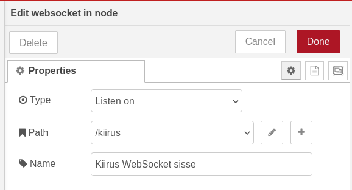

Leiame järgmisena vasakult *template* sõlme. Kasutame seda, et luua JSON objekt, mida Node-RED suudab lugeda.

Paneme sõlme nimeks *Kiirus Template*, muudetavaks omaduseks(*property*) msg.payload, ja lisame koodi:

```js
{"kiirus":"{{kiirus}}",
"aeg":"{{aeg}}",
"piirang":"{{alla piiri}}"}
```

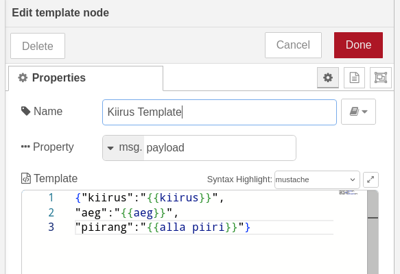

Leiame vasakult *json* sõlme, mille abil Node-Red meie loodud JSON objekti loeb ja paneme selle nimeks *Kiirus Json lugemine*.


Järgmisena lisame *switch* sõlme. Paneme *switch* sõlme nimeks *Kiirus tingimuslaused*. Paneme võrreldavaks muutujaks *msg.payload.kiirus* ja lisame kaks tingimust.

Esimene tingimus on, et kiirus väärtus oleks suurem, kui 0, ja väiksem, kui *flow.kiiruspiirang* muutuja väärtus ehk kiiruspiirang. Seda hakkame me määrama *dashboard-*il tekstiväljal.

Kontrollides, et kiirus oleks suurem, kui 0, väldime ebavajaliku info edastamist. Kiiruse väärtus võib olla alla nulli näiteks siis, kui objekt liigub sensorist kaugemale. (Soovi korral võib muidugi lubada negatiivseid väärtuseid, et kiirust mõõta kaherealise tee mõlemal real, kuid et hoida õpetus võimalikult lihtsana, piirdume praegu ühe sõidureaga.). Kui väärtus on suurem kui 0, liigume väärtuse lisamisega tabelisse edasi.

Teise tingimusega määratakse, mida teha, kui kiirus on suurem, kui kiiruspiirang.

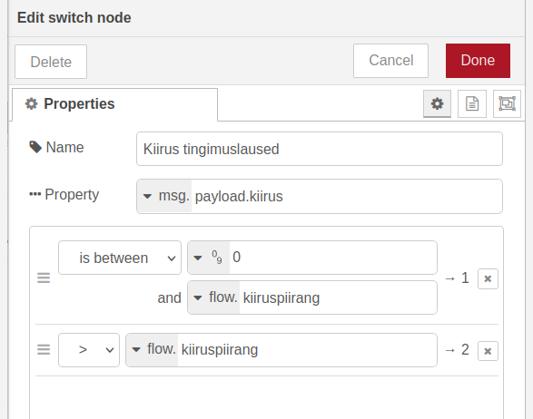

Teeme uue *change* sõlme, mille abil me kiiruspiirangu ületamisel paneme JSON objekti *piirang* omaduseks väärtuse *false*, ehk et näitame, et kiirus ei ole kiiruspiirangule vastav. Paneme sõlme nimeks *Kiiruspiirang false*.

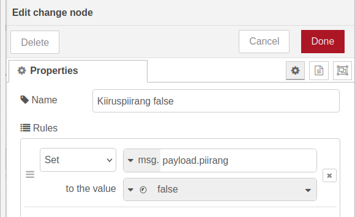

Järgmisena loome funktsiooni, mille abil paneme kirja kellaaja, kui mõõtmine tehti. Leiame vasakult *function* sõlme, paneme selle nimeks *Kiirusmõõtmine aeg*. 

*Function* sõlmed Node-RED-is kasutavad JavaScript-i. Lisame *On Message* vahelehele koodi:

```js
var d = new Date();
var options = { timeZone: 'Europe/Tallinn' };
msg.payload.aeg = d.toLocaleTimeString("et-EE", options);
return msg;
```

Mida see kood teeb? Kõigepealt loome uue *Date* objekti. Loome sätete jaoks muutuja *options*, kus paneme ajatsooniks Tallinn. *msg.payload.aeg* omaduse väärtuseks paneme *Date* objekti Eesti lokaati vormingus koos varem täpsustatud sätetega, ning tagastame *msg* objekti.

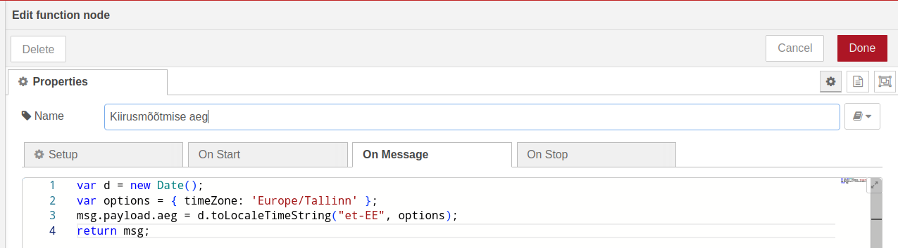

Loome tabeli(Vasakul menüüs *table* sõlm), mille nimeks saab *Kiirus tabel* ja sildiks paneme samuti *Kiirus tabel*. Tabeli toiminguks paneme *Append*(Kuna me tahame näha mitmete mõõtmiste tulemusi). Võtame maha linnukese *Auto Calculate Columns* eest.

Tabelil saab olema kolm veergu: esimese väärtuseks saab olema *key: kiirus*, teise väärtuseks *key: aeg* ning kolmanda *key: piirang*. Esimese kahe veergu andmetüüp on tekst, kolmanda tõeväärtus.

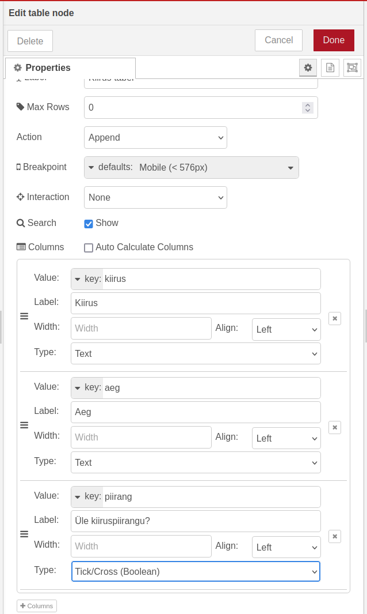

Loome ka tekstivälja, kus saab muuta kiiruspiirangut. Leiame vasakult menüüst *number input* sõlme, paneme selle nimeks ja sildiks *Kiiruspiirang*. Paneme ta sõnumit saatma siis, kui oleme vajutanud enter klahvi, ning vahemikuks 1-100.

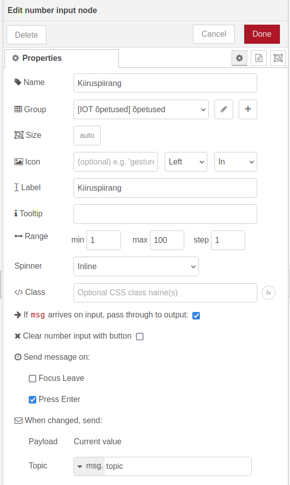

Praegusel viisil saame numbrivälja väärtuse kohta infot vaid siis, kui see muutub. Et numbrivälja väärtus salvestada, kasutame uuesti *change* sõlme, mis paneb *flow.kiiruspiirang* muutuja väärtuseks *msg.payload*.

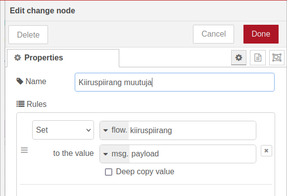

Ühendame omavahel *Kiiruspiirang* ning *Kiiruspiirang muutuja* sõlmed.

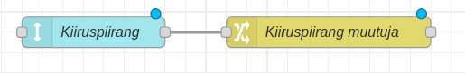

Samuti ühendame omavahel *Kiirus WebSocket sisse*, *Kiirus Template, Kiirus JSON lugemine*, ja *Kiirus tingimuslaused* sõlmed.

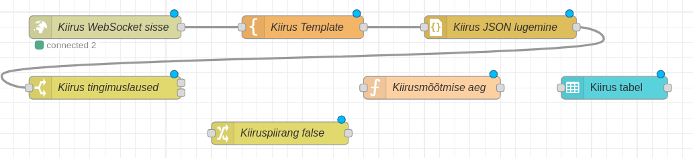

Näeme, et *Kiirus tingimuslaused* sõlmel on kaks kohta, kust ühendusi luua. Ülemisega liigutakse edasi, kui kiirus on suurem, kui 0\. Ühendame selle otse *Kiirusmõõtmise aeg* sõlmega.

Alumise ühenduskohaga liigutakse edasi, kui kiirus on suurem *flow.kiiruspiirang* muutujast. Selle ühendame *Kiiruspiirang false* sõlmega, et panna *msg.payload.piirang* väärtuseks *false*, ning ühendame *Kiiruspiirang false* sõlme *Kiirusmõõtmise aeg* sõlmega, et edasi liikuda kiiruse mõõtmise aja fikseerimisega.

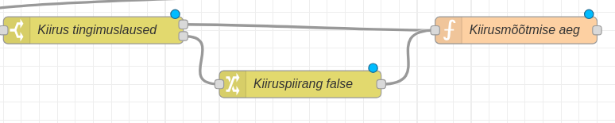

Lõpuks ühendame *Kiirusmõõtmise aeg* sõlme *Kiirus tabel* sõlmega. Meie Node-RED vaade peaks välja nägema selline:

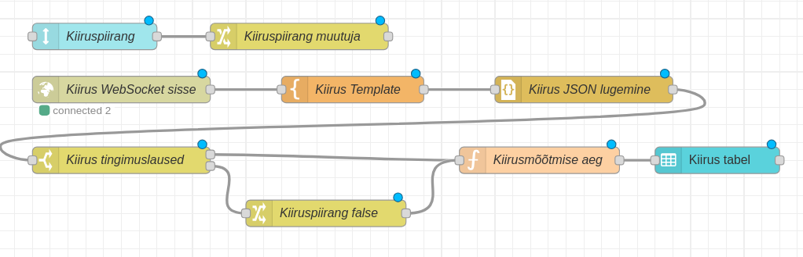

Kui me nüüd vajutame üleval paremal nurgas *Deploy*, paneme ESP32 programmi tööle, ning läheme Node-RED dashboard-ile(localhost:1880/dashboard), peaksime saama panna kiiruspiiranguid ja nägema erinevaid mõõdetud kiirusi.

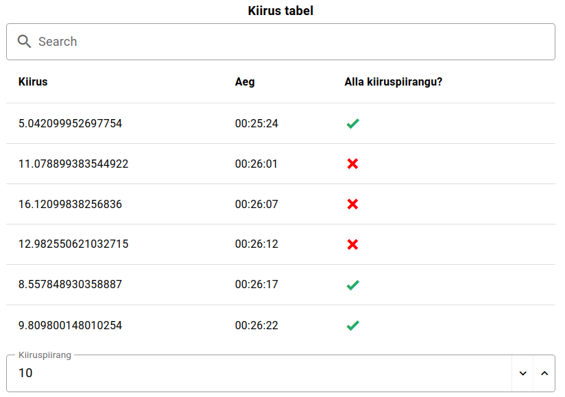

**Iseseisvaks nuputamiseks:**  
- Proovi panna ESP32 saatma viimase 10 mõõtmise keskmist, ning Node-RED seda näitama tekstiväljal.

**Kasutatud allikad:**  
- [https://flowfuse.com/node-red/core-nodes/switch/](https://flowfuse.com/node-red/core-nodes/switch/)   
- [https://lastminuteengineers.com/arduino-sr04-ultrasonic-sensor-tutorial/](https://lastminuteengineers.com/arduino-sr04-ultrasonic-sensor-tutorial/)   
- [https://projecthub.arduino.cc/Isaac100/getting-started-with-the-hc-sr04-ultrasonic-sensor-7cabe1](https://projecthub.arduino.cc/Isaac100/getting-started-with-the-hc-sr04-ultrasonic-sensor-7cabe1)   
- [https://arduinojson.org/v7/example/generator/](https://arduinojson.org/v7/example/generator/)   
-  [https://flows.nodered.org/flow/40116bb72b83e02ceb01b1ca61f97505](https://flows.nodered.org/flow/40116bb72b83e02ceb01b1ca61f97505)


[Järgmine õpetus](../node-red-ettevalmistus/)