Leiame vasakult menüüst *websocket in* sõlme. Paneme sõlme tüübiks *Listen on*, teeks(*path*) /kiirus ja nimeks *Kiirus WebSocket sisse*.

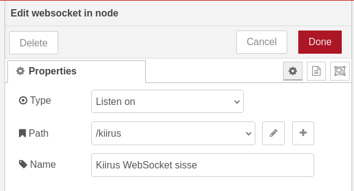

Leiame järgmisena vasakult *template* sõlme. Kasutame seda, et luua JSON objekt, mida Node-RED suudab lugeda.

Paneme sõlme nimeks *Kiirus Template*, muudetavaks omaduseks(*property*) msg.payload, ja lisame koodi:

```js
{"kiirus":"{{kiirus}}",
"aeg":"{{aeg}}",
"piirang":"{{alla piiri}}"}
```

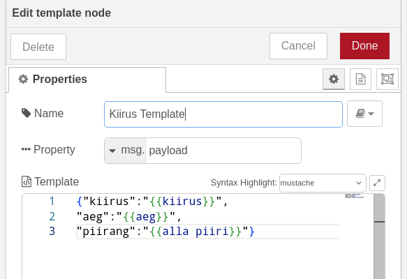

Leiame vasakult *json* sõlme, mille abil Node-Red meie loodud JSON objekti loeb ja paneme selle nimeks *Kiirus Json lugemine*.

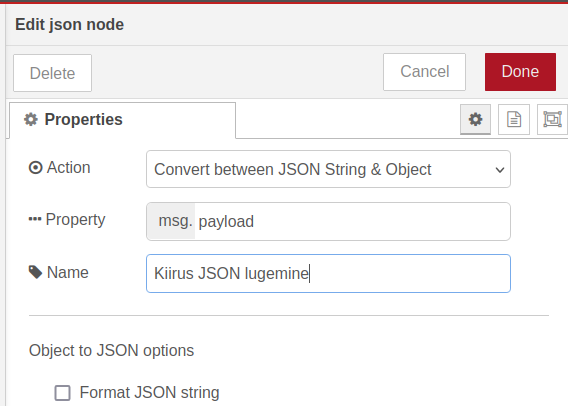

Järgmisena lisame *switch* sõlme. Paneme *switch* sõlme nimeks *Kiirus tingimuslaused*. Paneme võrreldavaks muutujaks *msg.payload.kiirus* ja lisame kaks tingimust.

Esimene tingimus on, et kiirus väärtus oleks suurem, kui 0, ja väiksem, kui *flow.kiiruspiirang* muutuja väärtus ehk kiiruspiirang. Seda hakkame me määrama *dashboard-*il tekstiväljal.

Kontrollides, et kiirus oleks suurem, kui 0, väldime ebavajaliku info edastamist. Kiiruse väärtus võib olla alla nulli näiteks siis, kui objekt liigub sensorist kaugemale. (Soovi korral võib muidugi lubada negatiivseid väärtuseid, et kiirust mõõta kaherealise tee mõlemal real, kuid et hoida õpetus võimalikult lihtsana, piirdume praegu ühe sõidureaga.). Kui väärtus on suurem kui 0, liigume väärtuse lisamisega tabelisse edasi.
{: .info}

Teise tingimusega määratakse, mida teha, kui kiirus on suurem, kui kiiruspiirang.

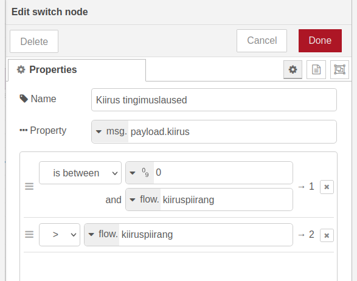

Teeme uue *change* sõlme, mille abil me kiiruspiirangu ületamisel paneme JSON objekti *piirang* omaduseks väärtuse *false*, ehk et näitame, et kiirus ei ole kiiruspiirangule vastav. Paneme sõlme nimeks *Kiiruspiirang false*.

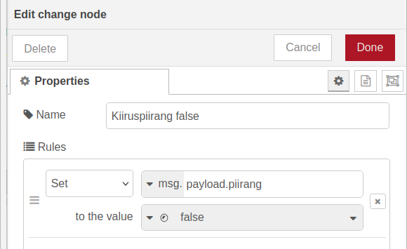

Järgmisena loome funktsiooni, mille abil paneme kirja kellaaja, kui mõõtmine tehti. Leiame vasakult *function* sõlme, paneme selle nimeks *Kiirusmõõtmine aeg*. 

*Function* sõlmed Node-RED-is kasutavad JavaScript-i. Lisame *On Message* vahelehele koodi:

```js
var d = new Date();
var options = { timeZone: 'Europe/Tallinn' };
msg.payload.aeg = d.toLocaleTimeString("et-EE", options);
return msg;
```

Mida see kood teeb? Kõigepealt loome uue *Date* objekti. Loome sätete jaoks muutuja *options*, kus paneme ajatsooniks Tallinn. *msg.payload.aeg* omaduse väärtuseks paneme *Date* objekti Eesti lokaati vormingus koos varem täpsustatud sätetega, ning tagastame *msg* objekti.

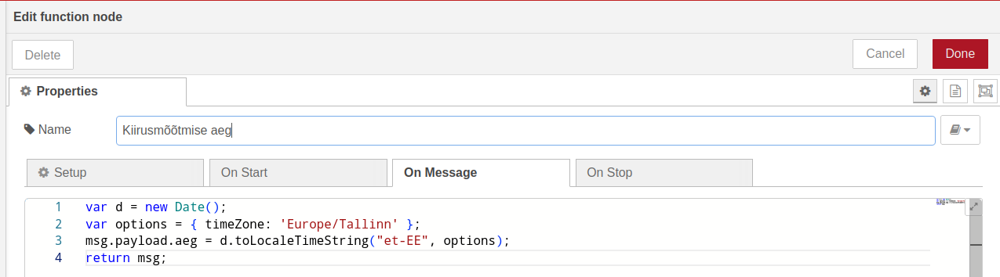

Loome tabeli(Vasakul menüüs *table* sõlm), mille nimeks saab *Kiirus tabel* ja sildiks paneme samuti *Kiirus tabel*. Tabeli toiminguks paneme *Append*(Kuna me tahame näha mitmete mõõtmiste tulemusi). Võtame maha linnukese *Auto Calculate Columns* eest.

Tabelil saab olema kolm veergu: esimese väärtuseks saab olema *key: kiirus*, teise väärtuseks *key: aeg* ning kolmanda *key: piirang*. Esimese kahe veergu andmetüüp on tekst, kolmanda tõeväärtus.

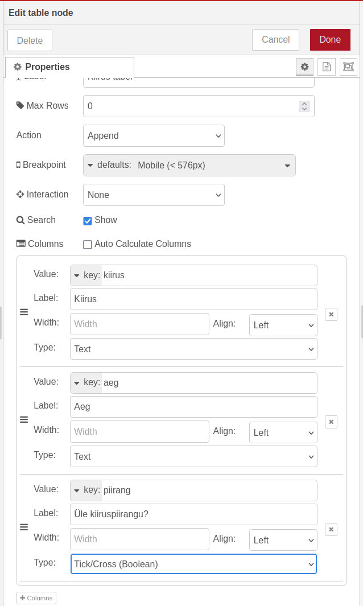

Loome ka tekstivälja, kus saab muuta kiiruspiirangut. Leiame vasakult menüüst *number input* sõlme, paneme selle nimeks ja sildiks *Kiiruspiirang*. Paneme ta sõnumit saatma siis, kui oleme vajutanud enter klahvi, ning vahemikuks 1-100.

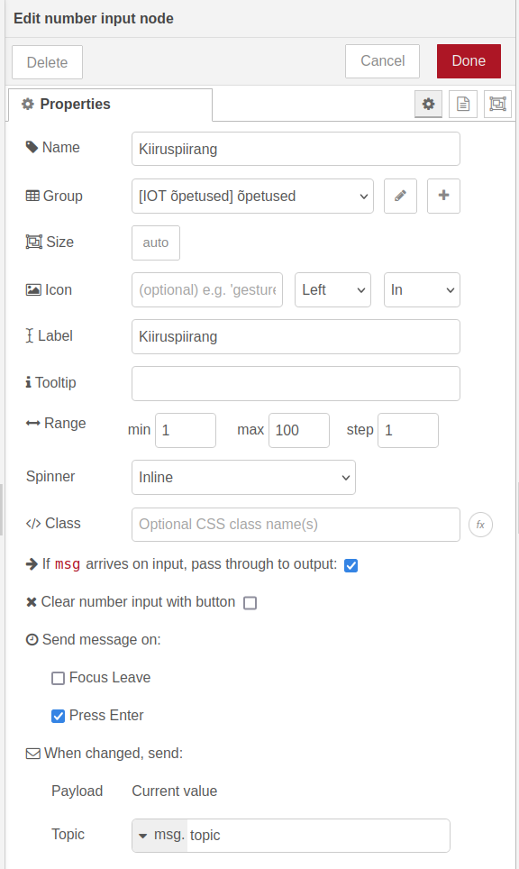

Praegusel viisil saame numbrivälja väärtuse kohta infot vaid siis, kui see muutub. Et numbrivälja väärtus salvestada, kasutame uuesti *change* sõlme, mis paneb *flow.kiiruspiirang* muutuja väärtuseks *msg.payload*.

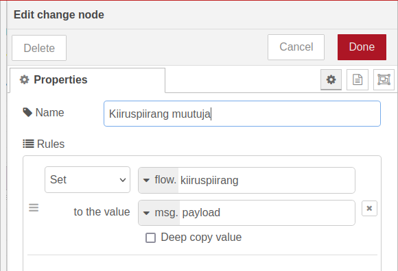

Ühendame omavahel *Kiiruspiirang* ning *Kiiruspiirang muutuja* sõlmed.

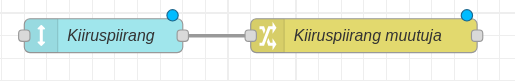

Samuti ühendame omavahel *Kiirus WebSocket sisse*, *Kiirus Template, Kiirus JSON lugemine*, ja *Kiirus tingimuslaused* sõlmed.

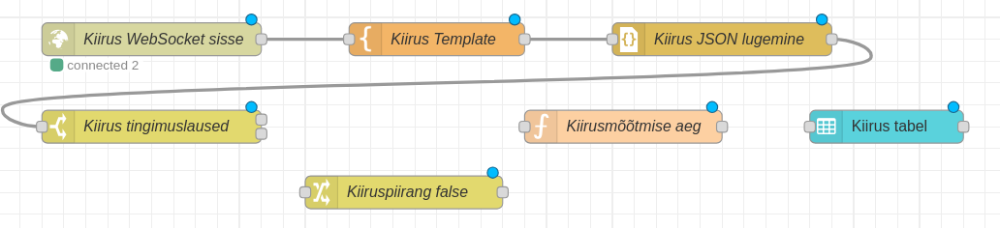

Näeme, et *Kiirus tingimuslaused* sõlmel on kaks kohta, kust ühendusi luua. Ülemisega liigutakse edasi, kui kiirus on suurem, kui 0\. Ühendame selle otse *Kiirusmõõtmise aeg* sõlmega.

Alumise ühenduskohaga liigutakse edasi, kui kiirus on suurem *flow.kiiruspiirang* muutujast. Selle ühendame *Kiiruspiirang false* sõlmega, et panna *msg.payload.piirang* väärtuseks *false*, ning ühendame *Kiiruspiirang false* sõlme *Kiirusmõõtmise aeg* sõlmega, et edasi liikuda kiiruse mõõtmise aja fikseerimisega.

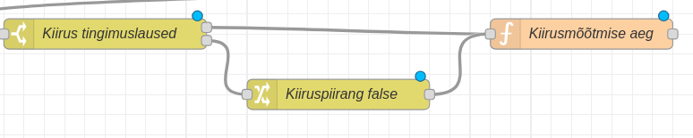

Lõpuks ühendame *Kiirusmõõtmise aeg* sõlme *Kiirus tabel* sõlmega. Meie Node-RED vaade peaks välja nägema selline:

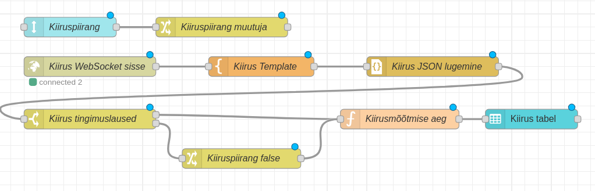

Kui me nüüd vajutame üleval paremal nurgas *Deploy*, paneme ESP32 programmi tööle, ning läheme Node-RED dashboard-ile(localhost:1880/dashboard), peaksime saama panna kiiruspiiranguid ja nägema erinevaid mõõdetud kiirusi.

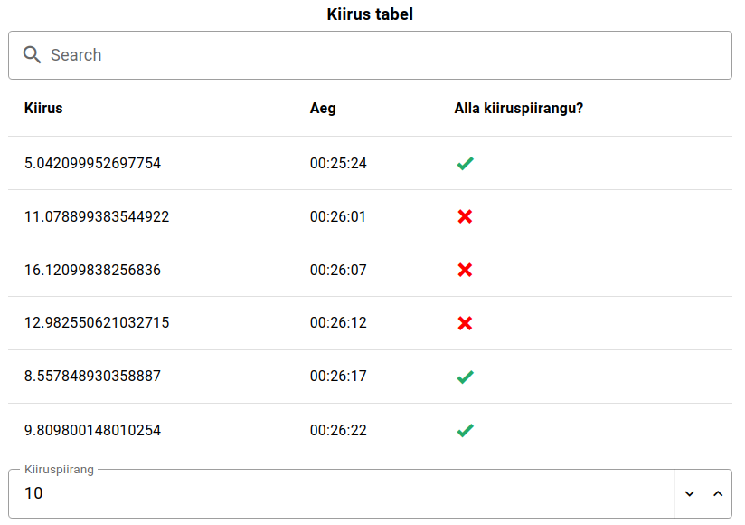

**Iseseisvaks nuputamiseks:**  
- Proovi panna ESP32 saatma viimase 10 mõõtmise keskmist, ning Node-RED seda näitama tekstiväljal.

[Järgmine õpetus](../NTP-protokoll/)


**Kasutatud allikad:**  
- [https://flowfuse.com/node-red/core-nodes/switch/](https://flowfuse.com/node-red/core-nodes/switch/)   
-  [https://flows.nodered.org/flow/40116bb72b83e02ceb01b1ca61f97505](https://flows.nodered.org/flow/40116bb72b83e02ceb01b1ca61f97505)