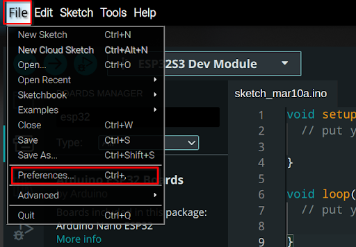
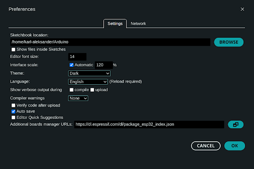
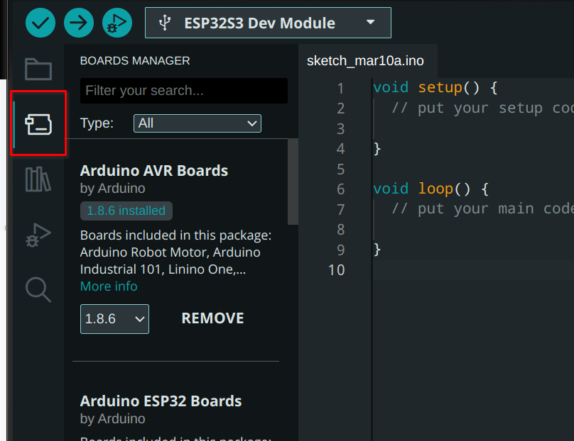
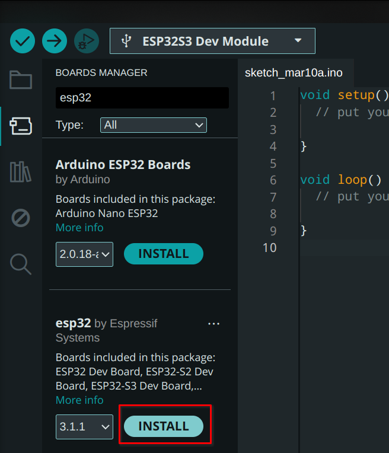
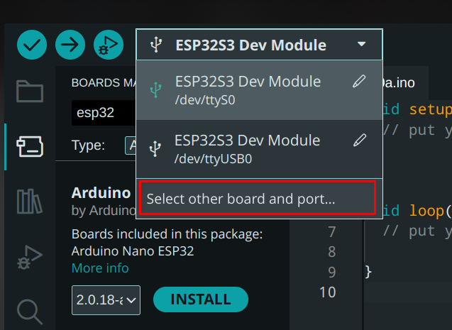
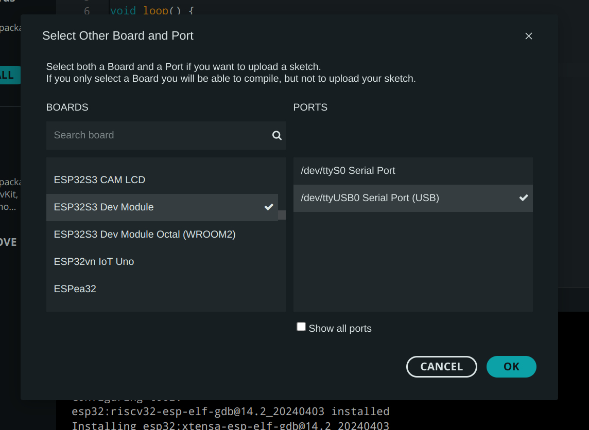
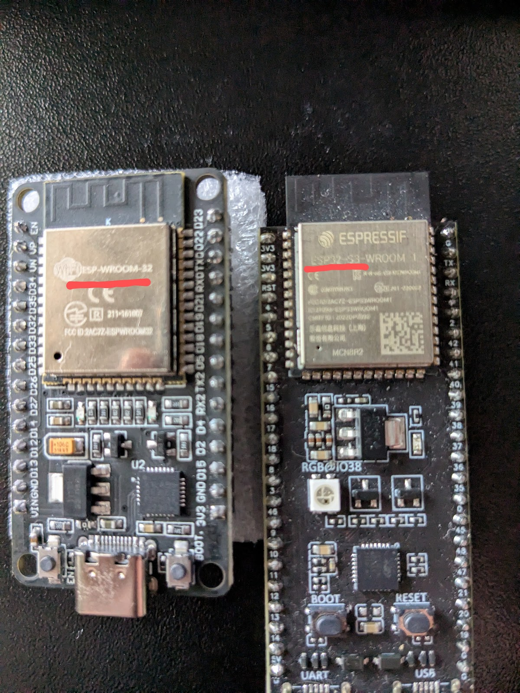

(TODO - Mingi väike tutvustus ESP32 kohta)
{: .todo}

Et ESP32 programmeerida, kasutame Arduino arendusplatvormi. Selle saame arvutile alla laadida [Arduino kodulehelt](https://www.arduino.cc/en/software).

Arduino on vabavaraline platvorm, mis on loodud lihtsaks ning ligipääsetavaks elektroonika arenduseks.
(TODO - Rohkem tutvustust Arduino kohta?)
{: .todo}

Kui Arduino IDE on installitud, lisame toe ESP32 arenduslaudadele.

Teeme lahti Arduino IDE ning valime üleval menüüs *File -> preferences…*

Avanenud aknas lisame Additional boards manager URLs: tekstikasti järgneva teksti:
`https://dl.espressif.com/dl/package_esp32_index.json`

Vajutame OK. Seejärel võtame vasakult menüüst lahti *Boards Manager*.

otsime “esp32” ning installime “esp32 by Esspressif Systems” arenduslaua liidese.

Ühendame oma ESP32 USB kaabli abil arvutiga. Ülevalt asuvast rippmenüüst valime “*Select other board and port…*”. Avaneb menüü, kus saame valida USB pesa, millega ESP32 on ühendatud, ning oma arenduslaua.

Kuvatõmmisel olev valik töötab ESP32-S3 arenduslauaga. Kui sa ei ole kindel, mis arenduslaud sul on ning mida sa peaksid Arduino IDE menüüs valima, leiad arenduslaua mudeli kohta informatsiooni arenduslaua pealt ning internetist.

*Erinevate arenduslaudade mudelid. Parempoolset arenduslauda on kasutatud õpetuste kirjutamisel ning testimisel.*

Kui õige arenduslaud on valitud, olemegi valmis ESP32-te Arduino IDE abil programmeerima!

Linux kasutajatele võib programmi lauale laadimisel tulla viga *errno13 permission denied* või muud taolised vead. Tavaliselt on lahenduseks käsureal tegemine: *sudo chmod a+rw /dev/ttyUSB0*
{: .important}

Rohkem Arduino ajaloo kohta saab lugeda [siit](https://spectrum.ieee.org/the-making-of-arduino)

**Kasutatud allikad:**  
- [https://www.arduino.cc/en/Guide/Introduction](https://www.arduino.cc/en/Guide/Introduction)

[Järgmine õpetus](../node-red-ettevalmistus/)
