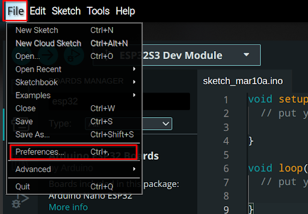
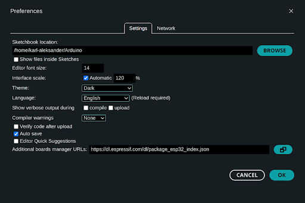
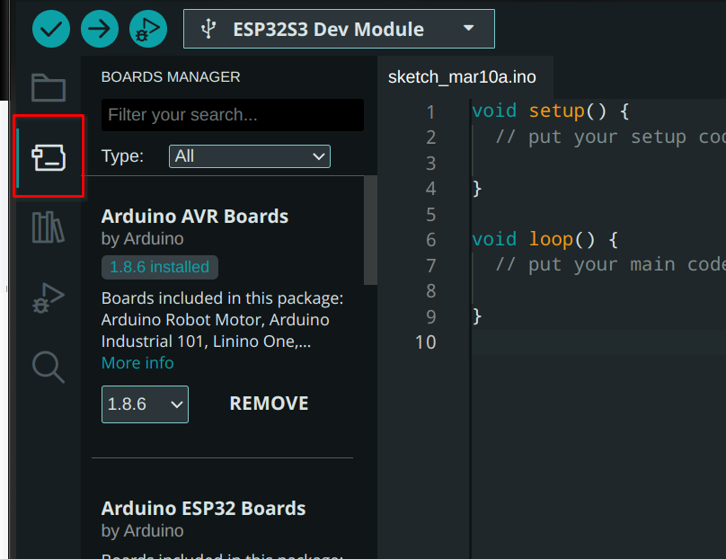
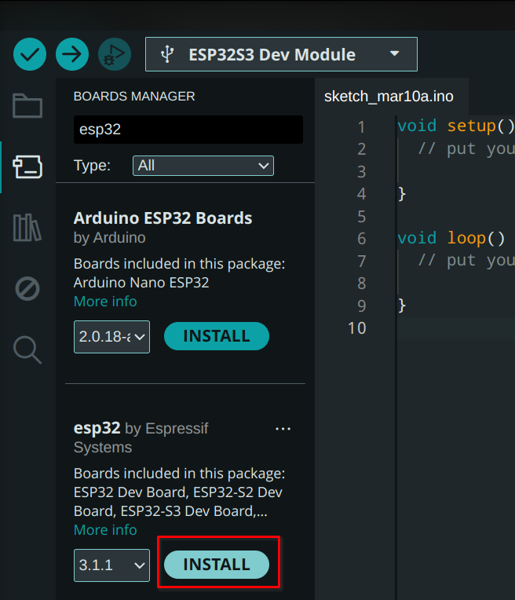
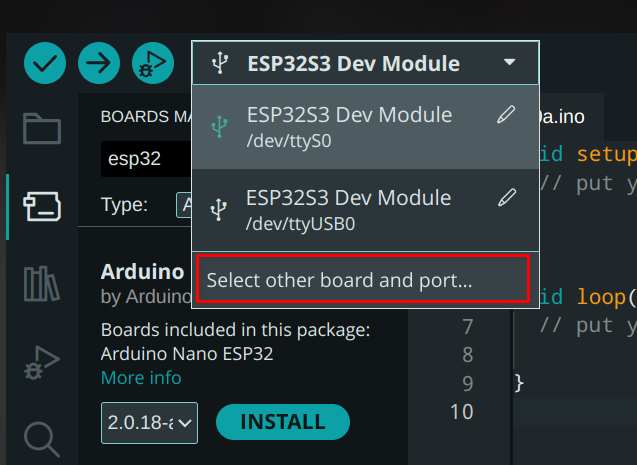
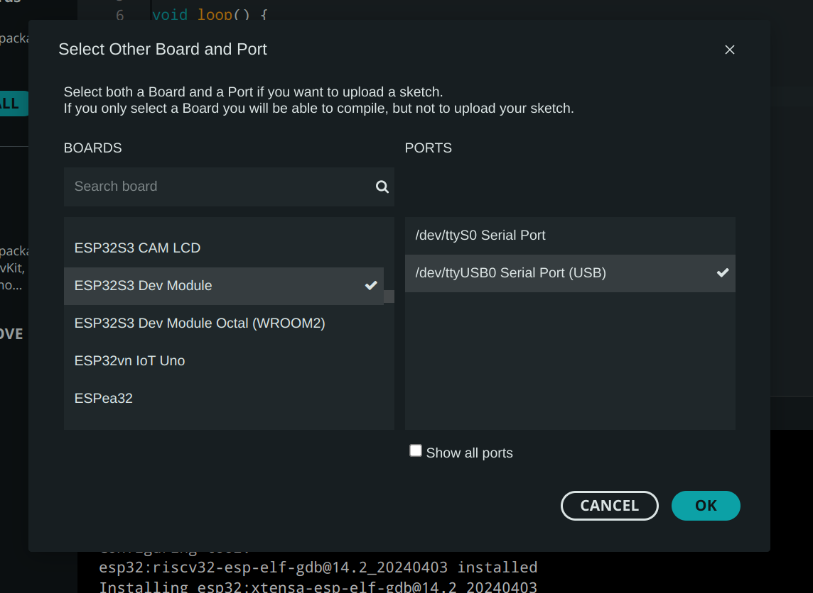

ESP32 on Espressif firma poolt arendatud mikrokontroller, millel on sisseehitatud 2.4 Ghz wifi ja bluetooth ühenduste võimalused. ESP32 mikrokontrollerid on loodud töötama väikse energiakuluga, mille tõttu on need kasulikud asjade interneti, kaasaskantavate seadmete ja muude sarnaste projektide jaoks. ESP32 arenduslauad on arenduslauad, mille peal on ESP32 mikrokontroller. Et ESP32 programmeerida, kasutame Arduino arendusplatvormi. 

Arduino on vabavaraline platvorm, mis on loodud lihtsaks ning ligipääsetavaks elektroonika arenduseks. ESP32 programmeerimiseks kasutame Arduino IDE-d ning Arduino programmeerimiskeelt, mis on sarnane C++ programmeerimiskeelele. Arduino IDE saame arvutile alla laadida [Arduino kodulehelt](https://www.arduino.cc/en/software).

Kui Arduino IDE on installitud, lisame toe ESP32 arenduslaudadele.

Teeme lahti Arduino IDE ning valime üleval menüüs *File -> preferences…*

Avanenud aknas lisame Additional boards manager URLs: tekstikasti järgneva teksti:
`https://dl.espressif.com/dl/package_esp32_index.json`

Vajutame OK. Seejärel võtame vasakult menüüst lahti *Boards Manager*.

otsime “esp32” ning installime “esp32 by Esspressif Systems” arenduslaua liidese.

Ühendame oma ESP32 USB kaabli abil arvutiga. Ülevalt asuvast rippmenüüst valime “*Select other board and port…*”. Avaneb menüü, kus saame valida USB pesa, millega ESP32 on ühendatud, ning oma arenduslaua.

Kuvatõmmisel olev valik töötab ESP32-S3 arenduslauaga. Kui sa ei ole kindel, mis arenduslaud sul on ning mida sa peaksid Arduino IDE menüüs valima, leiad arenduslaua mudeli kohta informatsiooni arenduslaua pealt ning internetist.

*Erinevate arenduslaudade mudelid. Parempoolset arenduslauda on kasutatud õpetuste kirjutamisel ning testimisel.*

Kui õige arenduslaud on valitud, olemegi valmis ESP32-te Arduino IDE abil programmeerima!

Linux kasutajatele võib programmi lauale laadimisel tulla viga *errno13 permission denied* või muud taolised vead. Tavaliselt on lahenduseks käsureal tegemine: *sudo chmod a+rw /dev/ttyUSB0*
{: .important}

Rohkem Arduino ajaloo kohta saab lugeda [siit](https://spectrum.ieee.org/the-making-of-arduino)

[Järgmine õpetus](./ettevalmistus-2)

**Kasutatud allikad:**  
- [https://www.arduino.cc/en/Guide/Introduction](https://www.arduino.cc/en/Guide/Introduction)
- [https://www.espressif.com/en/products/socs/esp32](https://www.espressif.com/en/products/socs/esp32)
