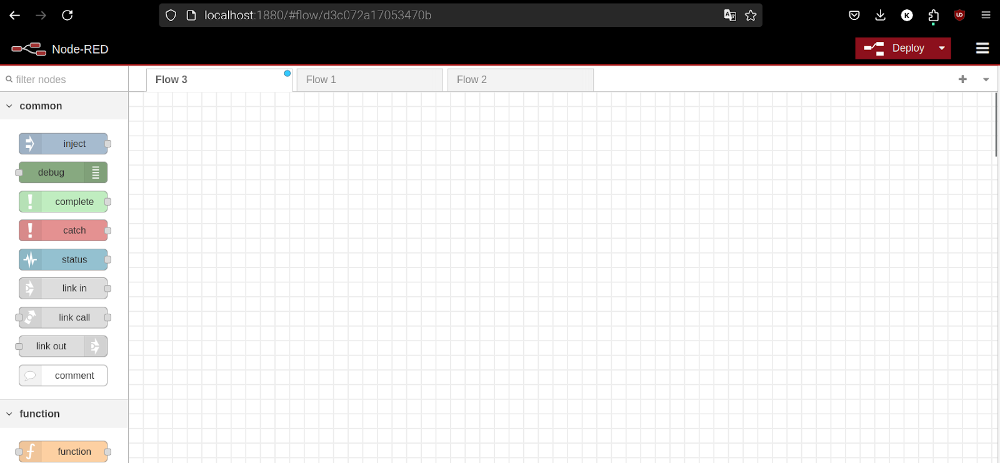

ESP32 on nüüd arenduseks valmis. Kuna aga tegu on asjade interneti kursusega, võiks meil olla ka enda arvutis mingi keskkond, millega ESP32 saaks suhelda. 

Selleks kasutame vabavaralist platvormi **Node-RED**. Node-RED on andmevoolu põhine *low-code* tööriist, mida me hakkame kasutama enda arvutis HTTP ning MQTT protokollidega töötamiseks.

(Node-RED allikas: [https://nodered.org/about/](https://nodered.org/about/) )

Kasutame Node-RED installimiseks Dockerit. Kui sul Dockerit arvutisse installitud ei ole, leiad õpetuse [siit.](https://docs.docker.com/desktop/)

Node-RED installimine ning käivitamine on lihtne. Kui Docker on installitud, jooksuta Docker käsureal:  
`docker run \-it \-p 1880:1880 \-v node\_red\_data:/data \--name TarkLinn nodered/node-red`

(Linux kasutajatele: jooksuta terminalis sama käsku sudo õigustega)

Esimesel käivitamisel läheb natuke aega. Kui Node-RED on käima hakanud, saad sinna ligi minnes veebibrauseris aadressile *localhost:1880*

Paigaldame *Node-RED*\-ile ka *Dashboard 2.0* laienduse, et enda targa linna kontrollimiseks luua veebis graafiline kasutajaliides. Selleks leiad õpetuse [siit](https://dashboard.flowfuse.com/getting-started.html).

Kui *Dashboards 2.0* laiendus on installitud, oleme valmis enda esimeseks ESP32 asjade interneti projektiks!

**NB: Node-RED on vaja Dockeris käima panna iga kord, kui arvuti uuesti sisse lülitad. Selleks jooksuta Docker käsureal:**  
docker start TarkLinn  
**või Linux terminalis:**  
sudo docker start TarkLinn
{: .important}

**Kasutatud allikad:**  
[https://nodered.org/about/](https://nodered.org/about/)

[Järgmine õpetus](../HTTP-info-saamine/)